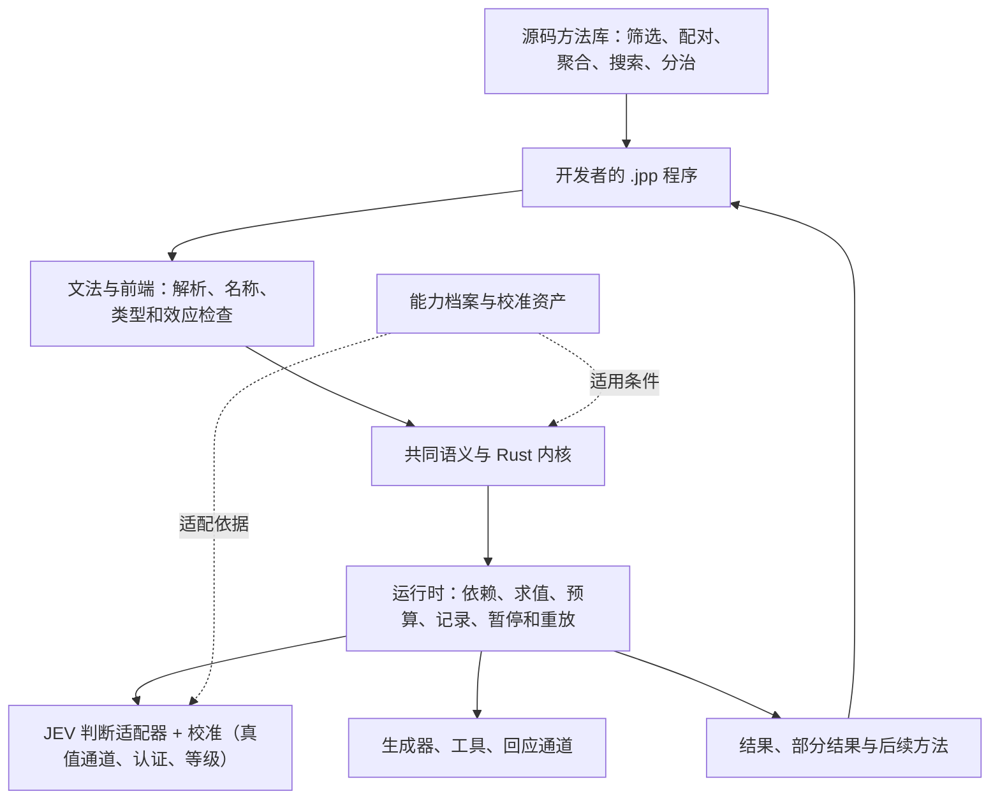

# J++ 总设计与交付地图

2026-09-25 按黑板重写（此前版本停在 09-24，把当天称为"同步分支待合入"的架构重构与固定序认证方法，如今都已实际合入 `main`，本次一并更新）。本文把已有总计划、当前实现和最近发现放到同一张图上，作为阅读入口和阶段定位，不另立一套语言规范。状态是当日快照；下一段工作包是推进建议，不代表已启动实现。

**J++ 已经有独立源码、可运行的 Rust 内核、接通真实判断后端的校准流程，而且拆解 9 月 24 日发现的"校准门槛"这项工作，今天已经落地：固定序认证方法把正式档门槛从约 160 条标注压到远小得多的标注集，已经真机上线。** 剩下的门槛不是"能不能便宜认证"，而是"表达量比、深度、换后端"这三条验收标准本身还没有到参考带——这是当前设计与工程工作的重点，不是从头再造一次语言。

下一段的具体代码起点、里程碑挂点见 [实施任务](implementation-handoff-2026-09-23.zh-CN.md)（仍是 09-23 定的起点，尚未按本文更新）。

## 1. 我们最终要交付什么

开发者安装 J++，编写 `.jpp` 程序，把问题、材料、求解方法与中间结果当作可操作的对象。程序能根据已有结果提出下一道问题，组合其他方法，利用精确算法求解；局部信息不足时，可以先交出有用结果，把剩余问题交给下一段程序继续处理。

这里的关键不是预装很多聪明功能，而是：**开发者写出的新方法也能成为别人的基础材料，不需要每增加一种应用就修改内核。** JEV 提供判断能力；确定性算法、生成器、工具和回应通道共同参与计算。未来接入其他后端仍沿这一分工，具体能力与校准是否兼容需由适配器和实测确认。

正式实现使用 Rust，用户写的是 J++。Python 保留作行为参照和已有应用实验。

## 2. 整体结构：每一层让下一层更容易被构造

图中包含目标职责，不表示各层已经全部完成。精确计算属于语言的普通计算能力，不必绕到模型中完成。

| 层 | 应负责什么 | 当前状态（本仓库 `main`） | 只是裁定、任何分支都未造 |
|---|---|---|---|
| 源码与前端 | 人能写、拆分、导入程序，错误能定位到源码 | 独立语法、解析、检查、解释执行、多文件示例；前端直接降到中间表示（`jpp-frontend` 改名 `jpp-syntax`），检查器抽成独立层 `jpp-check` | — |
| 共同语义与内核 | 问题、读数、方法、未决和外部效应在组合后仍有明确含义 | 高阶方法、动态问题、部分结果与续接、题成为一等值、三路过滤/配对/聚合/迭代、组合封闭性契约、值级 taint、中间表示层 `jpp-ir`、来源边分种类（值依赖/选择依赖，B92）、类型化程序入口与 `entry_hash` | 作者声明策略线 `declare:{hi, lo?}`（B128–B130）与宿主接受门（施工步 20j-1 进行中） |
| 执行系统 | 根据依赖运行，批量判断，记录成本与结果，恢复计算 | 惰性判断、同状态融合、预算耗尽降级而非停机（B93）、账本 v3（`jpp-ledger`：`CalibUsed` 条目、`calib_ref` 留位、v2 迁移）、批调度、按窗口发出一层、端口内并发 | 真机跨端口并发调度（端口内已并发，跨端口调度仍是后续工作） |
| 能力适配与反馈 | 同一程序使用真实判断、生成、工具与回应，并接收可用反馈 | 真实 JEV client（`--backend live`）、后端注册表与替身判断器（步 15g）、`calib-import` 真值通道、拆分样本两侧认证、**固定序/序贯认证方法已上线**（B104/B87，正式档门槛大幅下降）、试用档校准等级、逐出口记线等级、真机默认必须带能力画像、验收仪表脚本、`calib-import --cost` 动作空间代价线 | 首批共享题式库落地后新题 0 行校准（`bank/` 已有 5 条示例条目，规模仍小） |
| 方法库 | 用少量构造写出很多算法；算法可以接收和返回方法 | 组合示例、小型源码库；三路过滤、配对、聚合已是可复用构造，`tally`/`first_k` 共用 `compose`/`element` 合成路径 | 锦标赛/搜索骨架 |
| 交付与工具 | 安装、编写、调试、复用、分享形成一条完整路径 | PR #27–#30 及今天的架构重构与后续一整天工作已合入 `main`；`cargo test --locked --workspace` **884 passed, 0 failed, 9 ignored**；报告模式 CI（GUIDE/README/METHODS 代码片段与全部示例） | 一页纸新开发者指南、诊断机读输出（JSON、编号化运行期错误，`diag_json` 已有基础，尚未成篇） |

### 最小构造不是把所有东西叫成"一个单元"

统一应保留重要差异。材料不是问题，模型读数不是已验证事实，方法也不等于执行一次方法。现行设计中这些对象的职责：

| 构造 | 输入与输出 | 如何继续组合 |
|---|---|---|
| 材料与状态 | 材料及上下文 → 本次判断的输入 | 可以由前一段计算产生，供不同问题使用 |
| 问题 | 判、选、量的题面与配置 → 问题值 | 可以传递给方法，并按运行中的结果构造下一题 |
| 判断与桥 | 状态 + 问题 → 读数 → 接受、忽略、选择、刻度或未决出口 | 出口控制后续计算；出口带着自己背后的证据等级（正式/固定序/试用/借用/仅夹具/无） |
| 方法 | 输入、捕获的环境与其他方法 → 结果或新方法 | 简单方法与复合方法都能继续作为参数或返回值 |
| 部分结果与续接 | 已知结果 + 剩余问题 → 当前可用部分及后续计算 | 调用者使用已知部分，另一个策略继续剩余部分 |
| 外部效应 | 判断、生成、动作或请求 → 观察、材料、执行结果或等待状态 | 结果回到程序，成为新的输入；实际发生的调用由运行系统记录 |

规范中的六个 IR 形式 `state / judge / cut / gen / do / ask` 是共同语义的表达结构；普通函数、列表和控制流继续承担一般计算。

## 3. 放回原来的五步计划

| 原计划 | 当前到哪里 | 已产生的效果 | 剩余重点 |
|---|---|---|---|
| 1. 源码到运行 | **已完成，稳定** | `.jpp` 经解析、检查，由 Rust 实际执行 | 随后续能力补齐文法与诊断 |
| 2. 方法与结果组合 | **主要路径已跑通** | 方法可传递和返回；问题可动态产生；部分结果可续接；集合级构造（过滤/配对/聚合/迭代）已可复用，`tally`/`first_k` 共用合成路径 | 搜索与分治骨架、跨算法复用样本仍少 |
| 3. 外部能力与生命周期 | **门槛这一层已解除，可用性仍受三条验收数字限制** | 真实后端、账本 v3、预算降级而非停机、重放、校准真值通道、固定序认证方法均已合入并上线；一道新题不再必须约 160 条标注才有第一个已决出口 | 真机跨端口并发；作者声明策略线（B128–B130）写进代码（步 20j-1） |
| 4. 可复用程序与基础优化 | **局部实现** | 小型源码库、等价写法核对（防止同一程序两种写法调用数相差十几倍）已有；共享题库雏形（`bank/`，5 条示例） | 共享题式库规模化、锦标赛/搜索骨架 |
| 5. 整版交付 | **公开快照按日推进，今天并入了此前"待合入"的整套架构重构** | PR #27–#30、今日架构重构（crate 由 3 拆至 10：`jpp-core`+`jpp-cli` 合并改名 `jpp`，解释器独立成 `jpp-runtime`，上限 11）、固定序认证、预算降级、账本 v3、库层合成、一批静态检查均已合入 `main` | 作者声明线代码化；发行画像、可安装包 |

当前最准确的定位是：**独立语言的执行基础、真实后端与便宜认证路径已经打通；第 3 步不再受校准门槛卡住，重点转向第 4、5 步与三条验收标准本身的数字。**

## 4. 最近的工作产生了什么效果，发现了什么问题

### 已跑通的行为（合入 `main`）

PR #27–#30 把研究树的运行时增量、构造施工、真实后端、题式级校准、规则批与值级 taint 带进公开仓库；今天（9 月 25 日）的每日同步把此前称为"同步分支待合入"的整套架构重构（crate 合并改名为 `jpp`、解释器独立为 `jpp-runtime`）连同其后一整天的工作一起并入：账本 v3、类型化程序入口（`--input-trusted`）、数值提升、预算耗尽降级而非停机（B93）、按窗口发出与端口内并发、库层合成 `compose`/`element`、七项静态检查（研究步 24a–24g）、`calib-import --cost` 动作空间代价线，以及本条目标题里的固定序/序贯认证方法本身（B104/B87，研究步 20h-1/20i：80 条盲复核零分歧后正式上岗）。`cargo test --locked --workspace`：****884 passed, 0 failed, 9 ignored****。

### 9 月 24 日发现的门槛，9 月 25 日的处理结果

真实后端接通后，9 月 24 日发现任何没有校准记录的新题一律返回 `Unsure(cold)`，一道题要约 160 条带真值标注才能认证出一条正式档的线。今天，固定序认证方法（对齐同一顺序的序贯候选、保证随机到达与标签无关）把这个门槛压低，并已完成 80 条盲复核零分歧的验证后上岗——不是又一轮设计裁定，是代码、测试与真机验证都已经落地。这不等于三条验收标准达标：详见下一节。

### 表达量比：量法修正之后，数字仍然不达标

步 31-1b（B96 裁定）把 T1 的逐点打分改成留出集、按性质验收，并对每个实现重新跑了第二套基线（十份新基线九份第一次验收就过）。结果：只计通过新验收方法的实现 3.69×，计入全部实现 4.48×，按旧冻结打分法（`t1-strict`）4.97×——都远低于 9–20× 的参考带，而且这次的读数不能直接和上一版本地图写的"约 4.1×/3.4×"比较，因为验收方法本身换了。深度证据仍是固定观察下的跳数分布（一/二/三跳 22/12/4 个判断），真机深度曲线还没测。换后端仪表项（`profile_swap`，8 条追踪假设）按黑板记录的最近一次读数是 1/8 全过；后续步骤又摘掉 4 组假设的 `ignore`，但还没有重新跑仪表脚本确认新分数，这里不做未经验证的声称。

### 今天新增的裁定，还没有代码

作者主权与策略表达一批（B128–B130）：作者可以在 `cut` 上直接写 `declare:{hi, lo?}` 作为明说的策略线，按写的数字原样用、不写进校准库；放行不可逆 `do` 的声明线需要宿主显式接受。论证见 `地基/附注/2026-09-25-作者主权与策略表达裁定.md`；把它接进代码的施工步 20j-1，截至本次同步仍是进行中的 worktree 分支。

## 5. 旧设计怎样进入新实现

现行依据继续是 [12：IR 与类契约](../research/地基/12-IR与类契约-v0.1.md) 和 [13：Rust 实践修订](../research/地基/13-Rust实践反馈设计修订-v0.2.md)（今天的每日同步也第一次把 [19：Nature 决策单](../research/地基/19-Nature决策单-2026-09.md)、[20：架构方案](../research/地基/20-架构方案-v2.md)、[21：工程方案](../research/地基/21-工程方案-v1.md) 等此前从未同步过的编号文本带进了 `research/地基/`），加上持续新写入的一批裁定（校准键改为题式主键、值级 taint 契约、组合封闭性契约、校准等级分档、固定序认证、预算降级、库层合成、作者声明线等）。

| 原设计要求 | 现行分层中的位置 | 本轮确认的缺口 |
|---|---|---|
| 材料按判断分为接受、忽略、未决 | 判断/桥 + 三路过滤构造 | 已交付：`sieve` 直接吃题、三流出口，产物可再过滤 |
| 两组材料计算关系、构造组合 | 枚举/召回 + 关系问题 + 配对方法 | 已交付：`pair` 构造 |
| 集合上的存在、全称、计数区间、排序 | 集合聚合库 | 已交付：`tally`/`first_k`（计数区间、存在/全部三值出口，共用 `compose`/`element`）；搜索/锦标赛骨架仍缺 |
| 反馈、分治、搜索、选择策略 | 普通控制流 + 高阶方法 + 库骨架 | 有个别程序；跨算法可复用的完整方法集仍不足 |
| 线不能由程序自己写，只能来自带真值样本 | 校准子系统（真值通道、两侧拆分认证、固定序认证） | 已交付并接通真机，门槛已大幅下降；作者声明策略线是这条规则内一个明说的例外（宿主须显式接受才能放行不可逆动作），代码待 20j-1 |

## 6. 下一段怎样做，才能形成一个完整版本

**A（已完成）～把架构重构、固定序认证与预算降级并入本仓库。** 这一项在上一版地图里是"待合入"，今天已经完成：crate 拆分与合并、固定序/序贯认证方法、预算耗尽降级、账本 v3、库层合成、静态检查批、端口内并发全部在 `main` 上测试通过。

**B．把作者声明策略线（B128–B130）写进代码。** 施工步 20j-1：`cut` 上的 `declare:{hi, lo?}`、宿主接受门（`--release-on-declared` / `EntryArgs.accept`）、报告里的证据量列表。这是今天唯一"只裁定、没有代码"的一等公民机制。

**C．按纠正后的口径继续重测表达量比，并每次公开全部仪表读数。** 步 31-1b 的性质验收读数（3.69×/4.48×/4.97×）已经是本次公开的最新数字，仍远低于 9–20× 的参考带；换后端仪表项（1/8，另有 4 组待重新验证）与深度证据（仅跳数分布）同样需要下一轮真机测量。

**D．继续扩大集合级方法库与真实场景验证。** 优先沿用通爻的真实问题：输入需求和若干参与者材料，程序提出关系，构成候选组合。共享题库（`bank/`）已有 5 条示例条目起步；完整原生 J++ 路径与规模化的题库仍待实现。

交付衡量围绕四件事：新作者能否用已有构造写出新程序；加入第二种算法是否少写了重复协调代码；换策略后重要差异是否仍然可表达；真实运行在同等目标下的质量、调用、等待和费用怎样变化。

完整版本的最低使用路径是：**安装 → 自己写源码 → 导入现成方法 → 标一批真值、拿到可用校准线（固定序方法降低了这一步的成本）→ 使用真实能力 → 得到结果或可继续处理的未决 → 查看记录并继续运行。**

## 7. 研究、公开代码与协作位置

主分支 `main` 已包含 PR [#27](https://github.com/Towow-ai/jpp/pull/27)、[#28](https://github.com/Towow-ai/jpp/pull/28)、[#29](https://github.com/Towow-ai/jpp/pull/29)、[#30](https://github.com/Towow-ai/jpp/pull/30)，以及 2026-09-25 每日同步（研究树提交 `85e28bfc`，取代此前"同步分支待合入"的 `9716e61b` 基线）。`cargo test --locked --workspace`：**884 passed, 0 failed, 9 ignored**。作者声明策略线（B128–B130，施工步 20j-1）是当前唯一只有设计裁定、任何分支都还没有代码的一等机制。下次同步继续按依赖顺序整理后再合，且保留公开侧已有的审查修复（参见 `rust/PUBLIC-SNAPSHOT.md` 的改写记录）。

沿用职责：主要 Rust 内核、适配与运行时实现在研究树完成、按依赖顺序同步进本仓库；前端、源码库、使用路径、文档按已认领的工作包衔接；关键设计裁定（如今天的作者主权与策略表达）由独立评审给出，写入依据文本后排期实现。

## English summary

J++ now has independent `.jpp` source, a working Rust interpreter, a real JEV backend wired through a calibration pipeline, and -- as of today's sync -- a fixed-sequence certification method that is live, not just designed: it cuts the labeled-evidence threshold for a formally certified line by aligning sequential candidates to a shared ordering and keeping random arrival label-independent, validated with an 80-row blind review at zero disagreements before going into service (ruling B104/B87, research steps 20h-1/20i). Today's daily sync also folds in everything the previous map called "on a same-day branch, pending review": the kernel-crate consolidation (`jpp-core` and `jpp-cli` merged and renamed to `jpp`; the interpreter split out into its own crate, `jpp-runtime`; 10 crates total, capped at 11), ledger v3, typed program entry, budget exhaustion that degrades at the next refresh point instead of halting (ruling B93), in-port concurrency, a shared `compose`/`element` synthesis path for `tally`/`first_k`, and seven static-check additions. `cargo test --locked --workspace`: **884 passed, 0 failed, 9 ignored**.

None of this moves the project's three acceptance numbers into their reference bands yet. A re-measurement of the expressiveness ratio (step 31-1b, ruling B96) replaced point-based grading with a held-out property check and reads T1 at 3.69x counting only implementations that pass the new check, 4.48x counting all implementations, and 4.97x under the old frozen grading kept for comparison -- all well below the 9x-20x literature band, and not directly comparable to the previous map's ~4.1x/~3.4x because the acceptance method itself changed. Depth evidence is still a fixed-observation hop distribution only (22/12/4 judgments at hops one/two/three). Backend interchangeability last read 1 of 8 tracked hypotheses fully passing, with 4 more hypothesis groups un-ignored since but not yet re-run through the dashboard. One design decision from today has no code anywhere: author-declared policy lines (`declare:{hi, lo?}` on a `cut`, ruling B128-B130) are ruled but not built; the construction step, 20j-1, is an active work-in-progress branch.

The next steps are: build the author-declared-line construction step (20j-1); keep re-measuring the expressiveness ratio, depth curve and backend-swap fraction under the corrected/current methods and publish every dashboard reading as it lands; and continue growing the shared question-bank and method library toward a real-scenario application.
