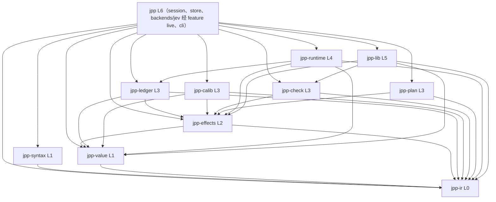
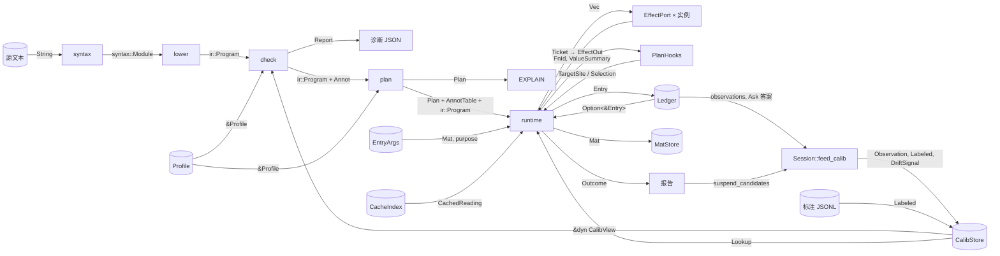

# 20 · 架构方案 v2：J++ 的目标架构

**v2（2026-09-24）。** 本版在 v1（`20-架构方案-v1.md`，留档不改）上合入 2026-09-24 三份裁定附注标出的「下一版合入」项，以及 `过程记录/总账待补条目.md` 里标「20 待改」的两条。改动处就地以〔Bn 改：原文……〕标出，原文可追溯；依 Nature 2026-09-23 授权写入，Nature 可点名否决。改动清单：
- **B74（crate 上限 11，`评估①裁定` §三）**：§2.1 crate 表、层数与内核计数；§2.2 依赖表与第 2 条；§2.3 原 `jpp-store`、`jpp-backend-jev`、`jpp`、`jpp-cli` 四段合为 `jpp` 一段（四个模块）；A6；§2.5 缓存行；§五 S1、S2、S8 与末段；§6.1；§6.2；§6.3；§七；§8.1；§九；§十；§11.1；§十三 T6；终审记录第 9 条加注。`21` 步 23 拆 23a（`schedule` 与 J-15 降级方向）与 23b（`fission`、`lower`、`plan` 三个 pass 以触发 §3.9 行的示例为建造条件）：§2.3 `jpp-plan`、§3.9 未测行为表、§6.2、§七。
- **B72（`Trial` 等级）、B75（`Class` 不放行、混合样本）、B68（`OutOfScope`，`探针首轮裁定`）**：§3.4 `Exit.grade` 与等级表；§3.8。
- **B76（题类映射与落点）**：§2.1 表 `jpp-syntax`、`jpp-ir` 两行；§2.3 `jpp-ir` 接口与 `jpp-syntax::lower` 拥有的数据；§3.3 `Question.kind`、`Form.over_kind` 与映射表位置；§3.4 `ReadingMeta.kind`；附录 A B46 的总账引用（N4、N7 → L-067、K-158）。
- **B73（真机必须带画像）**：§2.3 `jpp::cli`；§3.9；§九 画像行。
- **B77（账本头 `calib_used_hash`）**：§2.3 `jpp-ledger` 的 `HeaderCompared`（十一字段）；§3.7 第 (4) 条；§4.2；§4.3；§九 账本行；§十二 D13 行。
- **B71（规则读面 `Cx`，`施工中裁定` §二）**：§2.3 `jpp-check` 接口块两行；检查器内部分工说明；`jpp-ir` 的 `AnnotTable` 说明一句。
- **B83（续接时的命中记录，`附注/2026-09-24-B83续接缺口裁定.md` §一，2026-09-24）**：§3.7 第 (1)、(4) 条；§4.2；§4.3；§九 账本行。头行 `calib_used` 是本趟实际命中的记录集合，每趟改写；续接换线报 `W-header` 并列键、不拒绝；格式不变。
- **B84（值级来源，同附注 §二，2026-09-24）**：§3.1 来源标签；§3.2 `Mat.sources`、`State.parents`；§3.3 `Question.sources`；§3.7 第 (2)、(3) 条；§3.10 表加 sources 列并加两行；§2.4 B33 行。`Mat.from_key`、`Question.from_key` 并入来源标签 `sources`；`derived_from` 为其 q_hash 投影。
- **B85–B91（标注门槛裁定，`附注/2026-09-24-标注门槛裁定.md`，2026-09-24）**：§2.3 `jpp-calib` 的 `commission`、`load` 注释与 `Cert`、`scope` 字段；§3.4 等级派生读 `alpha_eff`；§3.8 证书字段（认证方式、候选规则与停点、`order`、`alpha_eff`、`truth_baseline`、`scope.extensions`）；§4.4 第 1–3 条与新第 8 条。缺省认证方式改为固定序不拆分（B86），序贯（B87）与拆分（B85）可选；待标清单不带读数（B88）；模型标注的 `alpha_eff`（B89）；范围扩展按 α（B91）。
- **B104 与 B87 修订（`附注/2026-09-24-B104裁定.md`，2026-09-25）**：§3.4 条件表加 `delta_unknown`、`scope_unknown` 两行与 `releases()` 两项；§3.8 `selection.delta`、`scope.n_text`、序贯候选与 `arrival` 的生成方式；§3.9 δ 的过渡规则一句；§4.4 第 3 条（序贯候选、顺序与「各自有效」）、第 4 条（`load` 证明旧证书的 δ 并写回）。判区带宽不小于证书记录的认证带宽；无指纹的记录范围未知、不放行；序贯的 `random` 顺序必须与标签无关。
- **B105–B106（`附注/2026-09-25-B105-B106裁定.md`，2026-09-25）**：§2.3 `Program.entry` 注释（由 `Session::compile` 从宿主名字表写入，语法待 A-13）、`EntryArgs` 定义（值条目与材料条目、`purpose` 绑定）、`Session::compile` 签名；§3.2 `Origin::Input` 只指材料条目；§3.10 宿主入口行拆为值条目与材料条目两行；§七宿主入口行状态。`mat(input.x)` 仍记 `Computed`；`entry_hash` 为整份入口的哈希。
- **B107–B117（`地基/附注/2026-09-25-批量裁定.md`，2026-09-25）**：§2.3 `EntryArgs` 句（CLI `--input-trusted`，B108）；§2.4 J-08 行加静态子面（步 24-0）；§3.4 等级派生（alpha_eff 超过试用 α 为 `Provisional`）；§3.6 `Outcome` 加 `ignored`（B110）、情景树为派生视图（B112）；§3.7 (1) `calib_ref.key`（B116）；§3.8 键空间、生产者去向与迁移（B116）；§4.4 第 1 条（清单按 `(item, q)`，B107）、第 4 条（`load` 复现判据，B117）。
- **B122、B124（`地基/附注/2026-09-25-待补批量裁定-2.md`，2026-09-25）**：§4.4 第 4 条（旧证书 δ 多解与无解都降 `Fixture`，`load` 不在多解里挑）；§九账本行（步 18a 账本 v3：`calib_used` 改为 `Entry::CalibUsed` 条目、`calib_used_hash` 移出比对集合改逐键比、`output_mat` 序列化 sources 与边种类、为 20a-2 留位 `calib_ref.{key, kind, fill}`）。§2.3 `jpp-ledger` 的 `HeaderCompared` 代码块按 B124 读作十字段加 `CalibUsed` 逐键比，下一版改字面。B126、B127 只改 `12` 与 `21`。

- **B121（守卫证据的产生点，`地基/附注/2026-09-25-B121守卫证据裁定.md`，2026-09-25）**：§2.4 J-08 行守卫栈的来源；§3.1 `GuardEv` 四条产生与合并规则改写（读出 = `handle` 分派，`Unsure` 恒空，证据随值走，删 let 旁路表）；§3.10 `Exit → Bool` 行与控制流行。`21` 插热修步 16-0、改写步 16、登记 A-14。
- **B128（作者声明线，`地基/附注/2026-09-25-作者主权与策略表达裁定.md`，2026-09-25）**：§2.3 `EntryArgs.accept`（宿主接受声明，进 `entry_hash`）；§3.4 `grade` 加 `Declared`、等级表加 `Declared` 行、正交位表加 `host_accepts_declared`、`releases()` 改写；§4.4 第 9 条（声明线不进 `CalibStore`，报告证据量）。B129（策略三式）、B130（检验负担）只改 `12` 与 `21`。
- **B131（出口合成，`地基/附注/2026-09-25-库层出口合成与待补批3裁定.md` §一，2026-09-25）**：§2.4「出口只由桥产生」行改写（加合成构造 `compose`、封闭规则集）；§3.4 `releases()` 加合成出口合取句与 `grade: None ⇒ 假`；§五 S3 一句。条文本体在 `12` §2.3 B131 条。B132（`iterate` 留内核）、B133（元素记录构造 `element`）只改 `12`、`21` 与本文 §五 S3 一句。
- **B92–B95、B97（仪表读数 4 诊断与裁定，`评估/2026-09-24-仪表读数4诊断与裁定.md`，2026-09-24）**：§2.3 `jpp-check`、`jpp::cli`（B97 诊断编号表、`describe`/`explain`）；§2.5 批调度行加两条无意绕过的写法（B94）；§3.1 来源标签的边种类（B92）；§3.6 聚合构造的未决须显式转交（B81 (c) 核对）；§3.10 三行标边种类（B92）；§4.3 预算停机不再 `Halt`（B93）；§五 S3 生成来源推广到内置与效应（B97）。
- **补遗（`评估①裁定` §十，2026-09-24）**：§3.4 拆为等级表与条件表（`scope_out`、`suspend_candidate` 为正交位，不是等级）；§3.1 加谱系放行；§4.1 第 2 步按 B76 改写；§2.3 触发点统一以 `NodeId` 为键；四条模块级约束确认；v1 状态段加注。
- **总账待补「20 待改」两条**：`Plan.triggers` 以触发点的 `NodeId` 为键；`PlanHooks` 的 `instantiate` 带环境视图 `EnvView`，另有 `speculate`、`may_effect`，`select_within` 随 `21` 步 22 加入，13b 后冻结（§2.3 `jpp-ir::plan`、`jpp-plan`；§4.1、§4.5 调用写法）。

附录 A、附录 B、评审处理记录、终审记录是历史记录，原文不改（附录 A B46 的总账引用更正与终审第 9 条加注除外）。其中出现的 `jpp-store`、`jpp-backend-jev`、`jpp-cli` 按 B74 读作 `jpp::store`、`jpp::backends::jev`、`jpp` 的 `cli/` 模块；「`HeaderCompared` 十字段」按 B77 读作十一字段。施工排期仍归 `21`。

---


以下为 v1（2026-09-23）的起草记与状态段，保留为历史；其中代码 HEAD、「新增 crate `jpp-value`、`jpp-stat`」等陈述已被 v2 改动清单与终审记录取代，现状以黑板为准（补遗 12(h)）。

2026-09-23 记。起草：Fable 5.1（架构师，依 `17` 阶段 1.5）。输入：`00-定位与方法论-v1.md`、`00-目标与动机-v1.md`、`12-IR与类契约-v0.1.md`（含 B1–B35）、`13-Rust实践反馈设计修订-v0.2.md`、`00-宪法.md`、`18-设计总账-v1.md`、`17-总规划-v1.md`、`20a-语言架构评价标准-v1.md`、`20b-设计对问题的追溯表-v1.md`、五份现状测绘（`过程记录/架构测绘-*.md`）、题库原型分支 `488218a` 的 `地基/题库/规范.md` §六、`过程记录/总账待补条目.md` 末段。代码事实以 `rust-jpp` HEAD `c4a4265`（含 B33 提交 `d29e48d`）为准；本文未修改任何代码。

**状态。** 本文是设计方案与架构方案合一的主文档。正文按 Nature 2026-09-23 授权由 Fable 裁定的技术项（附录 A，B37 起）与既有依据文本一起约束施工；Nature 保留点名否决权。附录 A 每条按 `00-定位与方法论` §5.5 六项写；正文里凡引用附录 A 的条目，写「（B37）」这样的编号。本文不写施工排期，排期归 `21-工程方案-v1.md`。**2026-09-23 同日经三份对抗评审（`过程记录/架构评审-{可实现性,防漂移,目标对齐}.md`）后修订**；逐条处理记录见文末「评审处理记录」。修订后新增裁定 B56–B60，新增 crate `jpp-value`、`jpp-stat`，层号按实际依赖重排。**2026-09-23 晚经独立 Fable 终审（未参与设计）后再修订**：附录 A 改号为 B37–B61（原 B36–B59 与 `19` 的 B36「真值复核改由 Fable」撞号），`jpp-stat` 并入 `jpp-value::stat`、`jpp-lower` 并入 `jpp-syntax::lower`（极简性维度），层号重编为 L0–L7，逐条见文末「终审记录」。

**读法。** 只用 `00-定位与方法论` 术语表的术语。「能力画像」即依据文本里的「档案」`Profile`；「题式」指带槽的题模板，「题类」指题的分类；缝为八条。§二是主体：每个模块写唯一职责、对外接口、拥有的数据、不变量与强制点、禁止依赖谁。§二末尾的两张表（不变量登记表、缝到模块表）是评审取数的入口。§十二按 `20a` 逐维自评，评的是「方案承诺」，施工后按代码再评一次。

**与共识冲突之处（先列，正文按共识处理）。**
1. 任务说明沿用「判断器为底层效应」；本文按术语表处理为各效应同级、各带画像，`judge` 的特殊只在它产出读数并必须过桥。架构上的落点是 §二 L5 的效应注册表：五种效应经同一条注册机制，`judge` 只多一个 `produces_reading` 字段。
2. `12` §5 把料库、题库、handler 库列为「库（不是语言）」，`12` §2.12（B17）又要求组合契约「检查器认得」。本文把这类「库层产物但内核要认得其形状」的东西放在 IR 的契约类型里（§三·7），库只提供实例。
3. `20b` §四 Q1 提出 `gen`/`do`/`ask` 缺画像字段；术语表说各效应带画像。本文按术语表设计（B37），并指出 `12` §1.2 只给 `judge` 定类假设是对的：类假设是「判断器这一类」的性质，其他效应只有成本、时延、并发、失败类型这些调度输入，没有需要降级规则的假设。
4. `12` §4 表在 HEAD 已含第 8、9 两行（推测提升、循环向量化），`INTERFACE.md` 与两份测绘记录的「文档写 7 实际 9」已不成立，不再列为偏差。
5. `设计/C-模块与标准.md` 的九模块是 B5、B13、B17、B20、B21 之前划的；本文 §六·3 按新条目重画，并给每个模块一条「去掉它哪条验收坏」的消融判据（Q19）。
6. **深度缝只有一半由内核接管。** `00-目标与动机` §三要求「何时再往下问一层，何时停」全部由编译器接管；本版只把「何时停」（三条终止线）放进内核，「何时再问一层」由 `jpp-lib/derive/*.jpp` 的确定性派生与作者控制流承担（B43）。§2.5 按此如实登记为「可绕过」，§十三 T7 写差距与推翻条件。这是与共识的差距，不是被消解的冲突。
7. **两类判断器在同一程序里作为效应调度，本版只到数据模型。** `00-定位与方法论` §二要求高成本判断器与低成本判断器都作为带画像的效应调度；本版数据模型留位（效应实例 = 效应种类 × 模型 id，B60），路由规则不裁，B38 的「两个 `Session`」是本版权宜。
8. HEAD 把 `sieve`/`pair`/`tally`/`first_k`/`iterate` 写成 Rust 内置；`12` §5 把骨架定为「库（不是语言）」的普通函数。本文按 `12`：骨架一律是 `jpp-lib` 的 `.jpp` 函数，内核构造只收需要内核能力的构造（§五 S3 准入闸门）。HEAD 的 Rust 骨架是施工差距（§六）。

---

## 目录

- 一、总则：架构要保证什么
- 二、分层与模块
  - 2.1 层与 crate 总表
  - 2.2 依赖规则
  - 2.3 逐模块说明（L1 前端 … L6 `jpp`）
  - 2.4 不变量登记表
  - 2.5 八条缝的决定模块
- 三、数据模型
- 四、关键流程
- 五、扩展点
- 六、与现状的差距
- 七、依据文本中尚无代码模块的职责落位
- 八、模块依赖图与数据流图
- 九、存储
- 十、适用场景
- 十一、规范与约定
- 十二、自评（按 `20a`）
- 十三、设计取舍（按 §5.5 六项）
- 附录 A · 候选裁定 B37–B61
- 附录 B · 最需要评审挑战的决定
- 评审处理记录（2026-09-23 三份对抗评审）
- 终审记录（2026-09-23 晚，独立 Fable 终审）

---

## 一、总则：架构要保证什么

架构不是为了整洁，是为了让 `00` 系列的四类锚点落到结构上。每条原则后面写它挂在哪个锚点，评审时先核锚点再核结构。

**A1 八条缝的每个决定期各有唯一的决定模块。** 批调度、深度与终止、未决去向、预算、缓存与增量、校准、判断力缺席、时延预算，每条缝在 §2.5 的表里按「计划期决定」「运行期决定」两列各恰登记一个模块（没有该期决定的写「—」）；其他模块只提供输入或执行决定，不重复决定。表的行格式就是新增一条缝时的登记格式（`20b` Q17）。锚点：`00-定位与方法论` §三；`20a` D19。推论：任何模块内出现「按语法形状决定调度」的分支，都是缝退回局部的信号（D1.3）。

**A2 效应经同一条注册机制，画像是效应的属性；IR 与运行时按 `EffectSpec` 字段分派，不按效应名分支。** 五种效应在 IR 上是同一个节点 `Node::Effect { effect: EffectId, .. }`，各有一个 `EffectSpec`（§2.3 `jpp-effects`）；规划、调度、账本键、taint、登记、执行六处只读 `EffectSpec` 的字段（`produces_reading`、`side_effecting`、`sched`、`taint_rule`、`key_parts`、`input_schema`、`output_shape`）。`EffectId::` 的具体变体名只允许出现在 `jpp-effects` 的注册表文件与固定观察客户端里，CI 用 grep 拦（§11.1）。判断器的价格、时延、并发、窗口、缺陷只以画像字段出现（B15）。锚点：术语表「效应」；`00-目标与动机` §二；`20a` D5.2、D20。

**A3 每条不变量恰有一个静态强制点和至多一个运行期兜底点，登记在 §2.4；带「唯一构造者」不变量的类型与其构造者同 crate。** 强制点必须位于所有路径必经之处：出口只能由 `jpp-value::bridge` 产生、读数答案只能由 `flush.rs` 填进运行时私有的读数表、`do` 的放行只经一个守卫检查点、未决责任只经一个责任表登记与销账。Rust 的可见性只到 crate 与模块，所以「只有某模块能构造」这类强制点，类型定义与构造函数必须在同一个 crate 里，字段 `pub(crate)`，外部只有访问器；反序列化走 `TryFrom<Raw>` 重新经过构造函数，是第二条构造路径，同样登记强制点。凡不能这样写出的强制点，登记表里不得标「类型」，只能标「CI grep」。锚点：`20a` D4、D14；`12` §2.11 通则「每一个把值搬过去的边界默认丢来源」、§11.6 第 3 条。

**A4 IR 独立于语法树，pass 只写标注表与计划，运行时只读 IR、标注表与计划。** 效应节点、`cut`、`fit`、`loop`、`handle`、`consume`、`state`、`construct` 是 IR 的类型化节点，不是按字符串识别的调用。IR 在降级后不可变；检查器与 pass 的产物写进独立的 `AnnotTable`（按节点 id 索引），「pass 不改节点」由 `&ir::Program` 的类型保证，不靠差分。运行时不依赖 `jpp-plan` crate，只拿到 `jpp-ir::plan` 里的 `Plan` 数据与经端口注入的两个纯函数（站点实例化、层内挑选）；「运行时不自行判定许可」由 `Cargo.toml` 保证。锚点：`20a` D1、D2、D1.3；`12` §4「每个 pass 一个开关」。

**A5 账本是审计物，不是缓存。** 恢复只以账本为准（`12` §2.6，B35）；重放零调用、逐字节一致；报告的每个字段从账本派生。缓存索引是账本的派生物，可丢弃可重建。锚点：`12` §2.10、J-18；`20a` D8.4、D11、D13。

**A6 内核不依赖任何具体客户端、文件格式或命令行。** 真机客户端、文件存储、CLI 各在内核之外（`jpp` crate 的 `backends/`、`store/`、`cli/` 模块）；内核只见 trait。〔B74 改：原文「各在内核之外的 crate」；依 Nature 2026-09-23 授权，Fable 裁定 B74（地基/附注/2026-09-24-评估①裁定.md）〕锚点：`20a` D3.3、D17.4；验收 3「换接口程序不改」。

**A7 兜底值倒向拒绝，且先问倒过去还回不回得来；未测的数值不由内核编一个数。** 未测的布尔类假设按 J-15 取保住守卫的一侧；优化行按 B39 的「失败方式」定方向；未测的数值字段（δ、窗口、K 上限、并发、价格、时延）按 §3.9 的「数值字段未测行为表」取一个**不需要数值**的保守行为，计划估计以 `Estimate::Unknown` 传播，不写成 0 也不写成内核常数；停岗这类不可逆的拒绝不自动做（B25）。内核 L0–L4 里代表判断器属性的数值字面量在 CI 用 grep 拦（§11.1），允许名单只有 `jpp-value::stat` 的统计常数与测试目录。锚点：`12` §2.11 通则；`20a` D20.1、D20.4；`00-定位与方法论` §八第 3 条。

**A8 规模约束。** 单文件不超过 1,500 行，单函数不超过 150 行；一个文件只隐藏一项会变的设计决定（Parnas）；超限即拆。执行者：`clippy.toml` 的 `too-many-lines-threshold = 150` 与 CI 里一段统计文件行数的脚本，超限即失败。`interp.rs` 4,151 行、`check.rs` 2,121 行、`effects.rs` 1,923 行都违反此条，§六给拆分表。锚点：`20a` D3.4、D18。

---

## 二、分层与模块

### 2.1 层与 crate 总表

从源码到执行共七层、十一个 crate〔B74 改：原文「八层、十四个 crate」；依 Nature 2026-09-23 授权，Fable 裁定 B74（地基/附注/2026-09-24-评估①裁定.md）〕。层号按 §8.1 的实际依赖图编：高层号只依赖低层号，同层号之间互不依赖。行数是目标量级，不是上限；单文件 1,500 行是硬上限（A8）。

| 层 | crate | 唯一职责 | 输入类型 → 输出类型 | 目标规模 |
|---|---|---|---|---|
| L1 | `jpp-syntax` | 文法与降级：词法、语法、表层 AST、多文件装载、源位置；`lower` 模块把表层 AST 降为 IR（名字解析、注册表驱动的节点识别、预算块解析）〔B76 改：原文括号内另有「题类推断」，推断函数移到 `jpp-ir::question_kind`〕 | 源文本 → `syntax::Module`（带 `Span`）→ `ir::Program` | 2,300 |
| L0 | `jpp-ir` | IR 本体：类型化节点、站点表、标注表、良构检查、打印；`key`（全部键与 id 类型）；`plan`（`Plan`、`SitePlan`、`TriggerPlan`、`Estimate`、运行期钩子 trait `PlanHooks`）；`question_kind`（题类推断函数与 `QuestionKind`，B76） | 无输入（类型定义） | 1,800 |
| L1 | `jpp-value` | 值模型：`Value`、`Mat`、`State`、`Question`、`Form`、`ReadingMeta`、`Exit`、`Duty`、契约值 `Outcome`、`Taint`/`GuardEv` 及其合并；桥的纯函数 `bridge::cut`；契约值的验证式构造；`stat` 模块（纯统计：二项上界、保形、认证、漂移、代价线，原 `conformal.rs`） | 数据 + `Lookup` → `Exit`；数 → 数 | 2,000 |
| L2 | `jpp-effects` | 效应本体：`EffectSpec` 注册表、画像 `Profile`（按效应实例分表）与 JSON Schema 生成、统一效应端口 trait、`CalibView`/`FitView`/`MatStorePort`/`CacheLookup` 视图 trait、固定观察/零调用/重放三个内置端口 | trait 与类型定义 | 1,600 |
| L3 | `jpp-ledger` | 账本：条目、账本头、编解码（JSONL 链式）、版本、`depth_profile` 等只读聚合 | `Entry` ↔ 字节 | 1,000 |
| L3 | `jpp-calib` | 校准与真值：记录、证书、两侧认证、真值通道、停岗候选、迁移报告、`allocate`/`unsure_bound` 的读线函数；实现 `CalibView` | 标注 → 记录；记录 → 线 | 2,800 |
| L3 | `jpp-check` | 静态检查：名称、类型、效应推断（含可组合的结构摘要 Φ）、J/B 规则单元、诊断层 B13、报文；产物写 `AnnotTable` | `ir::Program` + `Profile` + `CalibView` → `Report` + `AnnotTable` | 3,500 |
| L3 | `jpp-plan` | pass 管线与计划：九个 pass 各一文件，输出 `Plan`（估计、按站点与触发点的许可）；实现两个运行期钩子（站点实例化、层内挑选） | `ir::Program` + `AnnotTable` + `Profile` → `Plan` | 2,500 |
| L4 | `jpp-runtime` | 解释执行：求值器、登记、刷新与层、读数表、责任表、守卫栈、预算核、层内调度、内核构造 | `ir::Program` + `AnnotTable` + `Plan` + 端口 → `Outcome` | 5,000（分 13 个文件） |
| L5 | `jpp-lib` | 标准库：Rust 侧 S 库（`transform` 函数、渲染、`review_material`、`diagnose` 包装）与 `lib/*.jpp`（四骨架、handler、契约读法、派生守则、题库题式） | 函数与 `.jpp` 源 | 1,200 + `.jpp` |
| L6 | `jpp` | 宿主接口与命令行，一个 crate 带 lib 与 bin 两个目标：`session/`（facade：`Session`、`compile`/`explain`/`run`/`replay`/`resume`/`feed_calib`，不读写固定路径）、`store/`（持久对象：料库、题库、画像装载、缓存索引、存储后端、迁移，原 `jpp-store`）、`backends/<name>/`（真机端口，feature 门控；`backends/jev/` 只在 feature `live` 下编译，原 `jpp-backend-jev`）、`cli/`（参数、文件路径、报告落盘、真机开关，bin 目标，原 `jpp-cli`）〔B74 改：原文本行只是 facade（600 行），另有 `jpp-store`（L4，1,600 行）、`jpp-backend-jev`（L5，700 行）、`jpp-cli`（L7，1,200 行）三行三个 crate；依 Nature 2026-09-23 授权，Fable 裁定 B74（地基/附注/2026-09-24-评估①裁定.md）〕 | 库 API；进程入口 | 4,100 |

内核 = L0–L4 里除 `jpp-syntax` 外的八个 crate〔B74 改：原文「九个」，`jpp-store` 移出内核成为 `jpp::store`〕。现状的 `jpp-core`（11,471 行、9 个文件）拆成它们；`jpp-frontend` 改名为 `jpp-syntax`，`lower.rs` 成为它的 `lower` 模块（终审并入，原拟独立 crate `jpp-lower`；`conformal.rs` 同理成为 `jpp-value::stat`，原拟 `jpp-stat`；理由见终审记录第 9 条）。`jpp-store`、`jpp-backend-jev` 不再是 crate，是 `jpp` 的模块；`jpp-cli` 并入 `jpp` 的 bin 目标（B74；`jpp-plan` 受 §2.2 第 3 条保护必须建，`jpp-lib` 作 B21 准入边界保留到 `21` 步 32 复核）。拆分映射与施工顺序见 §六。

### 2.2 依赖规则

1. **只能向低层号依赖；允许的依赖集合是一张表，CI 核对。** 表：`jpp-syntax → ir`；`jpp-value → ir`；`jpp-effects → ir, value`；`jpp-ledger → ir, value, effects`；`jpp-calib → ir, value, effects`；`jpp-check → ir, effects`；`jpp-plan → ir, effects`；`jpp-runtime → ir, value, effects, ledger`；`jpp-lib → ir, value, effects, check`；`jpp → 全部`。`jpp` 的 `backends::jev` 只在 feature `live` 下编译，`ureq` 是可选依赖，只由该 feature 引入〔B74 改：原文另有 `jpp-store → ir, value, effects, ledger, calib`、`jpp-backend-jev → ir, value, effects`、`jpp-cli → jpp` 三条；依 Nature 2026-09-23 授权，Fable 裁定 B74（地基/附注/2026-09-24-评估①裁定.md）〕。执行者：`scripts/deps.py` 读 `cargo metadata`，逐 crate 比对这张表，多一条即失败。同层号之间互不依赖（表里没有）。
2. **内核（L0–L4）不引用 `jpp`（含其 `backends/`、`cli/` 模块）、任何 HTTP 库、任何固定文件路径。**〔B74 改：原文「不引用 `jpp-backend-jev`、`jpp-cli`」〕 由第 1 条的表保证；`home_dir`/`"~/"` 另加一条 grep。
3. **运行时（L4）不依赖 `jpp-syntax`，也不依赖 `jpp-plan`。** 运行时只看 IR、`AnnotTable` 与 `jpp-ir::plan` 的数据类型；推测、向量化、刷新点标记都是 L3 写的标注；需要在运行期才能算的两件事（拿到方法值后实例化目标站点、超预算时按价值密度挑选本层子集）经 `Ports.hooks: &dyn PlanHooks` 注入，trait 定义在 `jpp-ir::plan`，实现在 `jpp-plan`。运行时因此**做不了**自己的分析（D1.3 由 `Cargo.toml` 保证）。
4. **检查器（L3）不持有客户端、不做 IO、不依赖 `jpp-value`。** 它只看 IR 与题字面量，读画像与校准的只读视图 `CalibView`（trait 在 `jpp-effects`，`jpp-calib` 实现）。
5. **`jpp-ir` 零内部依赖**（外部依赖 `serde`、`serde_json`、`sha2`）。所有跨 crate 传递的键、id、枚举（`SiteId`、`NodeId`、`ModelId`、`Phys`、`Op`、`Cause`、`LineGrade`、`JudgeKey`、`CacheKey`、`EffectKey`、`AskKey`、`CalibKey`、`CalibRef`、`FitRef`、`Lookup`、`Delta`、`EffectId`、`EffectInstance`）都在 `jpp-ir::key`，其他 crate 只隐藏它们的编码、查找与认证。
6. **可见性默认 `pub(crate)`。** 每个 crate 的 `lib.rs` 只 `pub use` 对外接口；带唯一构造者不变量的类型字段一律 `pub(crate)`（A3）。不设 `pub` 占比指标（无工具取数）。
7. **每个 crate 的 `lib.rs` 顶部一句「本 crate 隐藏的设计决定」**（D3.2），见各模块说明的「隐藏的决定」栏。

### 2.3 逐模块说明

每个模块按同一格式：隐藏的决定 / 对外接口 / 拥有的数据 / 不变量与强制点 / 禁止依赖。接口写到 trait 与函数签名级；类型定义见 §三。

#### L1 · `jpp-syntax`（文法、前端与降级）

**隐藏的决定。** `.jpp` 的具体文法。改文法（例如加 `match` 关键字、`Fn(A) -!{judge}-> B` 记法）只改这里：文法在 `parse`，表层名到 IR 节点的映射在 `lower` 模块（下文「L1（续）」）。

**对外接口。**
```rust
pub fn lex(src: &str, file: FileId) -> Result<Vec<Token>, Vec<SyntaxDiag>>;
pub fn parse(tokens: &[Token]) -> Result<Module, Vec<SyntaxDiag>>;
pub fn load(entry: &Path, resolver: &dyn SourceResolver) -> Result<Vec<Module>, Vec<SyntaxDiag>>; // 相对 import
pub trait SourceResolver { fn read(&self, path: &Path) -> Result<String, String>; }   // 嵌入宿主可替换
pub struct Module { pub items: Vec<Item>, pub budget: Option<BudgetExpr>, pub spans: SpanTable }
```
`SourceResolver` 让 L1 不直接读文件系统；CLI 提供文件实现，嵌入宿主提供内存实现（D17.4）。

**拥有的数据。** 表层 AST（`syntax::Expr` 等，14 个通用节点，与现状同构）、`Span`/`FileId`/`SpanTable`。表层 AST 不认识六形式，这是刻意的：文法层不承担语义识别。

**不变量与强制点。** 每个节点带 `Span`（`SyntaxDiag` 必带位置）。无语言级不变量。

**禁止依赖。** `jpp-ir` 以外的内部 crate。判据：`Cargo.toml` 只有 `serde` 与 `jpp-ir`；`lex`/`parse` 不引用 `jpp_ir`（文法层不承担语义识别，grep 为 0），只有 `lower` 模块引用。

#### L0 · `jpp-ir`（IR 本体）

**隐藏的决定。** 语言有哪些形式、它们的字段是什么。这是全项目最稳定的模块：依据文本改一种形式才改它。

**对外接口（节点）。**
```rust
pub struct Program { pub version: IrVersion, pub functions: Vec<Function>, pub entry: EntryDecl /* 入口参数声明：名字、种类（值 / 材料）、taint；由 Session::compile 从宿主名字表写入，源码声明语法待 A-13（B106）；serde 缺省、空不序列化、不进哈希 */,
                     pub budget: Budget /* 必填，非 Option */, pub sites: SiteTable }
pub enum Node {                                   // 每种语言形式恰一个变体（D2.2）；五种效应共用 Effect
    State  { on: Vec<Expr>, ctx: Vec<Expr>, r#ref: Vec<Expr>, over: Vec<Expr> },
    Effect { effect: EffectId, via: Option<ModelRef> /* B60，缺省会话默认实例 */, inputs: BTreeMap<SlotName, Expr> /* 按 EffectSpec.input_schema 校验 */,
             taint_out: Option<TaintOut> /* 只对 taint_rule = Declared 的效应允许 */, site: SiteId },
    Cut    { reading: Box<Expr>, calib: Option<CalibExpr>, cost: Option<CostExpr>, site: SiteId },
    Fit    { fit_ref: FitRefExpr, readings: Vec<Expr>, site: SiteId },
    Loop   { bound: Box<Expr>, variant: Option<Variant>, body: Block, site: SiteId },
    Handle { exit: Box<Expr>, arms: Arms, site: SiteId },       // unsure 臂必须显式
    Consume{ duty: Box<Expr>, how: ConsumeHow, site: SiteId },  // drop | escalate | literalize
    Construct { name: ConstructId, args: Vec<Expr>, site: SiteId }, // 内核构造（outcome/allocate/repeat/…），经注册表
    Host(HostExpr),                                             // 字面量、名字、列表、记录、函数、调用、条件、块
}
pub struct Expr { pub id: NodeId, pub node: Node, pub span: Span }           // 降级后不可变
pub struct AnnotTable { /* NodeId → Annot；SiteId → SiteAnnot */ }              // L3 写，L4 读
pub struct Annot { pub effect: Option<EffectRow>, pub summary: Option<Phi>, pub duty_kind: Option<DutyKind>, pub refresh_point: bool }
```
`Host` 里的高阶调用（`map`/`filter`/`fold`）、`if`、`Loop` 与 `let` 值表达式是推测与向量化的触发点，`Plan.triggers` 统一以它们的 `NodeId` 为键（每个 `Expr` 都有 `NodeId`；13a 实现 `BTreeMap<NodeId, TriggerPlan>`）；`SiteId` 只留给效应与构造站点（账本键要它）〔补遗 12(g) 改：原文「与每个效应节点一样带 `SiteId`」〕（§2.3 `jpp-plan`）。`Phi` 是可组合的过程间摘要：函数体的摘要含其形参方法的占位，调用处代入实参摘要后合成（`13` §2「效应在调用处实例化」的静态面）。

标注表只装 L3 之外有读者的标注（规划、运行时）；只在 `jpp-check` 内消费的分析结果（名字表、值类别、作用域）留在分析结果缓存，经 `Cx` 给规则。站点表已表达的所属函数与最近外层站点由规则直接读 IR，不重算、不重存。〔依 Nature 2026-09-23 授权，Fable 裁定 B71（地基/附注/2026-09-24-施工中裁定.md）〕

**对外接口（工具与子模块）。**
```rust
pub fn wellformed(p: &Program) -> Result<(), Vec<IrDiag>>;     // 降级末尾与每个 pass 后跑（D2.3）
pub fn print(p: &Program, a: Option<&AnnotTable>) -> String;    // 可 diff 的文本形式（D2.4）
pub mod key  { /* SiteId、NodeId、ModelId、EffectId、EffectInstance、Phys、Op、Cause、LineGrade、Hash、QHash、FormHash、StateHash、
                  JudgeKey、CacheKey、EffectKey、AskKey、CalibKey、CalibRef、FitRef、Lookup、Delta；q_text_hash 等纯函数 */ }
pub mod plan { pub struct Plan {..} pub struct SitePlan {..} pub struct TriggerPlan {..} pub enum Estimate {..}   // 见 jpp-plan
               pub trait PlanHooks { fn instantiate<'b>(&self, plan: &Plan, body: &'b Function, env: &dyn EnvView) -> Vec<&'b Expr>;   // 形参已绑进 env，实参摘要经视图查
                                     fn speculate<'b>(&self, plan: &Plan, at: NodeId /* let 值表达式 */, block: &'b Block, env: &dyn EnvView) -> Vec<&'b Expr>;
                                     fn may_effect(&self, e: &Expr, env: &dyn EnvView, reach: Reach /* Strict | World */) -> bool;
                                     /* fn select_within(&self, layer: &[PendingSite], remaining: &Remaining, plan: &Plan) -> Selection;  随 21 步 22 加入 */ }
               pub trait EnvView { .. } }                                  // 运行时把求值环境交给钩子的只读视图
pub mod contract { pub struct OutcomeShape {..} }                 // B17 形状，供检查器；值本体在 jpp-value
pub enum QuestionKind { Attr, Rel, Cmp, Class, Mention, Degree, Decide, Subset, Enough }   // 九题类（B76）
pub fn question_kind(op: Op, request: Option<Request>, shape: &SlotShape, decl: &SlotDecls) -> (QuestionKind, KindSource /* Inferred | Declared */);  // 题类推断唯一处（B76）
```
〔总账待补「20 待改」，步 13a 提出，主会话 2026-09-24 认可（地基/过程记录/总账待补条目.md）：`PlanHooks` 原文是 `instantiate(&self, body: FnId, args: &[ValueSummary]) -> Vec<TargetSite>` 与 `select_within` 两个方法。实现带环境视图 `EnvView`：HEAD 的效应判断按运行期环境解析名字，纯静态摘要会改变现有测试结果；另加 `speculate`、`may_effect` 两个方法；`select_within` 随 `21` 步 22 加入；`PlanHooks` 在步 13b 后冻结。〕

**题类推断（B76）。** `question_kind(op, request, 状态槽形, 题式槽声明)` 是题类的唯一推断处，放 `jpp-ir` 是因为 `jpp-check` 不能依赖 `jpp-value`（§2.2 第 4 条），而检查器与运行时都要调它。映射表与不唯一格的处理规则见 `12` §2.2 题类条与 `附注/2026-09-24-评估①裁定.md` §六：不唯一处由题式槽表声明（`over_kind`、`accepts`），缺声明按表中缺省并记 `KindSource::Inferred`，声明与结构矛盾报 `E-kind-conflict`。`kind` 不进 `q_hash`、`form_hash` 与账本。题不是 IR 节点，不加 `Node::Question`，`AnnotTable` 不加字段（B71）。〔依 Nature 2026-09-23 授权，Fable 裁定 B76（地基/附注/2026-09-24-评估①裁定.md）〕
`Construct` 变体带 `ConstructId`，由 `jpp-syntax::lower` 从注册表解析；注册表本身在 L4（`jpp-runtime::constructs`），L0 只持有 id 与签名形状 `ConstructSig`，见 §五 S3。

**拥有的数据。** IR 节点、标注表、`SiteTable`（站点 id → 源位置 → 所属函数 → 所在循环/高阶调用站点）、全部键类型、计划的数据类型。`Budget` 在 IR 里必填（`Program.budget: Budget`），把「预算字段存在」从检查规则变成类型事实（J-07a）。

**不变量与强制点。** `wellformed` 检：每个效应站点的 `site` 唯一；`Effect.inputs` 的槽名集合等于 `EffectSpec.input_schema`（表由 `jpp-syntax::lower` 传入）；`Handle` 有 `unsure` 臂；`Loop` 有 `bound`；`Program.budget` 各字段非负；`Effect.via` 只在多实例画像下允许。键类型都是 `struct`，加分量是编译错（S6）。

**禁止依赖。** 一切内部 crate。

#### （并入 `jpp-value`）`stat` 模块

认证、保形、漂移、代价线用哪种统计量。现状 `conformal.rs` 原样搬入 `jpp-value::stat`；接口 `binomial_upper`、`certify`、`drift`、`cost_line`、`ks`、`psi`，输入输出只有数与切片，无 IO。`jpp-calib`（认证）与 `jpp-runtime`（同趟漂移检查）都经 `jpp-value` 拿到它，不互相依赖。原拟独立 crate `jpp-stat`；终审按极简性并入，理由见终审记录第 9 条。

#### L1 · `jpp-value`（值模型与桥）

**隐藏的决定。** 值长什么样、哪些值只能由谁签发。带唯一构造者不变量的类型（`Exit`、`Outcome`、`Mat`、`State`、`Question`、`Form`）与它们的构造函数放在同一个 crate，字段 `pub(crate)`，外部只有访问器（A3）。读数与责任在程序里只是句柄（`ReadingId`、`DutyId`），本体在运行时的私有表里。「只有 `flush` 能填答案」在 Rust 里写不成可见性（同 crate 的兄弟模块看得见 `pub(crate)` 项），按 A3 登记为 CI grep：`Readings::fill` 的调用点只许在 `flush.rs`（§11.1 `grep_fill.sh`）。

**对外接口。**
```rust
pub enum Value { Unit, Bool(bool, Taint, GuardEv), Int(i64, Taint), Float(f64, Taint), Text(Rc<str>, Taint),
                 List(Rc<[Value]>), Record(Rc<BTreeMap<Name, Value>>), Closure(Rc<Closure>), Builtin(HostBuiltinId) /* 只有通用宿主内置，B56 */,
                 Mat(Rc<Mat>), State(Rc<State>), Question(Rc<Question>), Form(Rc<Form>),
                 Reading(ReadingId), Exit(Rc<Exit>), Duty(DutyId), Outcome(Rc<Outcome>), Fail(Rc<Fail>), Pending(Rc<Pending>) }
pub enum Taint { Trusted, Untrusted }   pub fn join(a: Taint, b: Taint) -> Taint;   pub fn taint_of(v: &Value) -> Taint;   // ∨ 与递归折叠唯一处
pub struct GuardEv { pub from_releasing_judgement: bool, pub via_ask: bool }   // J-08 证据位，随 Bool 走；&& 取并，||、! 清空
impl Mat   { pub fn new(content: Json, origin: Origin, taint: Taint, derived_from: BTreeSet<QHash>, from_key: Option<JudgeKey>, rv: RenderVersion) -> Mat; /* 访问器 */ }
impl State { pub fn new(on: Vec<Mat>, ctx: Vec<Mat>, r#ref: Vec<Mat>, over: Vec<Mat>) -> Result<State, StateErr>; }   // 折 taint、derived_from、parents
impl Question { pub fn fill(form: &Form, fills: &[(SlotName, Value)]) -> Result<Question, FillErr>; pub fn literal(lit: &QuestionLit) -> Question; }
pub mod bridge { pub fn cut(meta: &ReadingMeta, ans: &Answer, lk: &Lookup, guard: &GuardEv, site: SiteId) -> (Exit, Option<DutyNeed>); }  // 唯一出口构造处
pub mod contract { pub fn build(parts: OutcomeParts) -> Result<Outcome, ContractRejected>; }   // B17 三条不变量在这里核，唯一构造
pub mod raw { /* 每个带唯一构造者不变量的类型一个 Raw 结构 + TryFrom<Raw>，serde 只派生在 Raw 上 */ }
```

**拥有的数据。** 值模型（§三）、桥的判序、契约值的验证、`Raw` 类型。

**不变量与强制点。** 「出口只由桥产生」：`Exit` 无 `pub` 构造函数，`bridge::cut` 是 crate 内唯一调用 `Exit::new` 的地方，`tests/bypass/exit_ctor.rs` 用 `trybuild` 断言外部 `Exit { .. }` 与 `Exit::new` 编译失败。B17：`Outcome` 只经 `contract::build`。I6：`Mat::new` 没有默认，`Raw → Mat` 再走 `Mat::new`。`Value::Reading(ReadingId)` 是句柄，无 `PartialOrd`、无算术（J-01 类型面）。

**禁止依赖。** `jpp-ir` 以外的内部 crate；无 IO。

#### L1（续）· `jpp-syntax::lower`（降级模块）

**隐藏的决定。** 表层名字到 IR 节点的映射。效应与构造都从注册表视图解析，不在这里写名字。

**对外接口。**
```rust
pub fn lower(modules: &[syntax::Module], constructs: &ConstructTable, effects: &EffectTable, hosts: &HostBuiltinTable) -> Result<ir::Program, Vec<Diagnostic>>;
```
`ConstructTable`、`EffectTable` 是只读视图，分别由 L4 与 L2 提供，经 facade 传入；`jpp-syntax::lower` 只依赖它们在 `jpp-ir` 里声明的签名类型（`ConstructSig`、`EffectSig`）。

**拥有的数据。** 名字解析环境；表层名到节点的三条规则：效应表里的名字 → `Node::Effect`，构造表里的名字 → `Node::Construct`，宿主内置表里的名字 → `Host(Call)`，其余 → 用户名字。〔B76 改：原文此处有「题类推断函数（`op × slot_shape → QuestionKind`，B46）」；题由构造在运行期造出，降级看不见题值，推断函数移到 `jpp-ir::question_kind`；依 Nature 2026-09-23 授权，Fable 裁定 B76（地基/附注/2026-09-24-评估①裁定.md）〕

**不变量与强制点。** 降级后 `wellformed` 必过（失败即内部错）。`budget` 块缺字段在这里报 `J-07a`，用户看到的预算存在性诊断只此一处。**效应形式与内核构造不作一等值（B56）**：效应名或构造名出现在非调用位置（赋值、传参、放进容器）报 `E-form-as-value`；只有宿主内置表里的名字可以作值。这样每个效应站点都有 `SiteId` 与标注，没有第二条执行路径（D2.2）。

**禁止依赖。** `jpp-ir` 以外的内部 crate（与文法同在 `jpp-syntax`；原拟独立 crate `jpp-lower`，终审按极简性并入）。

#### L3 · `jpp-check`（静态检查）

**B97（2026-09-24，已定未造，落 `21` 步 9b）。** 诊断编号表 `codes.rs` 是所有 `J-*`/`W-*`/`E-*` 编号的唯一登记处：每条 `(编号, 依据条款, 说明, 修法, 正反例)`，规则文件只引用它；`check --json`/`run --json` 的 `explain` 与 `fix` 字段、`jpp explain <编号>` 都读它；CI 核报文里出现的编号都在表里、表里的条款号都能在依据文本里找到（`scripts/clause_refs.py`）。依 Nature 2026-09-23 授权，Fable 裁定 B97（地基/评估/2026-09-24-仪表读数4诊断与裁定.md §五）。

**隐藏的决定。** 哪些性质能不执行就判定，以及判不准时的口径。口径分两种：诊断规则宁可漏报不误报；结构摘要 Φ 用于推测许可，方向相反——看不透的调用一律按「可能有效应」，许可为假（`12` §2.11 兜底往拒绝倒）。

**对外接口。**
```rust
pub fn check(p: &ir::Program, profile: &Profile, calib: &dyn CalibView, fits: &dyn FitView) -> (Report, AnnotTable);
pub trait Rule { fn id(&self) -> RuleId; fn basis(&self) -> &'static str; fn run(&self, cx: &Cx) -> Vec<Diagnostic>; fn requires(&self) -> &[AnalysisId]; }
pub struct Cx<'a> { pub program: &'a ir::Program /* 含站点表 */, pub profile: &'a Profile, pub calib: &'a dyn CalibView, pub fits: &'a dyn FitView, pub names: &'a Names, pub effects: &'a EffectRows }   // 分析结果的只读视图加 check 的输入；规则只收 &Cx（B71）
pub enum AnalysisId { Names, Effects }   // requires 的取值；钩子点必须在所需分析之后，注册测试核（B71）
pub fn rules() -> &'static [&'static dyn Rule];                   // 唯一注册点（S4）
pub fn diagnose_question(q: &QuestionLit, cx: &DiagCx) -> Vec<Diagnostic>; // B13 静态诊断层；运行时经 jpp-lib 的 transform 包装调用（B47）
pub struct Report { pub diagnostics: Vec<Diagnostic>, pub explain: fn(RuleId) -> &'static str }
```
`check` 的产物是 `AnnotTable`：效应行 `Annot.effect`、结构摘要 `Annot.summary`（宪法登记表「效应行多态之外再加结构摘要 Φ」行；过程间可组合，见 `jpp-ir`）、责任种类 `Annot.duty_kind`。`jpp-plan` 与 `jpp-runtime` 只读这张表，不重新分析（D1.3）。

**拥有的数据。** 分析结果缓存（名字表、效应不动点、Φ）；规则单元 `rules/j01.rs … j18.rs`（双面规则拆为 `j06a/j06b`、`j07a/j07b`、`j14a/j14b`）、`rules/i.rs`（I 不变量的静态面）、`rules/b17.rs`（契约形状）、`rules/b23.rs`（`E-fill-type`）、`rules/b34.rs`（`W-class-ambiguous`）、`diag/b13.rs`（诊断层）。每条规则一个文件，文件头写依据条文与静态/运行期分工。

**不变量与强制点。** §2.4 登记表「静态强制点」一栏全部落在本 crate 的 `rules/` 下；每条规则必须配一个绕过测试（`tests/bypass/j-NN.rs`：一个违反它的程序，断言被拒于预期编号与位置）。J-04、J-08（守卫证据静态可追部分）、J-09（证据槽声明存在性）、J-11、J-16、J-17 在现状缺失（测绘 check-front §三），本架构下各得一个规则文件；J-16 读 `FitView`。

**禁止依赖。** 客户端、账本、文件 IO、`jpp-value`；`CalibStore` 具体类型（只经 `CalibView`）。由 §2.2 第 1 条的表保证。

#### 检查器内部的分工说明

现状 `check.rs` 把名称/类型/效应推断与 J 规则写在一个 `Checker` 里（1,700 行 impl）。本架构把它分成两半：`analysis/`（名字、类型、效应行、Φ，三个不动点，产出标注）与 `rules/`（每条规则只收 `&Cx`：IR 含站点表、`check` 的输入、`requires` 声明的分析结果只读视图；不改分析、不自行分析；只读由共享借用保证，`rules/` 引用不到 `Checker`）〔B71 改：原文「每条 J 规则只读标注与 IR」；依 Nature 2026-09-23 授权，Fable 裁定 B71（地基/附注/2026-09-24-施工中裁定.md）〕。分开的理由是 D5.3：新增 J-19 只新增 `rules/j19.rs` 并在 `rules()` 加一行，不碰分析器；`j10` 与 `latency` 两条规则重复的「循环/函数体跨度收集」（测绘 check-front §五第 4 条）并成 `analysis/spans.rs` 一处。

#### L3 · `jpp-plan`（优化与规划 pass）

**隐藏的决定。** 哪些站点可以合并、提前、拆分、并发，以及计划期怎么估钱。这是「批调度」「预算」「时延预算」三条缝的计划期决定模块，也经钩子提供预算缝的运行期决定（§2.5）。

**对外接口。**
```rust
pub trait Pass {
    fn id(&self) -> PassId;                                  // lift | fuse | fission | lower | schedule | plan | ledger | speculate | vectorize
    fn basis(&self) -> &'static str;                         // 依据条文
    fn depends_on(&self) -> &[PassId];                       // 无环，由 pipeline 核
    fn run(&self, p: &ir::Program, a: &mut AnnotTable, plan: &mut Plan, cx: &PlanCx) -> PassReport;   // 节点不可变，由类型保证
}
pub struct Passes { /* 九个 bool，一处定义；默认值 = 已落地者开 */ }
pub fn pipeline(passes: &Passes) -> Vec<&'static dyn Pass>;   // 唯一注册点（S5）
pub fn plan(p: &ir::Program, a: &mut AnnotTable, profile: &Profile, passes: &Passes, ctx: PlanCtx /* 账本是否为空、缓存是否开 */) -> Plan;
pub struct Hooks;  impl PlanHooks for Hooks { .. }             // 两个运行期钩子的实现，经 Ports 注入运行时
pub fn explain(plan: &Plan) -> String;                        // EXPLAIN 文本；JSON 见 §十一
// 数据类型定义在 jpp-ir::plan：
pub struct Plan { pub layers_est: Estimate<u32>, pub calls_est: Estimate<u32>, pub cost_est: Estimate<f64>, pub latency_est: Estimate<f64>,
                  pub unsure_bound: Estimate<f64>, pub per_site: BTreeMap<SiteId, SitePlan>, pub triggers: BTreeMap<NodeId, TriggerPlan> /* 原文键为 SiteId，见下文注 */,
                  pub warnings: Vec<Diagnostic>, pub rejected: Option<Diagnostic> /* 只在可靠下界超预算或时延必超时，B42/B32 */ }
pub enum Estimate<T> { Known { lo: T, hi: T }, Unknown(UnknownReason) }   // 未知显示为未知，不写 0（`14` 附录）
pub struct SitePlan { pub phys: Option<Phys>, pub fission: Option<FissionPlan>, pub sched_class: SchedClass, pub concurrency: Concurrency /* 新类型，只经 Profile 访问器构造 */ }
pub struct TriggerPlan { pub kind: TriggerKind /* BlockFrom(usize) | If | Loop | HigherOrder(HostBuiltinId) */,
                         pub targets: Vec<TargetSite { site: SiteId, needs_bound: Vec<Name> }>,   // 从此触发点出发可提前登记的效应站点
                         pub dynamic: Option<FnSlot> /* 目标在形参方法体内：运行期拿到方法值后经 PlanHooks::instantiate 补 */ }
```
九个 pass 各一个文件 `passes/lift.rs … passes/vectorize.rs`〔B74：`fission`、`lower`、`plan` 三个 pass 文件属 `21` 步 23b，只在有示例触发其 §3.9 未测行为表那一行时才建（消费者 = 一个金样示例带一份该字段未测的画像）；建成前按 §3.9 表的「建成前」写法只告警。`schedule` 属步 23a，照建。依 Nature 2026-09-23 授权，Fable 裁定 B74（地基/附注/2026-09-24-评估①裁定.md）〕。`Passes` 结构体从 `jpp-runtime` 搬到这里，是它唯一的定义处。推测与向量化的许可不是目标站点上的一个布尔，而是「触发点 → 目标站点集」的关系（`TriggerPlan`）：块内位置、`if`、`Loop`、`map`/`filter`/`fold` 调用都是触发点，以触发点节点的 `NodeId` 为键〔总账待补「20 待改」，步 13a 提出，主会话 2026-09-24 认可（地基/过程记录/总账待补条目.md）：原文「各有 `SiteId`」、`triggers: BTreeMap<SiteId, TriggerPlan>`；块内位置的触发点是 `let` 语句，没有 `SiteId`，实现以 `let` 值表达式的 `NodeId` 为键〕。目标站点在形参方法体内时（`lib/methods.jpp` 的 `map(values, method)`、四骨架），静态只能给 `dynamic`，运行时拿到方法值后调用 `PlanHooks::instantiate(plan, body, env)` 得到目标站点集，再按同一规则登记。运行时因此不做分析，但骨架与高阶写法不失去合批（`16` §一十四倍写法的消除路径，§4.5）。

**拥有的数据。** `Plan`；每个 pass 的消融账（`PassReport { calls_before, calls_after, layers_before, layers_after }`），供 D10.3。

**不变量与强制点。** (1) pass 拿不到 `&mut ir::Program`，「不改节点」由类型保证；`wellformed` 在每个 pass 后跑一次。(2) 目标站点只收 `produces_reading && !side_effecting` 的效应，且只当 Φ 证明触发点到该站点之间无 `side_effecting` 或 `sched == Immediate` 的效应、无宿主变换，且路径上的方法值都已解析（K-069/K-075 的修法在这里定型：看不透的按有效应）。(3) `concurrency`、`latency` 估计只引用 `Profile` 字段，未测即 `Estimate::Unknown`（D12.2、D20.1）。(4) 可靠下界超预算 → `Plan.rejected`（B42 修订：只在账本为空且缓存关闭时，对每条路径必经、含至少一个读数站点的直线层按每层一次调用计；其余情形与下界含未知项时只告警 `W-cost`/`W-cost-unknown`）。(5) `PlanHooks::select_within` 是预算缝的运行期决定：按 B7 价值密度与剩余预算把本层分成发出/推迟，推测站点先推迟。

**禁止依赖。** 客户端、账本、运行时、`jpp-value`。`jpp-plan` 是纯函数 crate。

#### L4 · `jpp-runtime`（解释与运行时）

**隐藏的决定。** 惰性登记与刷新的执行策略；读数表、责任表、守卫栈的实现。这是「深度与终止（何时停）」「未决去向」「判断力缺席」三条缝的决定模块，也是「批调度」「预算」「时延预算」的执行模块（决定在 `jpp-plan`）。

**对外接口。**
```rust
pub struct Runtime<'a> { /* 私有字段 */ }
impl<'a> Runtime<'a> {
    pub fn new(p: &'a ir::Program, a: &'a AnnotTable, plan: &'a Plan, entry: EntryArgs, ports: Ports<'a>, opts: RunOpts) -> Self;
    pub fn run(self) -> Result<Outcome, RtError>;              // 一次运行；Pending 是 Outcome 的一种，不是 Err
}
pub struct Ports<'a> { pub effects: BTreeMap<EffectInstance, &'a mut dyn EffectPort> /* 按效应实例，A2/B60 */, pub transform: &'a TransformTable,
                       pub ledger: &'a mut dyn LedgerPort, pub cache: Option<&'a dyn CacheLookup> /* 跨运行读数 */, pub calib: &'a dyn CalibView, pub fits: &'a dyn FitView,
                       pub mats: Option<&'a mut dyn MatStorePort>, pub profile: &'a Profile, pub hooks: &'a dyn PlanHooks, pub clock: &'a dyn Clock }
pub struct Outcome { pub value: Option<Value>, pub pending: Vec<Pending>, pub layers: Vec<Layer>, pub cost: Cost, pub duties: DutyReport,
                     pub suspend_candidates: Vec<CalibKey> /* 本趟漂移触发，供 feed_calib */, pub trace: Trace /* 全部从账本派生，D8.4 */ }
pub mod constructs { pub fn table() -> &'static ConstructTable; }   // outcome/allocate/repeat/order/as_mat/…；骨架不在这里（S3 闸门）〔B138：`key_of` 是读法内置，归 `BuiltinSpec`，不在此〕
```
`Ports` 是按效应实例索引的端口表加账本、跨运行缓存、校准视图、料库、画像、计划钩子、时钟；每个都是 trait，测试用固定观察实现。`Clock` 是唯一的时间来源（D13.1：不确定性只经端口进入）。`EntryArgs { purpose: Option<Text>, values: Vec<EntryValue { name, value: Json, taint }>, materials: Vec<EntryMat { name, mat: Mat }>, accept: HostAccept { declared_lines: bool } }` 是宿主交给程序的目的与材料〔B128 加 `accept`（2026-09-25）：宿主对本趟的接受声明，`declared_lines` 为真时作者声明线（`cut` 的 `declare`，等级 `Declared`）可放行不可逆 `do`；CLI `--release-on-declared`；进 `entry_hash`（与 taint 声明同理：放行方向的杠杆必须进哈希），报告 `entry` 段可见。依 Nature 2026-09-23 授权，Fable 裁定 B128〕〔B105 改，原文 `EntryArgs { purpose: Option<Text>, materials: Vec<(Name, Mat)> }`〕：值条目按 B33 读出规则绑定（叶子 taint 宿主声明、缺省 `Untrusted`，sources ∅，程序直接取字段；CLI `--input` 只产这一种，`--input-trusted` 把整份声明为 `Trusted`、进 `entry_hash`、报告 `entry` 段可见，B108）；材料条目绑定为 `Value::Mat`，`Runtime::new` 盖 `Origin::Input`、清空来源键，taint 由宿主在材料上声明、缺省 `Untrusted`；`purpose` 有则以名字 `purpose` 绑定为 Text（`Untrusted`）。`mat()` 对值条目读出的值仍记 `Origin::Computed`（B33 第 5 条）。这是 `00-定位与方法论` §二预言二「只改最外层的目的与材料来源」的接口落点。

**内部模块（每个文件一项决定，均 ≤ 800 行）。**

| 文件 | 职责 | 对应现状 `interp.rs` 段 |
|---|---|---|
| `eval.rs` | 求值器：`Host` 节点、闭包、环境、整数边界（`13` §6）；`&&`/`||`/`!` 上 `GuardEv` 的合并 | ③ 383–899 |
| `register.rs` | 效应登记：`Node::Effect` 求值只登记，返回句柄或惰性值；到达触发点时读 `Plan.triggers`，目标在形参方法体内时经 `hooks.instantiate` 补目标集，再按同一规则提前登记 | ④ 899–1607 的登记部分与 `speculate_ahead`/`vectorize_ahead` 的执行半 |
| `readings.rs` | 读数表：`ReadingId → (ReadingMeta, Option<Answer>)`，模块私有；`answer_of(&mut self, id) -> &Answer` 是读答案的唯一入口，未填即触发 `flush` | 无（现状答案在 `Rc<Reading>` 内） |
| `flush.rs` | 刷新：收集就绪效应 → 按 `EffectSpec.sched` 与状态哈希分组成层 → 预算预核（超额时经 `hooks.select_within` 挑本层子集）→ 查本运行缓存键 → `CacheLookup` → 账本键 → 调端口 → 按登记顺序写账本 → 填答案。同一账本键只发一次；结构性刷新点表（`if`、`handle`、程序结束、`ConstructSpec.refresh` 为真的构造入口）也在这里 | ⑥ `flush` |
| `schedule.rs` | 层内并发：把一层拆成 `Vec<EffectCall>` 交端口批量提交，`sched == Immediate` 的效应一登记即 `submit`，刷新时 `poll`；超时转 `Unsure(latency)`；缺席熔断（B32/B35）；同趟漂移检查（`jpp_value::stat::drift` 对本趟读数与 `Lookup.reference`），触发即本趟按 `SuspendCandidate` 对待并记入 `Outcome.suspend_candidates` | 无（现状串行） |
| `budget.rs` | 层边界核（`13` §5 顺序：先记事实再核）、`Unsure(budget)` 生成、`absent` 策略 | ⑥ 部分 |
| `bridge.rs` | `cut` 站点：取 `answer_of` → `calib.lookup_for(meta)` 得 `Lookup`（含线、等级、δ、参考分布）→ 调 `jpp_value::bridge::cut` → `Unsure` 时向 `duty.rs` 登记责任；`fit` 桥同路 | ⑦ `cut_inner` 的调用半 |
| `duty.rs` | 责任表：未决责任登记、去向记录、销账；返回前按可达性核（可达性延伸进闭包捕获）；`Fn¹` 检查（B52 修订）；J-05 运行面唯一强制点 | ⑧ `consume`、`handle_unsure`、`collect_exit_ids` |
| `guard.rs` | 守卫栈：`if`/`handle` 臂入口压当前条件值的 `GuardEv`，出口弹；J-08 检查点 `release(stack: &[GuardEv], action: &ActionProfile) -> Result<(), RtError>`，不可逆 `do` 的唯一入口 | ⑤ + ⑨ `guard_of`/`walk_conjuncts` |
| `effects_exec.rs` | 端口调用包装：按 `EffectSpec.key_parts` 构键（`jpp-ir::key`）、按 `taint_rule` 定输出 taint、按 `output_shape` 拆输出、按动作声明的 `mat_shape` 核返回材料的基数与尺寸（违反出 `Fail(ShapeMismatch)`，B51-R2）、`derived_from`/`from_key` 并入 | ⑦ `do_`/`generate`/`ask`/`transform` |
| `constructs/*.rs` | 内核构造，每个一文件，各自注册 `ConstructSpec`（签名、效应、方法位置、是否刷新点、契约形状、`privileges`） | ⑧ `builtin` 的构造臂中通过 S3 闸门的部分 |
| `host_builtins.rs` | 通用列表/文本内置（`map`、`filter`、`len`…），taint 按 ∨ 输入；`Exit → Bool` 读出（`is_act` 等）在这里写 `GuardEv` | ⑧ 其余臂 |
| `outcome.rs` | `Outcome` 组装：全部字段从账本与责任表派生 | ① |

**拥有的数据。** 帧栈、环境、惰性队列、读数表、层记录、责任表、守卫栈（只记 `GuardEv`，不记名字绑定）、缺席计数、本趟漂移窗口。无全局可变量。

**不变量与强制点。** J-02（`bridge.rs` 造出口前查 `derived_from`）、J-05（`duty.rs`）、J-06a（`eval.rs` bound）、J-06b（`flush.rs` 键重复即停）、J-07b（`budget.rs` 层边界核）、J-08（`guard.rs::release`）、J-09（`jpp-value::bridge` 判序第一步）、J-12（`eval.rs` Fail 短路）、J-18（`flush.rs` 首次写账本前比头）。刷新点判据「凡结果依赖答案的操作皆是刷新点」落在唯一入口 `readings.rs::answer_of`；`12` §2.2 明列的结构性刷新点（`if`、`handle`/`match`、程序结束、构造入口）另成一表，两者并列。

**禁止依赖。** `jpp-syntax`、`jpp-plan`、`jpp-calib` 具体类型（只经 `CalibView`）、`jpp::store` 具体类型（只经 `MatStorePort`/`CacheLookup`；原文 `jpp-store`，B74）、任何客户端实现。判据：`Cargo.toml` 只列 `jpp-ir`、`jpp-value`、`jpp-effects`、`jpp-ledger`（§2.2 第 1 条的表）。

#### L2 · `jpp-effects`（效应与后端适配的抽象层）

**隐藏的决定。** 一种效应「是什么」：它的输入槽、输出形状、画像 schema、键的组成、taint 规则、调度类别、是否产出读数。换判断器、加效应都落在这里。

**对外接口。**
```rust
pub enum EffectId { Judge, Gen, Do, Ask, Transform }          // 五种（12 §2、§2.8）；新增须改依据文本；变体名只在本 crate 与内置端口出现（A2）
pub struct EffectInstance { pub effect: EffectId, pub model: ModelId }   // B60：同一效应可有多个带画像的实例
pub struct EffectSpec { pub id: EffectId, pub produces_reading: bool, pub side_effecting: bool, pub sched: SchedClass /* Layered | Immediate */,
                        pub input_schema: &'static [SlotDecl], pub output_shape: OutputShape /* Readings | Mats | Value | Answer */,
                        pub key_parts: &'static [KeyPart], pub taint_rule: TaintRule /* Inherit | Declared | Trusted */, pub batchable: bool,
                        pub profile_schema: ProfileSchema }
pub fn spec(id: EffectId) -> &'static EffectSpec;             // 唯一注册表（S2）；每种效应一文件 kinds/<name>.rs
pub struct EffectCall { pub instance: EffectInstance, pub site: SiteId, pub inputs: Vec<OwnedValue> /* 规范化、Send */, pub phys: Option<Phys>, pub key: EffectKey }
pub trait EffectPort: Send { fn instance(&self) -> EffectInstance;
                             fn submit(&mut self, calls: Vec<EffectCall>) -> Result<Vec<Ticket>, EffectError>;   // 并发在端口内做，上限从画像读
                             fn poll(&mut self, t: &Ticket) -> Poll<Result<EffectOut, EffectError>>; }
pub struct Profile { pub meta: ProfileMeta { model_id, version, hash, behavior_hash, measured_at },
                     pub effects: BTreeMap<EffectInstance, EffectProfile>, pub actions: BTreeMap<ActionId, ActionProfile> }
pub struct EffectProfile { pub cost: Field<CostModel>, pub latency_p95: Field<f64>, pub concurrency: Field<u32>, pub fail_types: Vec<FailType>,
                           pub taint_default: Option<TaintOut>, pub empty_rate: Field<f64>, pub answer_rate: Field<f64>,
                           pub assumptions: Option<ClassAssumptions> /* 只当 spec.produces_reading，B37 */ }
pub struct ClassAssumptions { /* H1–H8 各一或数个 Field<Tri>，字段名与 12 §1.2 表、foundation/profile/SCHEMA.md 一致 */ }
pub fn profile_schema() -> serde_json::Value;                  // 画像 JSON Schema 的唯一来源；run.py 与 ProfileLoader 都对它校验
pub trait CalibView   { fn lookup_for(&self, m: &ReadingMeta) -> Lookup; fn hash(&self) -> Hash; fn unsure_rate(&self, k: &CalibKey) -> Option<f64>; }
pub trait FitView     { fn get(&self, r: &FitRef) -> Option<&FitRecord>; }
pub trait MatStorePort { fn put(&mut self, m: &Mat) -> Addr; fn get(&self, a: &Addr) -> Option<Mat>; fn marks(&self, a: &Addr) -> Vec<CacheKey>; }
pub trait CacheLookup  { fn get(&self, k: &CacheKey) -> Option<CachedReading { record: ReadingRecord, source: LedgerRef }>; }   // 跨运行读数
pub struct FixedPorts; pub struct NoCallPorts; pub struct ReplayPorts;   // 三个内置实现，覆盖全部效应实例（D7.1）
```
现状 `Client` trait 把 `judge`/`generate`/`ask` 合在一个 trait 上，测试桩 41 处（`20a` §三示范）。统一成 `EffectPort` 后，端口按效应实例注册，测试桩只注册用到的实例；`FixedPorts` 是共用测试工具（D7.4）。`submit`/`poll` 让层内并发发生在端口实现里，`sched == Immediate` 的效应在登记时 `submit`、刷新时 `poll`；账本按登记顺序追加，不按返回顺序（D12.4）。`Lookup` 由校准侧从 `ReadingMeta` 构键，`bridge.rs` 不构造 `CalibKey`（S7）。

**拥有的数据。** `EffectSpec` 表、`Profile` 类型与 schema、`Tri`、`Field`。**画像字段的默认值只有一处：`Profile::untested()`，全部 `Untested`**；不存在 `Profile::default()`（D20.4；测绘 effects-calib §四的 `usd_per_input_token` 默认值随之删除，价格只能从画像读）。数值字段未测时各使用处的行为见 §3.9 表，不在这里补数。

**不变量与强制点。** I5（`ModelId` 是解析后的不可变 id，`EffectPort::instance` 必须返回它）；`EffectSpec.taint_rule` 是 `12` §2.11 表的唯一实现（D14.3 与 `jpp-value::taint` 的 ∨ 分工：规则在这里，格运算在那里）；`EffectSpec.input_schema` 是 `wellformed` 与检查器校验效应节点的唯一来源。

**禁止依赖。** `jpp-runtime`、`jpp-calib`、`jpp-ledger`、HTTP。

#### L3 · `jpp-ledger`（账本与重放）

**隐藏的决定。** 账本条目的物理格式和版本；从账本派生哪些只读聚合。键类型在 `jpp-ir::key`，这里只隐藏它们的编码。

**对外接口。**
```rust
// 键（定义在 jpp-ir::key，此处列出以便读）：
pub struct JudgeKey { pub instance: EffectInstance, pub state: StateHash, pub q: QHash, pub phys: Phys, pub render: RenderVersion, pub perm_seed: u64, pub run_seq: u64, pub site: SiteId, pub repeat_n: Option<u32> /* B28 */ }
pub struct CacheKey { pub instance: EffectInstance, pub state: StateHash, pub q: QHash, pub phys: Phys, pub render: RenderVersion, pub repeat_n: Option<u32> }   // 12 §2.10；B40
pub struct EffectKey { pub instance: EffectInstance, pub method: MethodIdentity /* 13 §4 */, pub args: ArgsHash, pub seq: u64, pub site: Option<SiteId> }
pub enum Entry { Judge { key: JudgeKey, cache: CacheKey, reading: ReadingRecord /* op == Select 时按 perm_seed 索引的集合 */, calib_ref: Option<CalibRef>, cost: f64,
                         reused_from: Option<ReuseSource /* Local(JudgeKey) | External { ledger: LedgerRef, seq } */>, parents: Vec<JudgeKey>, hop: u32, layer: u32, merged_by: Option<PassId> },
                 Intent { key: EffectKey, at: Tick },                                     // 不可逆 do 的写前意向（B55，§4.3）
                 Effect { key: EffectKey, output: Mat /* 含 taint、origin、derived_from、from_key */, cost: f64 },
                 Ask { key: AskKey, answer: Option<Answer> },
                 Absent { key: JudgeKey, reason: AbsentReason },
                 Halt { reason: HaltReason, layer: u32 } }
pub struct Header { pub version: u32, pub budget: Budget /* 记录，不比对 */, pub compared: HeaderCompared }
pub struct HeaderCompared { pub profile_hash: Hash, pub behavior_hash: Hash, pub model_id: ModelId, pub render_version: RenderVersion, pub calib_hash: Hash,
                           pub calib_used_hash: Hash /* B77，serde(default) */, pub lib_version: Version, pub bank_version: Version, pub ir_version: IrVersion, pub handler_version: Version, pub entry_hash: Hash }   // 比对集合的唯一定义处，共十一字段
pub trait LedgerPort { fn header(&self) -> Option<&Header>; fn set_header(&mut self, h: Header) -> Result<(), HeaderMismatch>;
                       fn get(&self, k: &dyn Key) -> Option<&Entry>; fn by_cache(&self, k: &CacheKey) -> Option<&Entry>;
                       fn append(&mut self, e: Entry, durability: Durability /* Now | Layer */) -> Result<(), LedgerError> /* 唯一写入口 */; }
pub fn encode_entry(e: &Entry, prev: &Hash) -> Vec<u8>; pub fn decode(bytes: &[u8]) -> Result<(Ledger, Truncated), DecodeError>;   // JSONL：头一行、每条一行带 seq 与前一条哈希；尾行半写即截断到最后一条完整并报告
pub fn depth_profile(l: &Ledger) -> Vec<(u32 /* hop */, u64 /* n */, u64 /* unsure_n */)>;   // 验收 2 的取数函数
pub fn observations(l: &Ledger) -> Vec<Observation>;      // 派生校准观察；reused_from 非空的条目剔除（不重复计入）
```
**账本头的两个校准哈希（B77）。** `calib_hash` 是首跑装载的整个校准库的哈希，`calib_used_hash` 是本趟 `cut` 实际命中的记录集合的哈希（由 `calib_used` 的内容按键排序算出）。J-18 比对规则：只凭账本重放时比 `calib_used_hash`，不比 `calib_hash`（重放只从头行补回命中的记录，装载集不在，库哈希必然不同）；续接两者都比（续接会命中首跑没命中的键，那些键的线来自装载库）。原文「十字段」，没有 `calib_used_hash`，重放比 `calib_hash`。旧账本缺该字段按 `serde(default)` 照读；旧二进制拒读新账本，发行前可接受。推翻条件：续接在实测中从未命中首跑未命中的键时，`calib_hash` 降为只记录不比对，与 `budget` 同列。〔依 Nature 2026-09-23 授权，Fable 裁定 B77（地基/附注/2026-09-24-评估①裁定.md）〕

**拥有的数据。** 条目、头、按账本键与缓存键的两个索引。

**不变量与强制点。** 只增（`append` 是唯一写入口，无 `remove`）；`Effect` 条目存 `Mat` 全字段（堵 `12` §2.4 记录的「账本存 output 不存 taint」与 `derived_from` 往返丢失）；`Judge` 条目记 `calib_ref`、`parents`、`hop`（验收 2）、`layer`、`merged_by`（D8.2 从账本派生）；复用条目 `cost == 0` 且 `reused_from` 非空，计费与观察派生都剔除它（B40 修订）；`decode` 遇未知字段报错并指名（`12` §2.11「无声吞掉一个字段」通则）；所有集合用 `BTreeMap`/排序（D13.5）。**v1 账本（HEAD 格式，键只存哈希）不迁移**：登记为归档，只由 `c4a4265` 版二进制重放；`decode` 遇 `version == 1` 报 `E-ledger-archived` 并指出该二进制。

**禁止依赖。** 运行时、校准、文件系统（编解码只对字节，落盘归 `jpp::store`；原文 `jpp-store`，B74）。

#### L3 · `jpp-calib`（校准与真值通道）

**隐藏的决定。** 一条线怎样从真值产生、怎样认证、何时停岗、怎样查找。这是「校准」这条缝的决定模块。

**对外接口。**
```rust
// CalibKey 定义在 jpp-ir::key（此处列出以便读）：
pub struct CalibKey { pub model: ModelId /* B60 */, pub form: FormHash, pub slots: SlotKinds, pub phys: Phys, pub render: RenderVersion, pub literal: LiteralMode,
                      pub repeat_n: Option<u32> /* B28 */, pub q_text: Option<QHash> /* 次键 */, pub class: Option<ClassLabel> /* B34 */ }   // B30 元组；Display 是唯一序列化
pub struct CalibRecord { key: CalibKey, kind: RecordKind /* Question | Form | Class | Mode | Fixture */, lo: f64, hi: f64,
                         n: u64, status: Status /* 冷 | 待真值 | 临时上岗 | 上岗 | 停岗候选 | 停岗 */, certs: BTreeMap<CertAddr, Cert>,
                         label_set: LabelSetFp, label_source: LabelSource, scope: Scope /* B24 补充：来源与风格指纹；extensions 为按 α 分档的范围扩展（B91） */,
                         unsure_rate: Option<f64>, delta: Option<Delta>, perm: Option<(u32, f64)> /* perms 与 mode_share 成对 */,
                         rerun_divergence: Option<RerunTest> /* B9/B28：band → 重跑 只在通过的键上启用 */ }   // 字段 pub(crate)，外部只有访问器
pub struct CertAddr { pub alpha: Q8, pub conf_delta: Q8, pub cluster: ClusterUnit, pub label_source: LabelSourceKind, pub label_fp: LabelSetFp, pub selection: Selection }  // 结构化，替代字符串拼接
pub struct Cert { /* 标注集指纹、认证方法（fixed-sequence | split | split-stratified | sequential）、候选规则与 step、停点、序贯的 order 与 stopped_at、种子、lo、hi、n、已决数、alpha_eff 与 truth_baseline（B89）：装载时可据此重跑（B86、B87） */ }
pub struct CalibStore { /* 私有 */ }
impl CalibStore {
    pub fn absorb(&mut self, k: &CalibKey, obs: Observation);                       // 无标注观察：进 samples，不动 n
    pub fn import(&mut self, labels: &[Labeled], opts: &ImportOptions) -> ImportReport;   // 真值通道（B19）
    pub fn commission(&mut self, k: &CalibKey, opts: &CommissionOptions) -> Result<Cert, Uncertified>;  // B24 两侧认证：缺省固定序不拆分（B86），拆分（B85 分层交替）与序贯（B87）可选，方式与候选规则进证书；唯一产生认证线的函数（B29）；模式级记录只作先验输入
    pub fn put_fixture(&mut self, r: RawRecord) -> Result<(), Rejected>;           // 只收 kind = Fixture
    pub fn mark_suspend_candidate(&mut self, k: &CalibKey, signal: DriftSignal);   // B25，自动
    pub fn confirm(&mut self, k: &CalibKey, decision: Confirm);                    // B25，人
    pub fn load(raw: Vec<RawRecord>, labels: &dyn LabelSource) -> (Self, LoadReport);  // 每条认证记录按 Cert 的认证方式重跑对应过程（固定序 / 拆分 / 序贯按 order 与 stopped_at；B86、B87），不一律 stat::certify；标注集找不到或结果不符 → 降为 Fixture 并报告
    pub fn migration_report(&self, from: ModelId, to: ModelId) -> MigrationReport;  // 验收 3：哪些键须重认、哪些可用旧标注集直接重认、预计标注量
    pub fn hash(&self) -> Hash;
}
impl CalibView for CalibStore { /* lookup_for：由 ReadingMeta 构 CalibKey；链 = 题键 → 题式键 → 类键 → 冷（B44 修订：模式键不在链上） */ }
pub mod strength { pub fn allocate(..); pub fn unsure_bound(..); }                                        // 只读线不发效应
// Lookup 定义在 jpp-ir::key：
pub struct Lookup { pub line: Option<Line>, pub grade: LineGrade, pub delta: Option<Delta> /* 只从记录来 */, pub record: Option<CalibRef>, pub reference: Option<RefDist> /* 同趟漂移的参照分布 */ }
```
**拥有的数据。** 记录、证书、标注集指纹、认证方法与种子。`CalibRecord` 是唯一持有线的类型。

**不变量与强制点。** I4/J-03 宿主面（`commission` 是唯一产生非夹具线的函数；`put_fixture` 拒绝非夹具；**文件面**：`load` 对每条带证书的记录重跑认证，重跑不过或标注集缺失即降为 `LineGrade::Fixture`，手写证书因此拿不到放行等级，A7 倒向拒绝且可撤回）；B24（两侧各自二项上界；拆分样本种子进证书）；B25（候选自动、停岗由人）；`n` 只随带标注样本长；`provenance` 由 `(n, 观察数, 有标注数)` 算出不可写；`perm` 成对，类型上不可只写一半（测绘 effects-calib §三第 2 条的收口）；`CertAddr` 结构化，加维度是编译错（同 §三第 1 条）；「收紧永远放行、放宽才要凭据」的判据按出口种类算（`12` §2.11 订正）。δ 只从记录取；画像里的 δ 只作 `commission` 的先验（K-017 的收口）。

**禁止依赖。** 运行时、客户端、文件系统、账本。

#### L5 · `jpp-lib`（标准库）

**隐藏的决定。** 常用构造怎么组合成骨架、handler、题式；S 库函数的 `taint_out`；派生守则与提示词的版本。

**对外接口。** Rust 侧：`pub fn s_library() -> TransformTable`（每个函数带 `taint_out` 声明与一行参数说明，D14.5；含 `diagnose` 包装：把 `jpp-check::diagnose_question` 注册为宿主变换，运行时的 derive 经它调用，B47）。`.jpp` 侧：`lib/outcome.jpp`（契约读法）、`lib/handlers.jpp`（B3 去向）、`lib/skeletons/{sieve,pair,divide,search,tally,first_k,iterate}.jpp`（骨架，B6 情景树形式，各附终止论证；HEAD 的 Rust 版按 S3 闸门改写为 `.jpp`）、`lib/bank/*.jpp`（题库题式定义，B21）、`lib/derive/*.jpp`（B5，件 k：确定性派生三形式与 `gen` 唤出的守则与提示词，守则是带版本的字面量材料，随 `lib_version` 进账本头，B45 修订）。

**不变量与强制点。** 库函数是普通 `.jpp` 函数，受与用户程序相同的检查；库不能绕过任何 J 规则（`jpp-lib` 的测试跑 `jpp-check` 全套）。S 库每个 Rust 函数必须声明 `taint_out`，注册时缺声明拒绝注册（编译期常量表，缺项是编译错）。准入：只收多个目的共享、任务无关的构造（B21 判据）；探针任务的代码不进本 crate（§五末段）。

**禁止依赖。** 运行时内部；只经 `TransformTable`、`ActionTable` 注册。允许依赖 `jpp-check`（只为把 `diagnose_question` 包装成宿主变换 `diagnose`，B47；依赖表已列，终审记录第 8 条）。

#### L6 · `jpp`（宿主接口、持久对象、真机端口与命令行；一个 crate，lib + bin）

〔B74 改：原文此处是 `jpp-store`（L4）、`jpp-backend-jev`（L5）、`jpp`（L6 facade）、`jpp-cli`（L7）四段，各是一个 crate；现合为一个 crate、四个模块，四段原文的接口、数据与不变量保留在下列各模块小节里，只改位置。依据：第二宿主、第二存储、第二判断器都不存在（阶段评估 ① §四第 1 条）；运行时不依赖存储（§2.2），存储经 `MatStorePort`/`CacheLookup` 被读，终审留 `jpp-store` 的理由「IO 在内核外（D17.4）」在 L6 同样成立；§2.2 第 2 条只禁内核（L0–L4）引 HTTP，`jpp` 是 L6，今天 `ureq` 在 `jpp-core`（D3.3 违规）反而因此被清出内核；命令行解析是手写的，没有外部依赖要隔离，终审记录第 9 条已把「`jpp-cli` 作 `jpp` 的 feature 二进制」列为理论下界的一部分。评估者提议的「`Session` 并入 `jpp-runtime::session`」不采：`Session` 要调 `jpp-syntax`、`jpp-check`、`jpp-plan`，运行时依赖它们即违反 §2.2 第 3 条。推翻条件：(1) 出现第二宿主需要不带命令行的嵌入库，`jpp` 拆回 lib crate 与 bin crate；(2) 第二判断器需要独立发布周期或独立依赖集，`jpp-backend-<name>` 恢复为 crate；(3) `21` 步 32 消融发现 `jpp-lib` 为空或全是探针代码，并入 `jpp`。依 Nature 2026-09-23 授权，Fable 裁定 B74（地基/附注/2026-09-24-评估①裁定.md）〕

**隐藏的决定。** 一次运行的生命周期怎样暴露给宿主（`session/`）；东西存在哪、什么格式、怎么迁移（`store/`）；一个具体判断器的传输协议、凭据来源、限流、重试与端口内并发（`backends/<name>/`）；命令行约定与文件布局（`cli/`）。

**crate 形态。** lib 目标承载 `session/`、`store/`、`backends/`；bin 目标承载 `cli/`。feature `live` 打开 `backends/jev/` 与可选依赖 `ureq`；不开时只有固定观察、零调用、重放三个内置端口（`jpp-effects`）。对外包名是 `jpp`。

##### `jpp::session`（原 L6 `jpp` facade）

**隐藏的决定。** 一次运行的生命周期怎样暴露给宿主。

**对外接口。**
```rust
pub struct Session { .. }
impl Session {
    pub fn new(cfg: SessionConfig) -> Self;                        // 端口注入，无固定路径；cfg.effects 是效应实例表
    pub fn compile(&mut self, src: Source, entry: &EntryDecl) -> Result<Compiled, Report>;   // syntax → lower（写 Program.entry，唯一写入处，B106）→ check → plan；Compiled 含 Program、AnnotTable、Plan
    pub fn explain(&self, c: &Compiled) -> &Plan;                  // 不花钱
    pub fn run(&mut self, c: &Compiled, entry: EntryArgs, ledger: &mut dyn LedgerPort) -> Result<Outcome, Error>;
    pub fn replay(&self, c: &Compiled, entry: EntryArgs, ledger: &dyn LedgerPort) -> Result<Outcome, ReplayError>;   // NoCall 端口；缺键 E-replay
    pub fn resume(&mut self, c: &Compiled, entry: EntryArgs, ledger: &mut dyn LedgerPort) -> Result<Outcome, Error>; // 重放 + 新效应
    pub fn feed_calib(&self, ledger: &dyn LedgerPort, out: &Outcome, store: &mut CalibStore) -> FeedReport;   // 校准进料的唯一调用处：观察 absorb、Ask 答案转 Labeled、suspend_candidates → mark_suspend_candidate
}
```
**不变量。** `run` 的顺序固定：`check` 有错不进 `plan`；`Plan.rejected` 不进运行时；`set_header` 不匹配报 `W-header` 但不阻止。这里是 `12` §9 建造顺序里「先检查后执行」的唯一实现处（现状 `lib.rs::run` 的角色）。校准进料从账本与 `Outcome` 派生，运行时对 `CalibStore` 只读；上岗（`commission`）在两次运行之间由宿主执行（与 B44 一致）。测试专用：`SessionConfig.skip_check: bool`（只在 `cfg(test)` 存在），用于运行面绕过测试（§11.5）。

**禁止依赖。** `std::fs`、`std::env`（判据：`jpp/src/session/` 内 grep 为 0；原文判据按整个 crate 计，合并后 `store/` 与 `cli/` 要做 IO，判据收窄到本模块，B74）。〔由 B74 推出，Fable 2026-09-24 确认（`评估①裁定` §十第 12(c) 条）〕

##### `jpp::store`（原 L4 `jpp-store`）

**隐藏的决定。** 东西存在哪、什么格式、怎么迁移。内核其他部分只见 trait。

**对外接口。**
```rust
pub trait Blob { fn get(&self, key: &str) -> Result<Option<Vec<u8>>, IoErr>; fn put_atomic(&mut self, key: &str, bytes: &[u8]) -> Result<(), IoErr>;
                 fn append_durable(&mut self, key: &str, line: &[u8]) -> Result<(), IoErr> /* 追加并落盘，B55 */; fn list(&self, prefix: &str) -> Result<Vec<String>, IoErr>; }
pub struct MemBlob; pub struct DirBlob;                                          // 内存 / 目录两个后端（D11.5）
pub struct MatStore<B: Blob> { .. }   impl MatStorePort for MatStore<_> { .. }
pub struct CacheIndex<B: Blob> { .. } impl CacheLookup for CacheIndex<_> { .. }   // 跨运行读数：CacheKey → (账本, seq) → ReadingRecord
pub struct QuestionBank<B: Blob> { .. } impl QuestionBank<_> { pub fn load(b: &B) -> Result<Self, BankErr>; pub fn entry(&self, f: &FormHash) -> Option<&BankEntry>;
                                                                pub fn raw_calib(&self) -> Vec<RawRecord>; pub fn labels(&self) -> &dyn LabelSource; pub fn version(&self) -> BankVersion; }
pub struct ProfileLoader; impl ProfileLoader { pub fn load(bytes: &[u8]) -> Result<Profile, ProfileErr> /* 对 jpp-effects::profile_schema 校验：未知字段报错并指名；缺字段 = Untested */; }
pub struct LedgerFile<B: Blob> { .. } impl LedgerPort for LedgerFile<_> { .. }  // append(Now) → append_durable；append(Layer) → 层末批量
pub fn ledger_open<B: Blob>(b: &B, key: &str) -> Result<(LedgerFile<B>, Truncated), LedgerErr>;
pub fn calib_open / calib_save; pub fn cache_index_rebuild(ledgers: &[Ledger]) -> CacheIndex;      // 缓存索引是派生物
```
**拥有的数据。** 文件布局、版本号、迁移脚本（`migrations/`）。格式细节见 §九。

**不变量与强制点。** 每类存储一个写入口（`*_save`、`put_atomic` 或 `append_durable`）；整份写入原子（临时文件 + rename），追加写入逐行落盘；读入核版本与逐条哈希，不符即拒；未知字段报错并指名。

**禁止依赖。** 运行时、客户端。原由 crate 依赖表保证；合并后是同一 crate 内的模块约束：`store/` 不引用 `jpp_runtime` 与 `crate::backends`（施工时由 `deps.py` 加模块级 grep 核，B74）。〔由 B74 推出，Fable 2026-09-24 确认（`评估①裁定` §十第 12(c) 条）〕

##### `jpp::backends::jev`（原 L5 `jpp-backend-jev`，feature `live`）

**隐藏的决定。** 一个具体判断器的传输协议、凭据来源、限流、重试与端口内并发。

**对外接口。** `impl EffectPort for JevPort`；`JevPort::from_profile(p: &Profile, creds: &dyn Credentials) -> Self`。价格、并发、超时全部从 `Profile` 读；本模块内（原文「本 crate 内」，B74）没有任何数值字面量代表判断器属性（D20.1 判据的 grep 覆盖 L0–L5 与 `jpp/src/backends/`，见 §11.1；原文「覆盖 L0–L5」，B74）。

**禁止依赖。** 内核之外的东西不禁；内核不依赖它。feature `live` 只在 `jpp` 一处声明（原文「只在 `jpp-cli` 与 `jpp` facade 打开」，B74）。第二个判断器是 `backends/<name>/` 一个新模块目录加一行注册（§五 S1）。

##### `jpp::cli`（原 L7 `jpp-cli`，bin 目标）

**B97（2026-09-24，已定未造，落 `21` 步 9b）。** 加两个子命令：`describe [名字 | --all] [--json | --md]` 从 `BuiltinSpec`（内置函数的静态规格表，分派表由它生成）、`ConstructSpec`、`EffectSpec` 输出签名、返回形状、最小示例（`examples/describe/<名字>.jpp`，是金样）、类别与依据条款；`explain <编号>` 读 `jpp-check` 的 `codes.rs`。两者的 `--md` 输出是 skill `writing-jpp` 的引用文件与 `INTERFACE.md` 现行接口部分的唯一来源，CI 比对快照。依 Nature 2026-09-23 授权，Fable 裁定 B97。

**隐藏的决定。** 命令行约定与文件布局。只做参数解析、`DirBlob` 装配、报告落盘、真机开关；不含语言语义。现状 `run_io.rs` 的三段合并逻辑（校准记录合并、账本补回、出料）搬进 `jpp::store::calib_open` 的合并策略与 `Session::run` 的头处理，CLI 只传路径。

**真机运行必须带画像（B73）。** `--backend live` 时画像按 `--profile <文件>` 装载，缺省按 `--profiles-dir <目录>`（再缺省为可执行文件旁的 `profiles/`）解析 `<model>.json`；解析不到报 `E-profile-missing`，报文写明试过的路径，不回退代码兜底。路径解析只在本模块，`Session` 与内核只收 `Profile` 值（§2.2 第 2 条：内核不引用固定文件路径）。画像哈希进账本头 `profile_hash`，真机运行不再为空；价格从画像 `cost` 读。发行附带 `profiles/jev-1.13.0.json`（由 `地基/foundation/profile/profiles/jev-1.13.0.json` 生成，注明实测编号）。固定观察后端在 `21` 步 15d 删除 `Profile::default` 之前可以无画像运行，但「未加载画像」的提示无条件打印；15d 之后按 §3.9 `Profile::untested()`。推翻条件：嵌入宿主（S9）须在没有文件系统的环境运行时，facade 收 `Profile` 值而不是路径，本条不受影响。〔依 Nature 2026-09-23 授权，Fable 裁定 B73（地基/附注/2026-09-24-评估①裁定.md）〕

### 2.4 不变量登记表

每条不变量：静态强制点（crate/文件/函数）、运行期兜底点、绕过测试。每行恰一个静态点、至多一个运行点（D4.2）；原来一行两点的拆成 a/b 两行。「—」表示该面不适用。「类型」只在同 crate 可见性能写出时才标（A3）。双面不变量每面各一个测试：静态面经 `check` API 断言编号与位置；运行面用 `SessionConfig.skip_check` 跑同一违反程序，断言 `RtError` 同编号。每个强制点带一个 `cfg(jpp_disable = "<编号>-<面>")` 关闭开关，CI 逐个关闭并断言对应测试变红（`14` 附录识别法则）。测试文件名是约定，施工时不得更名。共 34 行。

| 不变量 | 静态强制点 | 运行期强制点 | 绕过测试 |
|---|---|---|---|
| I1 判断器只在给定集合上分配概率 | `jpp-ir::wellformed`（题槽非空、`over` 候选由宿主给） | — | `bypass/i1.rs` |
| I2 读数是随机变量，确定性只由账本定义 | — | `jpp-runtime/flush.rs`（同键先查账本） | `bypass/i2_replay.rs` |
| I3/J-01 读数只经桥离开 | `jpp-check/rules/j01.rs` | `jpp-runtime/eval.rs` 遇 `Value::Reading` 进运算即 `RtError(J-01)` | `bypass/j01_static.rs`、`bypass/j01_rt.rs` |
| I4/J-03 线只从校准记录来（程序面） | `jpp-check/rules/j03.rs`（calib 位非字面） | — | `bypass/j03.rs` |
| I4/J-03 线只从校准记录来（宿主面） | — | `jpp-calib::commission` 唯一产线；`put_fixture` 拒非夹具 | `bypass/j03_host.rs` |
| I4/J-03 线只从校准记录来（文件面） | — | `jpp-calib::CalibStore::load` 重跑认证，不过即 `Fixture` | `bypass/j03_file.rs`（手改一条已认证记录的 `hi`，断言等级 `Fixture` 且不放行不可逆 `do`） |
| I5 读数记不可变模型 id | 类型：`EffectPort::instance` 返回 `EffectInstance` | `jpp-ledger::set_header` 核 | `bypass/i5.rs` |
| I6 材料带来源链与 taint | 类型：`jpp-value::Mat::new` 无默认，字段 `pub(crate)` | `jpp-runtime/effects_exec.rs` 并入 `derived_from` | `bypass/i6.rs` |
| I6 反序列化不绕过构造 | 类型：`Mat`/`State`/`Question`/`Form` 的 `serde` 只在 `Raw` 上，`TryFrom<Raw>` 走 `new` | — | `bypass/i6_raw.rs`（`trybuild`：外部 `Mat { .. }` 编译失败） |
| J-02 禁自指 | `jpp-check/rules/j02.rs`（静态材料） | `jpp-runtime/bridge.rs` 查 `derived_from` | `bypass/j02_static.rs`、`bypass/j02_rt.rs` |
| J-04 跨题不可比 | `jpp-check/rules/j04.rs`（指纹在类型里） | `jpp-runtime/constructs/fingerprint.rs`（`repeat`、`order` 共用的一个检查函数） | `bypass/j04_static.rs`、`bypass/j04_rt.rs` |
| J-05 未决必须消费 | `jpp-check/rules/j05.rs`（字面 `handle` 穷尽、返回类型） | `jpp-runtime/duty.rs`（返回前按可达性核；销账唯一入口） | `bypass/j05_*.rs`（if、handle 臂、容器、闭包、返回各一，每个静态/运行两面） |
| J-06a 循环必带 bound | `jpp-check/rules/j06a.rs` | `jpp-runtime/eval.rs` bound 计数 | `bypass/j06a_*.rs` |
| J-06b 键重复即停 | `jpp-check/rules/j06b.rs`（变式存在性） | `jpp-runtime/flush.rs` | `bypass/j06b_*.rs` |
| J-07a 预算字段存在 | 类型：`jpp-ir::Program.budget` 必填；`jpp-syntax::lower` 报缺字段 | — | `bypass/j07a.rs` |
| J-07b 预算不超 | `jpp-plan/passes/plan.rs` 可靠下界拒（B42） | `jpp-runtime/budget.rs` 层边界核 | `bypass/j07b_static.rs`、`bypass/j07b_rt.rs` |
| J-08 T-taint | `jpp-check/rules/j08.rs`（守卫证据静态可追时；子面「守卫全不可信」先落步 24-0：每个合取项都确定来自不可信状态且无 `ask` 即报，B108） | `jpp-runtime/guard.rs::release`（不可逆 `do` 唯一入口，读守卫栈的 `GuardEv`；栈由 `if` 条件值自带的证据与 `handle` 臂的 `from_exit` 压入，`Unsure` 恒空，B121） | `bypass/j08_*.rs`（字面 `true`、可信∧不可信、夹具线出口、`taint` 标签读取、拼接、join、Fail、容器、handler 臂、隐式流反例各一） |
| J-09 insufficient 先查 | `jpp-check/rules/j09.rs`（证据槽声明存在性） | `jpp-value::bridge::cut` 判序第一步 | `bypass/j09_static.rs`、`bypass/j09_rt.rs` |
| J-10 unsure 上界 | `jpp-check/rules/j10.rs` | `jpp-runtime/budget.rs` 实测 | `bypass/j10_*.rs` |
| J-11 材料来源 | `jpp-check/rules/j11.rs` | `jpp-runtime/effects_exec.rs` `transform` 纯性核 | `bypass/j11_*.rs` |
| J-12 Fail 传播 | `jpp-check/rules/j12.rs` | `jpp-runtime/eval.rs` 短路 | `bypass/j12_*.rs` |
| J-13 序号递增 | `jpp-check/rules/j13.rs` | — | `bypass/j13.rs` |
| J-14a 一对象与窗口 | `jpp-check/rules/j14a.rs`（槽形、静态已知长度） | `jpp-plan/passes/fission.rs`（窗口切分；未测窗口按 §3.9 表） | `bypass/j14a_*.rs` |
| J-14b 状态 taint 折算 | 类型：`jpp-value::State::new` 唯一构造 | — | `bypass/j14b.rs` |
| J-15 未测取保守 | `jpp-check/rules/j15.rs`（读 `Tri::Untested` 与 §3.9 表） | `jpp-value::bridge::cut` `untested` 位 | `bypass/j15_*.rs` |
| J-16 fit 注册约束 | `jpp-check/rules/j16.rs`（读 `FitView`） | `jpp-calib::FitRegistry::register_checked` | `bypass/j16_*.rs` |
| J-17 易错模式 | `jpp-check/rules/j17.rs` | — | `bypass/j17.rs` |
| J-18 账本头 | — | `jpp-ledger::set_header` → `W-header` | `bypass/j18.rs` |
| 出口只由桥产生或由合成构造从既有出口按封闭规则派生〔B131 改，原文「出口只由桥产生」〕 | 类型：`jpp-value::Exit` 无 `pub` 构造，`bridge::cut` 与 `constructs/compose.rs`（封闭规则集，见 `12` §2.3 B131）是仅有的两个调用处 | `compose` 只收 `Exit` 列表与五种规则之一，`.jpp` 写不出 Act / Ignore | `bypass/exit_ctor.rs`（`trybuild` 编译失败测试）；`bypass_25_1_aggregate_release.rs`（分量不放行则合成不放行） |
| B17 契约封闭 / 责任随包 / 证据只存键 | `jpp-check/rules/b17.rs`（形状） | `jpp-value::contract::build` 唯一构造并验证 | `bypass/b17_*.rs` |
| B33 值级 taint 不丢 | 类型：标量带位 | `jpp-value::taint_of` 唯一合并 | `bypass/b33_*.rs`（含 `b33_question.rs`，B58） |
| B84 值级来源不丢（taint 与 sources 同一标签） | 类型：标量带 `Provenance` | `jpp-value::prov::join` 唯一合并；`taint_of` 为投影 | `bypass/b84_*.rs`（`e.item`、`content()` 拼接、`over[k]`、控制流不传播、字面下标不带、哈希与键不变、`derived_from` 等于投影、重放逐字节） |
| B35 E-replay ≠ absent | — | `jpp-runtime/flush.rs`（重放模式缺键即 `E-replay`，与 `schedule.rs` 的缺席路径分开） | `bypass/b35.rs` |
| B44 未认证题式只冷出口 | — | `jpp-calib::lookup_for`（链上无模式键） | `bypass/b43_mode.rs`（未认证题式 + 模式级记录 → `Unsure(cold)`） |
| B56 效应形式不作值 | `jpp-syntax::lower`（`E-form-as-value`） | — | `bypass/b55.rs` |

### 2.5 八条缝的决定模块

每条缝的每个决定期恰一个模块（A1）。「使用者可否绕过」分两问：有没有绕过的语法（D19.4 前半）、有没有**无意中**绕过的写法（`00-定位与方法论` §三推论；D19.4 后半）。行格式即新增一条缝的登记格式（`20b` Q17；§五 S11）。

| 缝 | 计划期决定 | 运行期决定 | 决定的形式 | 执行模块 | 绕过语法 | 无意绕过的写法 |
|---|---|---|---|---|---|---|
| 批调度 | `jpp-plan`（`lift`、`fuse`、`speculate`、`vectorize`、`schedule` 写 `SitePlan`/`TriggerPlan`） | `PlanHooks::instantiate`（拿到方法值后补目标站点，实现在 `jpp-plan`） | 标注 + 触发点关系 | `jpp-runtime/register.rs`、`flush.rs`、`schedule.rs` | 无：程序无并发数、无「立即发」语法 | `16` §一的十四倍写法与高阶骨架，经 `TriggerPlan.dynamic` 消除；纸面推演见 §4.5，实测归 `tests/equiv_pairs`。另一种：多题 `sieve` 返回契约值列表时，作者按下标把结果对回填法、手工合并 K 份 `pending`（探针 folio 行 50–57、winnow-batched 行 15–22）——调用数没绕过，写法绕过了封闭；经 B82 单一契约值消除（§3.6），仪表以调用数比与逐行归类取数（B80）。第三种：直线段里经函数包装的逐题 `judge; cut; handle`（align 非设计者版 36 次对 9 次）与 `cut` 立即刷新使同层两次 `sieve` 各占一层（winnow 四层对两层）——经 B94 `cut` 惰性与 `lift` 穿过直线段里的函数调用消除（`21` 步 23c）。第四种：递归逐题（每步检视后再递归）按构造串行，语言不消除，由 B97 的工具让作者改用 `sieve`/`judge(state, [题])`〔依 Nature 2026-09-23 授权，Fable 裁定 B94、B97（地基/评估/2026-09-24-仪表读数4诊断与裁定.md）〕 |
| 深度与终止（何时停） | — | `jpp-runtime`（`eval.rs`/`flush.rs`/`budget.rs` 三条终止线） | 运行期 | 同 | 无：`bound` 必填，`variant` 由检查核 | 无 |
| 深度与终止（何时再问一层） | — | **本版不在内核**：`jpp-lib/derive/*.jpp` 的确定性派生 + 作者控制流；`jpp-plan` 只排序不增问（B43） | 库与程序 | — | 有：作者可不再问 | 有；这是与 `00-目标与动机` §三的差距，登记于 §十三 T7 |
| 未决去向 | — | `jpp-runtime/duty.rs`（四条去向，B3 原因路由） | 责任表 | `handle`/`consume` 节点 | 无：`unsure` 臂必须显式，通配不兜 | 无 |
| 预算 | `jpp-plan/passes/plan.rs`（估计、可靠下界拒，B42） | `PlanHooks::select_within`（层边界超额时按价值密度挑本层子集，由 `budget.rs` 调用，B43） | `Plan` + 层内挑选 + 停机 | `flush.rs`、`budget.rs` | 无：`budget` 必填，超即停 | 无 |
| 缓存与增量 | — | `jpp-ir::key`（缓存键定义）+ `jpp::store`（`CacheIndex` 跨运行、`MatStore` 标记；原文 `jpp-store`，B74） | 键 | `flush.rs`：本运行 `by_cache` → `CacheLookup` → 账本键 | 无：键由语言算 | 无 |
| 校准 | — | `jpp-calib`（`commission`、`lookup_for` 查找链、`load` 重认） | 线 | `bridge.rs`；进料经 `Session::feed_calib` | 无：J-03 三面 | 无 |
| 判断力缺席 | — | `jpp-runtime/schedule.rs`（熔断、`absent` 路由，B32/B35） | 运行期 | 同 | 部分：`budget.absent` 可声明策略，不可绕过路由 | 无 |
| 时延预算 | `jpp-plan`（拒必超时计划，`Plan.rejected` 同时覆盖 B32(b)） | `schedule.rs`（超时转 `Unsure(latency)`） | `Plan.latency_est` | 同 | 无：`latency_p95` 只在 `budget` 声明 | 无 |

D19.3（无内核决定模块的缝）计数为 1（深度缝的「何时再问一层」，如实登记）。D19.4 的语法绕过为 0；无意绕过的写法在纸面上为 0 的前提是 `TriggerPlan.dynamic` 落地，方案阶段标「不可计算」，`tests/equiv_pairs` 施工后取数（§十二）。

---

## 三、数据模型

全部定义在 `jpp-value`（值、材料、题、读数元数据、出口、责任、契约值、taint、守卫证据）、`jpp-ir::key`（键与 id）、`jpp-ledger`（账本条目）、`jpp-calib`（校准记录）、`jpp-effects`（画像）。这里只写字段与不变量；构造路径见 §2.4。带唯一构造者不变量的类型字段一律 `pub(crate)`（下文为可读性仍写字段名，不写可见性），序列化经 `raw::*` 与 `TryFrom`。

### 3.1 值、taint 与守卫证据（B33、J-08）

```rust
pub enum Value { Unit, Bool(bool, Taint, GuardEv), Int(i64, Taint), Float(f64, Taint), Text(Rc<str>, Taint),
                 List(Rc<[Value]>), Record(Rc<BTreeMap<Name, Value>>), Closure(Rc<Closure>), Builtin(HostBuiltinId),
                 Mat(Rc<Mat>), State(Rc<State>), Question(Rc<Question>), Form(Rc<Form>),
                 Reading(ReadingId), Exit(Rc<Exit>), Duty(DutyId), Outcome(Rc<Outcome>), Fail(Rc<Fail>), Pending(Rc<Pending>) }
pub enum Taint { Trusted, Untrusted }      // 二值；∨ 在 jpp-value::taint 一处
pub struct GuardEv { pub from_releasing_judgement: bool, pub via_ask: bool }   // J-08 的正向证据；与 taint 正交
```
标量带 taint 位，容器不带位（`taint_of` 递归 ∨），`Mat`/`Exit`/`Fail` 自带位。〔**B84 改**：标量与 `Fail` 带的是来源标签 `Provenance { taint: Taint, sources: Sources }`，`Sources` 是直接来源读数的账本键集合（排序去重，空集共享不分配）；`jpp-value::prov::join` 是唯一合并处（taint ∨、sources ∪），`Value::prov()` 对容器递归合并，`taint_of` 是第一分量的投影；`Mat`、`Question`、`State` 的 taint 与 `from_key`/`parents` 合为同一标签。上面 `Value` 定义里各处 `Taint` 按此读作 `Provenance`。sources 只记直接来源，传递闭包经账本 `Entry::Judge.parents` 链；`derived_from` = sources 的 q_hash 投影（J-02 读法不变）。依 Nature 2026-09-23 授权，Fable 裁定 B84（地基/附注/2026-09-24-B83续接缺口裁定.md §二）〕〔**B92 补**：sources 的每条边带种类——值依赖（内容由读数算出：`pick`/`at` 的 k、读出的标量、`literalize`、由出口拼出的文本与题、以出口为语境的 `gen`）或选择依赖（`sieve`/`pair` 元素的 `item`、`over[k]`、按出口做的 `filter`：内容先于读数存在）；J-02 的 `derived_from` 只取值依赖边的 q_hash，跳数与谱系放行计全部边；同键两种边并存按值边计；`join` 保留种类。步 18 序列化 sources 时带种类并删 `derived_from`。依 Nature 2026-09-23 授权，Fable 裁定 B92（地基/评估/2026-09-24-仪表读数4诊断与裁定.md §四·2）〕`Bool` 另带 `GuardEv`：J-08 要的是「至少一个合取项来自可信状态上的、线放行的判断，或经 `ask`」，这是正向证据，值级 taint（内容来源是否可信）表达不了它：字面量 `true` 的 taint 是 Trusted 却没有判断证据；可信判断 ∧ 不可信判断按 taint ∨ 是 Untrusted 却满足 J-08；夹具线切出的出口 taint 可信但等级不放行。`GuardEv` 的产生与合并只有四条：`Exit → Bool` 读出（`is_act` 等）时 `from_releasing_judgement = exit.taint == Trusted && exit.grade.releases()`，`via_ask = exit.via_ask`；`a && b` 取两者的并；`a || b`、`!a` 清空；其他运算产生的 `Bool` 为空。`if taint(e) == "trusted"` 是字符串比较，`GuardEv` 为空，不满足 J-08（`12` 2026-09-21 13:45 裁定）。〔**B121 改**（2026-09-25）：语言里没有 `is_act` 一类内置，`if` 不收 `Exit`，出口消去为值的唯一形式是 `handle` 分派，「`Exit → Bool` 读出」按此读。第一条改为：`handle` 分派到臂时算 `GuardEv::from_exit(e)`——`e.kind` 为 `Unsure(_)` 时两位恒假（未决不是放行判定，unsure 臂拿到的是责任；`via_ask` 同归零），否则 `from_releasing_judgement = e.taint == Trusted ∧ e.releases()`（17b 起加 B72-4 谱系条件）、`via_ask = e.from_ask`；它 (a) 压入该臂的守卫栈，(b) 并入臂返回值里每个 `Bool` 叶子（递归进 `List`、`Record`；臂是 `fn` 或直接给的值同此；嵌套 `handle` 取并）。`from_exit` 在 `jpp-value` 上只定义一次，两处共用。第二至四条不变；再加：`if` 的分支值不带条件的证据（`if` 不是出口消去形式，分支里的 `do` 由守卫栈覆盖，证据沿 pc 扩散是放行方向）；取字段、取下标、函数返回、`let` 绑定原样携带值自身的证据，不按名字、不按求值窗口另记——现状按 `let` 求值窗口折叠出口的旁路表（`prov_key`、`last_eval_provenance` 等）整体删除，它按名字归属，既串（把未决出口折成证据，`ccd9fe03`）又漏（拆 let、容器往返、`&&` 合取三种形状被假拒绝）。守卫栈：`if` 入口压条件值自带的 `GuardEv`，`handle` 臂入口压 `from_exit`；`guard.rs::release` 是唯一放行点，任一层 `from_releasing_judgement ∨ via_ask` 即放行，栈空不管。`GuardEv` 不进 `value_json`、账本、报告、任何哈希。臂里的字面量不能伪造证据（证据只来自实际分派的已决出口；`ignore` 臂返回 `true` 是作者分支逻辑，B33 第 3 条）；比较式守卫如 `len(xs) > 0` 为空、不放行，不从 sources 推证据。依 Nature 2026-09-23 授权，Fable 裁定 B121（地基/附注/2026-09-25-B121守卫证据裁定.md）〕`Value::Reading`、`Value::Duty` 是句柄，本体在运行时私有表；别名不构成两份证据（`13` §3）。

**谱系放行（B72-4，随 `21` 步 17b）。** `from_releasing_judgement` 的产生条件再加一项：被判断状态的材料经 `from_key` 可达的每个祖先出口都须满足 `releases()`，否则为假，报文写「该材料由 {等级} 线的出口选出」；§3.10 `Exit → Bool` 行同。这是收紧；若使现有示例三成以上的放行路径断掉，按 B72 推翻条件降为告警 `W-lineage-grade`（补遗 12(f)：本句落在这里而不在 §3.4，因为它是 J-08 放行规则的一部分）。〔B84 补：「可达」= `State.parents`（∪ 槽材料的 sources ∪ 题的 sources）经账本 `Entry::Judge.parents` 的传递闭包；祖先出口的等级从本趟切过的出口表按账本键取（续接与重放从头重跑，祖先都在本趟重新切，B83 保证用的是本趟线）。规则文字不变，覆盖面由结构通道扩到全部显式数据流；B72 的三成推翻条件按 B84 的覆盖面评估。`GuardEv` 不并入来源标签。〕

### 3.2 材料与状态

```rust
pub struct Mat { content: Json, addr: Addr, modality: Modality, origin: Origin /* Literal | Input | Q(QHash) | Do(ActionId) | Gen | Ask | Transform(MethodIdentity) | Computed */,
                 prov: Provenance /* B84：taint ∨ 输入、sources ∪ 输入；原文 taint: Taint, from_key: Option<JudgeKey>（B59 的来源出口键，17a 已实现为集合）；derived_from: BTreeSet<QHash> 为 sources 的 q_hash 投影，步 18 前保留为字段 */, render_version: RenderVersion, hash: Hash }
pub struct State { on: Vec<Mat> /* 1 或 2 */, ctx: Vec<Mat>, r#ref: Vec<Mat>, over: Vec<Mat>,
                   prov: Provenance /* B84：taint = ∨ slots；parents = sources = ∪ 槽 sources ∪ 题 sources，账本字段名仍为 parents；原文 taint、derived_from、parents 三个字段 */, derived_from: BTreeSet<QHash> /* ∪；B84 起为投影 */, parents: Vec<JudgeKey> /* ∪ sources（原文 ∪ from_key），不进 hash */,
                   repr: Repr, size_tokens: u32, has_fail: bool, hash: StateHash }
```
`State::new` 是唯一构造函数，折算 taint、`derived_from` 与 `parents`（B84 起三者由一次 `prov::join` 得出）。`StateHash` 是含槽结构的规范化 JSON 的哈希（`12` §2.10），`sources`/`parents` 不参与，旧账本重放不受影响。`Origin::Computed` 是 B33 第 5 条；`Origin::Input` 是宿主入口的材料条目（值条目读出后造的材料记 `Computed`，B105）。

### 3.3 题与题式

```rust
pub struct Question { op: Op /* Test | Select | Measure */, text: Text, subject: Subject, predicate: Predicate, partition: Partition, request: Request,
                      presupposition: Option<Text>, class: Option<ClassLabel> /* 作者写的校准类别标签，B34 */, evidence: Vec<SlotPath> /* J-09 */,
                      scale: Vec<Text>, form: Option<FormHash>, fill: Option<Fill>, kind: QuestionKind /* 基础题类（不依赖状态），jpp_ir::question_kind 派生的只读字段，serde(skip)、不入 hash_of（B76 改；原文「由 op × slot_shape 推出，只读（B46）」） */,
                      prov: Provenance /* B84：taint = ∨ 各槽填入值的 taint，字面题为 Trusted（B58）；sources = ∪ 填入值的 sources——派生题、literalize、over[k] 取出的题由此带来源出口键（B59 的 from_key: Option<JudgeKey> 并入；结构通道上它没有生产者，见 21 步 17a 记录） */,
                      q_hash: QHash /* 不含 presupposition，不含 form、fill、prov（taint 与 sources）、kind（12 §2.2；kind 依 B76） */ }
pub struct Form { op: Op, template: Text, slots: Vec<SlotDecl { name, accepts: FillKind /* 具体物 | 类别 | 抽象，B23 */, membership: Option<Membership> }>,
                  presupposition: Option<Text>, request: Request, scale: Vec<Text>, evidence: Vec<SlotPath>, class: Option<ClassLabel>,
                  over_kind: Option<OverKind /* Labels（缺省）| Candidates | Questions | Actions，B76 槽声明 */>, form_hash: FormHash /* 含 presupposition，B54；不含 kind，B76 */ }
```
两种哈希的分工：`q_hash` 进账本键与缓存键（同一题面同一状态的观察是同一次观察，前提声明不改变判断器读到的东西）；`form_hash` 进校准键（前提声明改变题式的适用域，因而改变哪条线适用）。这正是题库原型观察到的行为，本文把它定为规范（B54）。题类到槽形的映射表随推断函数 `jpp-ir::question_kind`（§2.3 `jpp-ir`）〔B76 改：原文「放在 `jpp-syntax::lower` 的推断函数旁（B46）」。B46 的「进 IR」指本节题的数据模型，不是 IR 节点：题由构造在运行期造出，降级看不见它。基础类作 `Question.kind`（不依赖状态），精化类（依赖状态槽形）在 `register.rs` 登记判断时算出放 `ReadingMeta.kind`，两者不一致时以精化类为准、都留在报告；检查器对 `QuestionLit` 用同一函数算基础类，判断站点上状态构造可见时算精化类。`kind` 不携带新信息（它是 `op`、`request`、槽形、槽声明的函数，这些量已在 `q_hash`、`form_hash`、校准键 `slot_kinds` 里），所以不进任何哈希与账本；校准记录写 `kind` 作分类字段，不进键。依 Nature 2026-09-23 授权，Fable 裁定 B76（地基/附注/2026-09-24-评估①裁定.md）〕

### 3.4 读数与出口

```rust
pub struct ReadingMeta { q_hash: QHash, state_hash: StateHash, op: Op, phys: Phys, instance: EffectInstance, key: JudgeKey,
                         perm: Option<(u32, f64)> /* perms 与 mode_share 成对 */, state_taint: Taint, question_taint: Taint,
                         form: Option<FormHash>, class: Option<ClassLabel>, repeat_n: Option<u32>, missing_evidence: Vec<SlotPath>, fail: Option<Fail>, hop: u32,
                         kind: QuestionKind /* 精化题类，register.rs 按状态槽形算出（B76） */, kind_source: KindSource /* Inferred | Declared */ }
// 答案不在值里：运行时 readings.rs 持 ReadingId → (ReadingMeta, Option<Answer>)，只有 flush 能填（CI grep，§11.1）
pub enum ExitKind { Act, Ignore, Pick(u32), At(u32), Unsure(Cause) }
pub enum Cause { Band, Tie, Cold, Insufficient, Fail, Budget, NoProgress, Drift, RejectedAll, NoCandidate, Absent, Latency, Untested }   // 12 §2.3 加 Untested（§3.9 表），封闭
pub struct Exit { id: ExitId, op: Op, kind: ExitKind, q_hash: QHash, state_hash: StateHash, taint: Taint /* 状态 ∨ 题（B58） */, site: SiteId,
                  via_ask: bool, grade: LineGrade /* Certified | Form | Trial | Provisional | Class | Fixture | Cold | Declared；原文无 Trial（B72）；Declared 为作者声明线（B128）；OutOfScope、SuspendCandidate 不是等级，是下面两个正交位（补遗 12(a)） */, scope_out: bool /* B68 */, suspend_candidate: bool /* B25 */, host_accepts_declared: bool /* B128：宿主接受声明，cut 时按 EntryArgs.accept 置位 */,
                  untested: Option<UntestedWhat> /* J-15 正交位 */, ledger_key: JudgeKey, calib_ref: Option<CalibRef>, hop: u32, duty: Option<DutyId> }
```
`LineGrade` 一个枚举回答「线是怎么认证的」，替代现状 `Exit` 上的 `fixture_line` 布尔、`line_source` 字符串与试用位（B72）；`scope_out`（B68）与 `suspend_candidate`（B25）回答「这次使用有没有失去保证」，是记录状态与材料的函数，可与任何等级叠加，保留为正交位（补遗 12(a)：写成等级会丢掉「它本来怎么认证的」）。`Mode` 不再是出口等级（B44 修订）。等级表：

| `LineGrade` | 能给出 act / ignore | 能放行不可逆 `do`（`releases()`） | 告警 | 依据 |
|---|---|---|---|---|
| `Certified`（题键，正式 α） | 是 | 是 | — | B24 |
| `Form`（题式键，正式 α） | 是 | 是（题式记录是 B30 主键记录，本身经认证） | `W-form-line` | B30 |
| `Trial`（题键或题式键，试用 α） | 是 | 否 | `W-trial-line`（文本带 α 与 n） | B72 |
| `Provisional`（临时上岗） | 是 | 否 | `W-provisional` | B19 修订 |
| `Class`（类键） | 是 | 否（`class_release` 后是） | `W-class-line` | B34、B75 |
| `Fixture` | 是 | 否 | `W-fixture-line` | B29 |
| `Declared`（作者声明线，`cut` 的 `declare`；不进记录、无证书） | 是 | 宿主接受声明时是（`host_accepts_declared`），否则否 | `W-declared-line`（带标注数、线附近读数密度、同键认证线对照） | B128 |
| `Cold` | 否，出口恒 `Unsure(cold)` | 否 | `W-untested`（载体 `calib_line`；J-15 的一个载体，不另设编号，补遗 12(e)） | B44 |

条件表（正交位；叠加时按最严的放行结论）：

| 位 | 含义 | 能给出 act / ignore | 叠加后能放行 | 告警 | 依据 |
|---|---|---|---|---|---|
| `scope_out` | 材料在该线认证范围之外 | 是 | 否 | `W-calib-scope` | B68 |
| `suspend_candidate` | 该线是停岗候选 | 是 | 否 | `W-suspend-candidate` | B25 |
| `untested` | 引用的判据未被测量（J-15） | 按载体 | 否 | `W-untested` | J-15 |
| `delta_unknown` | 选中证书没有记录认证带宽（旧种子分半证书），判区是否超出已检验区不可证 | 是 | 否 | `W-delta-unknown` | B104 |
| `scope_unknown` | 记录没有材料指纹（B68 前旧记录，或认证集无一条带文本），范围未知 | 是 | 否 | `W-scope-unknown` | B104 |
| `host_accepts_declared` | 宿主对本趟声明接受作者声明线放行（`EntryArgs.accept.declared_lines`，进 `entry_hash`） | 不改 | 只对 `Declared` 生效：置位则放行，否则不放行；对其他等级无作用 | 报告 `entry` 段 | B128 |

`releases() = (grade ∈ {Certified, Form} ∨ (grade = Declared ∧ host_accepts_declared)) ∧ ¬scope_out ∧ ¬suspend_candidate ∧ ¬delta_unknown ∧ ¬scope_unknown ∧ untested = None`〔B128 改，原文无 `Declared` 支；`Declared` 出口没有记录，四个记录位恒假〕〔B131（2026-09-25）：合成出口（`compose`，带 `parts`）的 `releases()` ≡ 全部分量 `releases()` 之合取，谱系检查穿过它到每个分量；`grade: None` 的已决出口 `releases()` 为假（`None` 只剩 `ask` 出口，经 `via_ask` 放行）——此前 `None` 缺省为真是步 25-1 所修洗线的根。〕（`Class` 加 `class_release` 后计入；后两位依 B104，`21` 步 20h-1 落地，20c 的 `load` 写回 δ 后 `delta_unknown` 自然清除，`scope_unknown` 只经带文本重导入或 B91 扩展清除）。等级由证书派生时读 `alpha_eff`（B89）：`alpha_eff ≤ 正式 α` 才得 `Certified` / `Form`，`≤ 试用 α` 得 `Trial`，超过试用 α 得 `Provisional`（路由、不放行；2026-09-25 解读改判，随 20c），`computed` / `human` 来源恒等于 `alpha`；范围扩展（B91）后落在扩展范围内的出口等级取记录等级与扩展等级之低者。〔依 Nature 2026-09-23 授权，Fable 裁定 B89、B91（地基/附注/2026-09-24-标注门槛裁定.md）〕

〔表改（原表七行三列：无 `Trial`、`OutOfScope` 两行与告警、依据两列）：
- **B72**：认证等级按 α 分档，不按样本量分档。同一个 B24 拆分认证在导入参数 `alpha_trial`（缺省 0.25，n_needed = 9）下产出的线记 `Trial`；正式 α（缺省 0.10，n_needed = 22）与门槛不变；导入时先按正式 α 认证，达不到再按试用 α，试用线不覆盖已存在的正式线。放行判定在步 17b 前只按最后一跳的等级；谱系放行见 §3.1（B72-4，随 `21` 步 17b），在那之前 `W-trial-line` 文本写明「等级不随材料传递」。依 Nature 2026-09-23 授权，Fable 裁定 B72（地基/附注/2026-09-24-评估①裁定.md）
- **B75**：`Class` 不放行不可逆 `do`，以本表为准（`12` B34 条原第 (2) 句「认证过即可放行」已改）。放行原则：只有该出口所用记录是这对（题, 材料分布）的主键记录（题键、题式键）且经正式 α 认证时才放行；借来的线（类键）、认证不足的线（`Provisional`、`Trial`）、非保证（`Fixture`、`SuspendCandidate`、`OutOfScope`）都不放行。类线的升格路径：导入时做留一来源认证（每个来源题式轮流留出、其余选线，留出题式上的已决错误二项上界 ≤ α）通过后记录标 `class_release: true`，`Class` 才放行；本版不实现，只定规则。依 Nature 2026-09-23 授权，Fable 裁定 B75（地基/附注/2026-09-24-评估①裁定.md）
- **B68**：范围外与 `Fixture` 同级：出口可用于路由与返回，不放行不可逆 `do`；表示为正交位 `scope_out`，不是等级变体（补遗 12(a)，语义不变）。依 Nature 2026-09-23 授权，Fable 裁定 B68（地基/附注/2026-09-24-探针首轮裁定.md）
- 放行判定集中在 `releases()` 一处（`21` 步 20a 前以 `Exit` 上的等级位与两个正交位承载）。〕

`Reading` 在程序里只是 `ReadingId`，无 `PartialOrd`、无 `Into<f64>`，J-01 的类型面。

### 3.5 未决责任

```rust
pub struct Duty { id: DutyId, exit: ExitId, cause: Cause, settled: Option<Settlement /* Escalated(AskKey) | Literalized(SiteId) | Dropped(Reason) | Returned */> }
```
责任表是 `jpp-runtime/duty.rs` 的私有状态；程序看到的只是 `Value::Duty(id)`，出口与契约值里存的也是 id。归属不用单值字段记（B52 修订）：程序返回前按**可达性**核——从返回值、各帧、闭包捕获环境出发，可达的未销账责任即 `RtError(J-05)`；HEAD 的 `collect_exit_ids` 就是这个核法，本文把可达性延伸进闭包捕获。捕获责任的闭包记 `Closure.captures: Vec<DutyId>`，只在该闭包是某条责任的唯一可达路径时是 `Fn¹`：调用一次后责任按实际去向销账，之后再调用、复制或丢弃该闭包报 `J-05`。B17 的写法（`examples/contract.jpp`：同一批未决同时在 `pending`、原契约值与 `resume` 闭包里）因此合法：责任经多条路径可达，闭包不是唯一路径，不触发 `Fn¹`。〔B134（2026-09-25）：Fn¹ 由创建责任的帧返回时判定，调用者帧的责任不判；「复制」= 经任何别名的第二次调用；`13` §3 B52 注。〕

### 3.6 契约值（B17）

```rust
pub struct Outcome { kind: ConstructId, value: Value, ignored: Vec<Value> /* 已决否定集合，B110：与 value、pending 并列的第三个分区，build 必收 */, pending: Vec<DutyId>, evidence: Vec<JudgeKey>, resume: Option<Value /* 续接方法或停止原因 */>,
                     spent: Cost, detail: Value /* B110 起不再含 ignore；不含情景树（B112：树是账本与 trail 的派生视图，jpp explain --tree） */, purpose: Option<Text> }
```
〔B110、B112 改（2026-09-25，`地基/附注/2026-09-25-批量裁定.md` §四）：`ignored` 为一等字段、`contract::build` 必收（可为空、不可缺省，缺即 `E-outcome-missing-ignored`），`detail.ignore` 撤，`E-tally-missing-rejected` 退役；契约值不带情景树，作者 `detail.tree` 只是标签。〕
定义在 `jpp-value::contract`，唯一构造 `contract::build(parts) -> Result<Outcome, ContractRejected>`：三条不变量（封闭、责任随包、证据只存键）在构造时核，谁调用都绕不过；`outcome({...})` 构造与 `.jpp` 骨架都经它。`jpp-ir::contract::OutcomeShape` 供检查器（`rules/b17.rs`）做形状检查。`pending` 只存责任 id，责任本体在责任表；`evidence` 只存键（不变量 3）。

**元素记录与多题产物（B81、B82，2026-09-24；落 `21` 步 25-0）。** `value` 与 `detail.ignore` 的元素、`pending` 的条目是同一种记录：

```rust
// 元素记录（Value::Record；字段顺序固定）：输入元素的全部字段 ∪ 下列字段
//   item: Mat | State        交给判断器的那份材料
//   index: Int               原始编号：只在输入不是元素记录时赋为输入位置，此后经任何构造不变
//   pos: Int                 本次调用输入列表里的位置
//   trail: [Exit]            历次出口
//   exit: Exit | Duty        本次出口（未决条目由它承担责任；contract::build 核每个 pending 条目都带它）
//   cause: Text | Unit       未决原因；已决为 Unit
//   q: Question, qi: Int     多题 sieve：题值与题在列表里的位置（单题 qi = 0）
//   fill: Record             多填法 sieve：调用者的整个填法记录（只有槽键进 fill()）
//   key: Text                本读数的账本键（by_q 按它过滤 evidence）
```

`pair` 的产物 `{item: {a, b}, left, right, at, trail}` 经 `sieve` 后 `left`/`right`/`at` 仍在元素上；原 `source` 字段撤。多题与多填法的 `sieve` 返回**一个** `Outcome`，元素集 = 材料 × 题（材料主序、题次序），`pending` 一份、`evidence` 并集、`spent` 一份（现状 `sieve.rs` 把费用与带入未决只记第一份契约的特判随之删除）；`by_q(o, k)` 在 `jpp-lib` 返回只含 `qi == k` 的子 `Outcome`（`evidence` 按元素 `key` 过滤，`spent` 与整体相同并在 `detail` 标 `shared`），子契约值与整体多路径可达同一责任，B52 合法。未决条目整体进入返回值即 J-05 的转移；投影掉 `exit` 的记录不是（`12` §3 J-05 注）。聚合构造（`tally`、`first_k`、`iterate`，以及任何把元素责任并进一个新出口的构造）的 `pending` 是聚合出口本身，不是元素条目；程序读了它的 `value` 就必须显式转交它的 `pending`（返回 `o.pending`、返回 `o` 整体或 `handle` 其出口），返回输入契约值的条目不覆盖它〔B81 (c) 核对，2026-09-24：refund 在真机冷线下删去 `pending: count.pending` 后运行期 J-05，不触发 B81 推翻条件，B81 §四·3 示例错；`评估/2026-09-24-仪表读数4诊断与裁定.md` §六〕。`spent` 由运行时从 `evidence` 键算，`outcome()` 不收自报值（A-2）。依据与六项：`附注/2026-09-24-仪表读数1裁定.md` §四、§五。

### 3.7 账本条目、账本头、键

见 §2.3 `jpp-ledger`。补充四条：(1) `Entry::Judge.reading` 记 `answer`（`op == Select` 时按 `perm_seed` 索引的集合，命中只复用同 seed，`12` §2.10）、`perm`、`phys`、`calib_ref`；不记出口（出口 = f(读数, 线)，线由头的 `calib_hash` 与条目的 `calib_ref` 定位，重放时重算）。〔B116：20a-2 起 `calib_ref` = `{declared: 类标签, key: CalibKey 序列化}`，`key` 为 `serde(default)`，旧账本照常重放；`--from-ledger` 回填由此取主键，待标清单由此附题面与填法（B107 过渡期由报告 `questions` 表给）。〕〔B137（2026-09-25）：`calib_ref.kind` 只放精化题类（B120 (a)）；线的来源另设 `calib_ref.line`（现只取 `"declared"`，B128 原文 `kind: "declared"` 订正），声明线数值与站点 `hi`、`lo`、`site`；18a 留位，全部 `Option`、为空不序列化。〕〔B142（2026-09-25）：Judge 条目的 `line`、`hi`、`lo`、`site` 本版无人填（判断条目在 flush 时落账，一读数可被多个站点按不同线切），去留 20a-2 定；声明线由 `cut` 声明分支追加 `CalibUsed` 条目入账——键 `declared:<题的校准键>@<site>`、记录 `{line: "declared", hi, lo, site}`、`hash = hash_of(record)`，格式不变；逐键比对对 `declared:*` 键不与校准视图比，改在运行时重放或续接走到该站点时与程序当前声明值比，不同（或站点已无声明）报 `W-header` 并列键、不拒绝（同 B83）。理由：`HeaderCompared` 没有程序哈希、改声明线不改任何判断键，不入账即察觉不到声明线被改，「线的来源靠账本比对」在此破口；不给头加程序哈希（格式变，且把改注释也报成 `W-header`，与 `behavior_hash` 只哈希行为承载子集的设计相反）。依 Nature 2026-09-23 授权，Fable 裁定 B142（地基/附注/2026-09-25-库层批4裁定.md §五）〕头行 `calib_used` 是产生这份账本的那一趟实际命中的记录集合，每趟入口清空、本趟按当前校准视图重填；续接换线报 `W-header` 并列键、不拒绝，续接后的账本只凭账本重放复现续接趟（B83）。(2) `Entry::Effect.output` 是完整 `Mat`，taint、`origin`、`sources` 随之持久（堵 `12` §2.4 记录的两处丢失；B84：序列化 `sources`，不再序列化 `derived_from`，它是投影；步 18 定这个编码，是步 18 与 B83 第 6 条一起定齐的两项格式）。(3) `Entry::Judge.parents`、`hop` 由 `register.rs` 构造状态时从各槽材料的 `sources` 与题的 `sources` 收集（B84；原文 `from_key`），`hop = 1 + max(parents.hop)`；`depth_profile` 由此聚合，验收 2 从账本取数；17a 只按结构通道收集时曲线是下界，17c 之后不是。(4) 账本头比对集合只在 `HeaderCompared` 定义一处（十一字段，B77 加 `calib_used_hash`，原文「十字段」；`budget` 记录但不比对，续接时预算变大不报 `W-header`，B61；只凭账本重放比 `calib_used_hash` 不比 `calib_hash`，续接两者都比，B77；`W-header: calib_used_hash` 的报文列出变化的键，B83）；`lib_version`（标准库含派生守则）与 `bank_version`（题库）分开，两件事不挤一个字段。(5) `perm_seed` 的唯一来源是 `flush.rs` 的确定性派生：对账本键去掉 `perm_seed` 后的分量取哈希，`op == Select` 时再按置换序号取值；不取随机数、时间或线程序号（D13.1）。判断器侧的置换以它为种子；夹具与重放按同一函数得到同一值。

### 3.8 校准记录

见 §2.3 `jpp-calib`。`CalibKey` 是结构化元组（B30/B34，加 `model` B60、`repeat_n` B28），`Display` 是唯一序列化，用于文件名与账本 `calib_ref`；旧字符串键经 `jpp::store::migrations::calib_v1_to_v2` 一次映射。`RecordKind::Class` 只在混合样本上认证过的记录才允许（B34）。混合样本的操作定义（B75）：标注行带 `class` 字段；来源身份 = 行上 `form` 的 `form_hash`，无题式的手写题取 `q_text_hash`；同一题式的不同填法是同一来源；不同来源数 ≥ `class_min_sources`（缺省 2），每来源行数 ≥ 该档 `n_needed`；分半按来源分层（每来源各自分半后合并）；记录写 `sources: {来源: n}`；不满足时停在「待真值」。〔依 Nature 2026-09-23 授权，Fable 裁定 B75（地基/附注/2026-09-24-评估①裁定.md）〕`RecordKind::Mode` 记录只作 `commission` 的先验输入，不在查找链上（B44）。证书的认证方式 `selection.method ∈ {fixed-sequence（缺省）, split, split-stratified, sequential}`；固定序与序贯的候选生成规则（只读读数、按计数分组）、`step`、每侧停点，序贯的 `order ∈ {random, two-ends}`、`stopped_at`、各候选 E 值与覆盖目标都进证书，`load` 按它们重跑（B86、B87）；`alpha_eff` 与 `truth_baseline`（B89，等于 `alpha` / `computed` 时不序列化，现有记录逐字节不变）；`scope.extensions: [{fingerprint, n_up, n_down, alpha, batch}]`（B91）。〔依 Nature 2026-09-23 授权，Fable 裁定 B85–B91（地基/附注/2026-09-24-标注门槛裁定.md）〕证书 `selection.delta` 记认证时的带宽，与写 hi / lo 的 δ 同源（固定序与分层交替拆分都写；旧种子分半证书无此字段，`load` 重跑复现 hi / lo 后写回）；`scope.n_text` 记指纹来自几条带文本样本（旧记录不序列化）；序贯候选 = 固定序候选序列中已决数 ≥ seq_first 者；序贯的 `arrival` 由与标签无关的置换生成（`random` 按 (p, item) 排序后置换，`two-ends` 按清单顺序），写证书时对到规范序 (p, 真值) 的槽位，`load` 按槽位重跑。〔依 Nature 2026-09-23 授权，Fable 裁定 B104 与 B87 修订（地基/附注/2026-09-24-B104裁定.md）〕

**键空间与迁移（B116，2026-09-25）。** 手写题 `test(题面, 标签)` 是零槽题式（`form_hash = hash(op, 题面, 前提)`、`slot_kinds = []`），与题式记录同一键空间；`q_text_hash` 次键只用于单填法覆盖（`RecordKind::Override`）。作者串只是类标签，不命名记录。生产者与去向：`calib-import` 带 `form`/`question` 的行 → 主键记录；只带 `key` 的行 → 类行（`W-key-as-class`）；`--from-ledger` 回填 → 账本 `calib_ref.key`；`put` → 夹具命名空间 `\u{1f}fixture\u{1f}<标签>`、`RecordKind::Fixture`。查找链：覆盖 → 题式 → 类 → 夹具 → 冷。迁移 `calib_v1_to_v2`：题式键记录就地重键（`phys`、`literal_mode` 从样本；`render_version`、`model` 从记录或迁移参数并写回；`slot_kinds` 缺写 `[]` 标 `partial_key`，查线作通配直到 B23）；作者串记录带 `--questions <map.json>`（`jpp check --questions-out` 导出）算零槽 `form_hash`，缺映射降类记录待真值；夹具不迁。证书 `selection: None` 只许由 `certify` 与 `commission_costed` 写出（生产者不变量，测试随 20a-2）。记录字段 `certs_history`（B117：`load` 写回时旧证书移入，为空不序列化）。〔依 Nature 2026-09-23 授权，Fable 裁定 B116、B117（`地基/附注/2026-09-25-批量裁定.md` §五、§六）〕

### 3.9 能力画像

```rust
pub struct Profile { pub meta: ProfileMeta { model_id: ModelId, version: Version, hash: Hash, behavior_hash: Hash /* 排除法：整份减去 note/source/value */, measured_at: Date },
                     pub effects: BTreeMap<EffectInstance, EffectProfile>, pub actions: BTreeMap<ActionId, ActionProfile> }
pub struct Field<T> { pub value: Tri<T> /* Known(T) | Untested */, pub tested_by: Option<ExperimentId> }
pub struct EffectProfile { pub cost: Field<CostModel>, pub latency_p95: Field<f64>, pub concurrency: Field<u32>, pub fail_types: Vec<FailType>,
                           pub taint_default: Option<TaintOut>, pub empty_rate: Field<f64>, pub answer_rate: Field<f64>, pub assumptions: Option<ClassAssumptions> }
pub struct ClassAssumptions { pub text_only: Field<bool>, pub modalities_accepted: Field<Vec<Modality>>, pub fixed_output_types: Field<bool>, pub select_sums_to_one: Field<bool>, pub k_limit: Field<KLimit>,
                              pub calibration: Field<CalibSummary>, pub one_hop: Field<bool>, pub arithmetic_capable: Field<bool>, pub window_bounded: Field<bool>, pub window: Field<Window /* text_slots.usable_lower、json_slots */>,
                              pub questions_free: Field<bool>, pub multi_object_crosstalk: Field<bool>, pub assertion_susceptible: Field<bool>, pub delta_prior: Field<Delta>,
                              pub position_bias: Field<f64>, pub error_correlation: Field<f64> /* B12 候选 */ }   // 字段名与 12 §1.2、foundation/profile/SCHEMA.md 一致
pub struct ActionProfile { pub cost: Field<f64>, pub latency_p95: Field<f64>, pub reversible: bool, pub idempotent: bool /* B55 推翻条件 */, pub fail_types: Vec<FailType>, pub taint_out: TaintOut,
                           pub mat_shape: Option<MatShape> /* B51-R2 候选：items ∈ {One, AtMost(K), Unbounded}、item_size、settled；缺省未声明 */ }
```
真机运行必须装载画像，路径由 `jpp::cli` 解析，内核只收值（B73，见 §2.3 `jpp::cli`）；过渡期（`21` 步 15d 前）固定观察可无画像，但打印提示。〔依 Nature 2026-09-23 授权，Fable 裁定 B73（地基/附注/2026-09-24-评估①裁定.md）〕H1–H8 每条一个或几个 `Field`，`Tri::Untested` 是 J-15 的载体；`assumptions` 只对 `produces_reading` 的效应存在（B37）。`Profile` 没有 `Default`；缺字段 = `Untested`，未知字段报错并指名（S1 与 §九同此一句）。画像的 `delta_prior` 只作 `commission` 先验，桥用的 δ 只从校准记录取。〔B104：这是目标形态。`21` 步 15d 之前的过渡规则：δ_用 = max(δ_证书, δ_运行)（加载画像）/ δ_证书（未加载画像，`profile.hash` 为空），不等报 `W-delta-mismatch`；15d 删 δ 兜底时 max 分支与该告警退役。证书未记录 δ 的线置 `delta_unknown`、不放行（§3.4），15d 后按本表「记录的 δ 未测」处理，届时仓库旧证书应已由 20c 迁完。依 Nature 2026-09-23 授权，Fable 裁定 B104（地基/附注/2026-09-24-B104裁定.md）〕

**数值字段未测时的行为表**（每行是一个不需要数值的保守行为；使用处不得自行补数，A7）：

| 字段 | 未测时 | 实现处 |
|---|---|---|
| 记录的 `delta`（非画像） | 该线的出口一律 `Unsure(untested)`，`untested = Delta` | `jpp-value::bridge` |
| `window` / `window_bounded` | 裂变到每次一个对象；对象长度不核，报 `W-window-untested` | `passes/fission.rs`〔B74：该 pass 属 `21` 步 23b，建成前只报 `W-window-untested`、不做裂变，发行说明写入已知限制〕 |
| `k_limit` | `Select` 不下沉为 K 选一，改为逐候选 `Test`（多花钱不出错） | `passes/lower.rs`〔B74：该 pass 属 `21` 步 23b，建成前只报 `W-klimit-untested`、不做逐候选下沉，发行说明写入已知限制〕 |
| `concurrency` | 取 1 | `passes/schedule.rs` |
| `cost`、`latency_p95` | `Estimate::Unknown(Untested)`；B42 不拒，报 `W-cost-unknown`；层边界只做事后核 | `passes/plan.rs`、`budget.rs`〔B74：`plan` pass 属 23b，其估计与层内挑选先由 `21` 步 22 承担〕 |
| `empty_rate`、`answer_rate` | 不进估计；`Estimate::Unknown` | `passes/plan.rs` |

### 3.10 taint 与来源：完整规则表

| 边界 | 输出 taint | 输出 `sources`（直接来源读数键；`derived_from` = 其 q_hash 投影，B84；原列名「`derived_from` / `from_key`」） | `GuardEv` | 实现处 |
|---|---|---|---|---|
| 字面量、`ask` 答案 | Trusted | ∅ | 空 / `via_ask` | `eval.rs`、`effects_exec.rs` |
| 宿主入口值条目（`EntryArgs.values`、`purpose`；B105） | 读出值，叶子 = 宿主声明，缺省 Untrusted（`purpose` 恒 Untrusted）；不带 origin，`mat()` 后记 Computed | ∅ | 空 | `Runtime::new` |
| 宿主入口材料条目（`EntryArgs.materials`；B105） | 宿主在 `Mat` 上声明，缺省 Untrusted；origin 由运行时盖 Input，`from_key` 清空 | ∅ | 空 | `Runtime::new` |
| `gen` | 按节点 `taint_out`：`inherit` = ∨ ctx（默认档 B37 定为 `inherit`） | ∪ ctx | 空 | `effects_exec.rs` 读 `EffectSpec.taint_rule` |
| `do` | 动作声明 | ∪ args | 空 | 同上 |
| `transform`、宿主内置、运算符 | ∨ 输入 | ∪ 输入 | 空 | `jpp-value::prov::join`（原 `taint_of`）、`host_builtins.rs` |
| 按计算键取下标 / 取字段（`xs[k]`、`r[name]`；B84） | 元素自身的位（B33 第 3 条：下标不改变内容） | 元素 ∪ 键的 sources（取出哪个元素取决于 k；字面键 ∅；键带来的边是选择依赖边，B92） | 空 | `eval.rs` `K::Index`、字段取值 |
| `state` | ∨ 槽 | ∪ 槽 ∪ 题；`parents` = 该并集（原文 ∪ `from_key`） | — | `State::new` |
| 文本 → 题面（`fill`、字面题） | ∨ 填入值（字面题 Trusted），B58 | ∪ 填入值的 sources：派生题、`literalize`、`over[k]` 取出的题由此带来源出口键（B59 的 `from_key` 并入，B84） | — | `Question::fill` |
| `judge` → 读数 | 状态 ∨ 题（B58） | — | — | `register.rs` |
| `cut` → `Exit` | 继承读数 | `hop` | — | `jpp-value::bridge` |
| `Exit` → 值（`handle` 分派到臂的返回值；语言无 `is_act` 类内置，B121） | `Bool` 叶子继承出口 | {出口的账本键}（B84） | 臂返回值的每个 `Bool` 叶子并入 `GuardEv::from_exit(出口)`（递归 `List`/`Record`）；`Unsure` 出口恒空（B121） | `duty.rs` |
| `Exit` → `Int`（`pick` 臂的 k、`at` 臂的 l）与读数/出口读出的其他标量（B84） | 继承出口（现状恒 Trusted 是漏，与上一行同一规则） | {出口或读数的账本键}（B92：值依赖边） | 空 | `duty.rs`、`host_builtins.rs` |
| `Exit` → `Mat`（`as_mat`）；`sieve`/`pair` 输出元素的 `item` | 继承出口 | {出口的账本键}（`derived_from` 投影为 {本次 q_hash}，保一跳；B92：`as_mat` 是值依赖边，`sieve`/`pair` 元素的 `item` 是选择依赖边、不进 `derived_from`） | — | `host_builtins.rs`、`sieve.rs`、`pair.rs` |
| `content()`/`text()` 读出 | 叶子标源材料的位 | 源材料的 sources（B84） | 空 | `host_builtins.rs` |
| `&&` | ∨ | — | 并 | `eval.rs` |
| `\|\|`、`!` | ∨ | — | 清空 | `eval.rs` |
| 控制流 | 不传播（B33 第 3 条） | — | 不传播：`if` 的分支值不带条件的证据（B121）；守卫栈在 `if` 入口压条件值自带的 `GuardEv`、在 `handle` 臂入口压 `from_exit(出口)`；`guard.rs::release` 唯一放行点 | `eval.rs`、`duty.rs`、`guard.rs` |
| 账本往返 | 原样（`Mat` 全字段） | 原样（`sources` 随步 18 的 `output_mat` 持久；在此之前效应输出的 `__mat` 编码不含 sources，跨效应边界的续接趟算不出之后判断的父键，已知限制） | — | `jpp-ledger` |

---

## 四、关键流程

每条流程按「经过哪些模块、每步的载荷类型、哪一步是强制点」写。图见 §八。

### 4.1 一次 `judge` 从源码到出口

1. **`jpp-syntax::load`**：源文本 → `syntax::Module`。相对 import 经 `SourceResolver`。
2. **`jpp-syntax::lower::lower`**：`judge(s, q)` 这个调用按效应表识别为 `Node::Effect { effect: Judge, inputs: {state, questions}, site }`；`test("…", "键")` 识别为构造调用 `Node::Construct { test }`，实参是字面量时检查器抽出 `QuestionLit` 作诊断与题类推断；`q_hash` 在运行期构造 `Question` 值时算出（`constructs/questions.rs`），不存进节点；D2.5「键的组成在 IR 上就齐」指字面题的 `q_hash` 全部输入（`op`、题面、`scale`、`evidence`）都在节点上可见，不是哈希值在节点上〔补遗 12(b) 改：原文「题字面量，`q_hash` 在这里算出并存进节点」与 B76 冲突〕。`budget` 块解析进 `Program.budget`，缺字段报 `J-07a`。`judge` 出现在非调用位置报 `E-form-as-value`（B56）。
3. **`jpp-check::check`**：分析器写 `AnnotTable`：`effect`（该站点效应行 `{judge}`）、`summary`（Φ：到最近刷新点的路径上有无 `side_effecting`/`Immediate` 效应与宿主变换，是否在循环体内，形参方法的占位）。规则单元跑 J-01…J-18、B17、B23、B34 与 B13 诊断；J-15 读画像 `Tri` 与 §3.9 表。
4. **`jpp-plan::plan`**：`lift`/`speculate`/`vectorize` 按 Φ 写 `Plan.triggers`（触发点 → 目标站点集；目标在形参方法体内的写 `dynamic`）；`lower` 写 `phys`（按 `k_limit` 与候选长度，未测按 §3.9 表）；`fission` 写窗口切分；`schedule` 写 `sched_class` 与 `concurrency`；`plan` 出 `Plan` 估计（`Estimate`），可靠下界超预算即 `rejected`（B42），其余告警。
5. **`jpp-runtime/register.rs`**：求值到效应节点，构造 `State`（`State::new` 折 taint、`parents`）与 `Question`，登记 `PendingEffect { site, call, reading: ReadingId }`；到达触发点时按 `Plan.triggers` 把可达目标站点一并登记，`dynamic` 的经 `hooks.instantiate`（带 `EnvView`）补齐。返回 `Value::Reading(id)`（答案未填）。
6. **刷新点**：`cut` 节点求值调用 `readings.rs::answer_of(id)`，未填即触发 `flush.rs`；`if`、`handle`、程序结束、刷新型构造入口是结构性刷新点，直接触发。
7. **`flush.rs`**：取就绪登记 → 按 `EffectSpec.sched` 分层（`Immediate` 的已在登记时 `submit`）→ 读数效应按 `StateHash` 分组（`fuse`）→ 对每题算 `JudgeKey` 与 `CacheKey` → 先本运行 `by_cache`（同状态同题不付两次，B40）→ `CacheLookup`（跨运行）→ `get(JudgeKey)`（重放）→ 未命中且非重放模式：`budget.rs` 预核，超额时经 `hooks.select_within` 挑本层子集、其余记 `Unsure(budget)` → `schedule.rs` 组 `Vec<EffectCall>` 交 `EffectPort::submit`、`poll` 收回 → 按登记顺序 `ledger.append(Entry::Judge)`（`13` §5：先记事实；复用的条目 `reused_from` 非空、`cost: 0`）→ 再 `budget.rs` 后核 → 填答案。重放模式缺键 → `E-replay` 致命（B35）。传输失败 → `schedule.rs` 按 `budget.absent` 重试、熔断，最终 `Entry::Absent` + 出口 `Unsure(absent)`。层内同趟漂移检查触发 → 该键本趟按 `SuspendCandidate`。
8. **`bridge.rs`**：取答案 → `calib.lookup_for(meta)`（校准侧构 `CalibKey`；链：题键 → 题式键 → 类键 → 冷）→ `jpp_value::bridge::cut(meta, ans, lookup, guard, site)`：判序 `insufficient`（`missing_evidence` 非空）→ 等级（`Cold` 即 `Unsure(cold)`）→ 未测位（`perm` 为 `None` 且 `op == Select`，或记录无 δ → `untested`）→ 线与 ±δ → `ExitKind` → `Exit`，`grade` 来自 `Lookup.grade`，`taint` 继承读数，`hop` 记入。`Unsure` 出口同时在 `duty.rs` 登记一条责任。
9. **`handle`/`consume`**：`duty.rs` 记录去向（升级 → `Ask` 登记；细化 → 新读数效应，题带 `from_key`；丢弃 → `Entry` 与 `W-drop-vs-escalate`；返回 → `Returned`）。程序返回前 `duty.rs` 按可达性核未销账责任，有即 `RtError(J-05)`。
10. **`outcome.rs`**：从账本与责任表组装 `Outcome`；`layers` 来自账本条目的 `layer` 字段。
11. **`Session::feed_calib`**（运行后，宿主调用）：从账本派生观察 → `absorb`；`Entry::Ask` 有答案的 → `import(source: Human)`（B31）；`Outcome.suspend_candidates` → `mark_suspend_candidate`。

强制点：第 3 步（静态）、第 7 步（账本先记、同键只发一次、E-replay）、第 8 步（唯一出口构造）、第 9 步（J-05）、第 11 步（校准进料唯一入口）。

### 4.2 重放

`Session::replay(compiled, entry, ledger)`：端口全用 `ReplayPorts`（任何 `submit` 即 `RtError(E-replay)`）；`set_header` 比对 `HeaderCompared` 十一字段，其中校准一项比 `calib_used_hash` 而不比 `calib_hash`（B77；原文「十字段」），不一致报 `W-header` 并继续；`flush.rs` 只查账本键；`Ask` 条目 `answer: None` 时程序仍以 `Pending` 结束。报告从账本派生，`Clock` 用账本里的 `Tick`，因此逐字节一致（D13.2 的测试对全部示例跑一次记录一次重放，比较 `Outcome` 的序列化）。命中的校准记录内容换了：`W-header: calib_used_hash`（原文「`calib_hash` 不同」；B77），出口按新线重算但不购买读数（`20a` D13.4）；只凭账本重放时从头行补回命中记录，装载库不在，`calib_hash` 不同是常态，不报。续接后写出的账本，其头行 `calib_used` 是续接趟的命中集合（B83），所以只凭它重放复现的是续接趟，不是首跑。

### 4.3 预算停机与续接

`budget.rs` 在每个层边界核两次：发出前按已知规模估（超 → 经 `hooks.select_within` 按价值密度挑本层能发的子集，推测站点先推迟；推迟的站点记 `Unsure(budget)` 进责任表〔B93 改：原文「一个都发不了 → `Entry::Halt`，程序以 `Outcome { pending }` 结束」。改为预算耗尽不产生 `Halt`：本次刷新余下的组与此后登记的站点全部按缺席处置（`absent_marks = budget`、记缺席账、不发），`cut` 给 `Unsure(budget)`，程序照常返回，报告 `budget.exhausted` 与 `W-budget`；`Pending` 只留给 `ask`；效应站点超预算产出 `Fail { kind: Budget }`；续跑重发、审计重放同站点停沿用 B32/B35 路径。依 Nature 2026-09-23 授权，Fable 裁定 B93（地基/评估/2026-09-24-仪表读数4诊断与裁定.md §三·1）〕）；发出后按实际费用核（超 → 记事实后停止后续，不抹去已发生的调用）。估计含未知项时只做事后核。续接 = `Session::resume(compiled, entry, ledger)`，带更高预算的新账本头（`budget` 不在比对集合，不报 `W-header`；校准比 `calib_used_hash` 与 `calib_hash` 两者，B77）：命中的键零调用，新键继续付费；计划期在续接时不算下界（账本非空），不会误拒。续接趟只有一套线（本趟校准视图）：首跑命中的键在库里换了记录，`W-header: calib_used_hash` 报出并列出变化的键，不拒绝；全部出口按本趟线重新切；`Interp::run` 入口比对完即清空头行 `calib_used`，由本趟命中重填，趟末 `calib_used_hash` 即本趟集合的哈希。不做「已命中键钉旧线」（库已停岗的线会继续放行不可逆 `do`），不做按条目绑定线版本（一趟之内视图不变，绑定不多任何信息）。〔依 Nature 2026-09-23 授权，Fable 裁定 B83（地基/附注/2026-09-24-B83续接缺口裁定.md）〕

`do` 的写前意向（B55，由 `13` §5「超时且无法知道远端是否完成……标明未知」推出）：不可逆动作发出前 `append(Entry::Intent, Durability::Now)`（逐行落盘，`Blob::append_durable`），返回后 `append(Entry::Effect, Now)`；其余条目 `Durability::Layer`，层末批量落盘。续接时遇 `Intent` 无对应 `Effect` 的不可逆动作，不重执行，产出 `Fail { kind: UnknownOutcome }` 走 `Unsure(fail)`；可逆或画像声明 `idempotent` 的动作重执行。现状 `--resume` 帮助文本「Resume may perform unrecorded actions」的含义收窄为：只对没有 `Intent` 的动作执行。

### 4.4 校准上岗

1. 程序运行产生读数；运行后 `Session::feed_calib` 从账本派生冷出口读数（`observations`，复用条目剔除）交 `CalibStore::absorb`，记为无标注观察（`n` 不动，状态 `待真值`）。运行时对 `CalibStore` 只读。账本里该键的读数可作抽样框：`calib-import --from-ledger` 按 B86 的候选分组输出待标清单，清单不带读数与出口（B88）；框与回接按 `(item, q)`，清单行带 `q`，同 `item` 多读数而标签行无 `q` 报 `E-list-ambiguous`，题面与填法经报告 `questions` 表（20a-2 后经账本 `calib_ref`）附到清单（B107）。
2. 真值来源三路（B19）：程序可算 → `import(source: Computed)`；模型标注 → `import(source: Model)` 加同键复核批次（B36），一致率单侧 95% 下界 ≥ 0.9 才认证，点估计过而下界不过为 `临时上岗`；记录写 `alpha_eff = alpha + (1 − a_lb(A))`（a_lb 只按落在已决区的复核行算），复核覆盖认证已决区时 `alpha_eff = alpha`，等级按 `alpha_eff`（B89）；人标 → `import(source: Human)`。`ask` 的答案经 B31 同时是标注，由 `feed_calib` 从 `Entry::Ask` 转 `Labeled`。
3. `commission`（两次运行之间由宿主执行）：缺省固定序、不拆分（B86）——候选阈值只由读数按计数生成，按从严到宽逐个以二项上界 ≤ α 检验、第一次不过即停，两侧通过前缀里取已决最多的合法对，每侧族错误率 ≤ δ；`--certify split` 为拆分样本（分层交替分半，B85）；`--certify sequential` 为按批导入的 e 过程（B87；候选 = 固定序候选序列中已决数 ≥ seq_first 者，每个候选只按混合 E 判、不另做二项检验），停止规则带覆盖目标，候选只在其已决集样本以与标签无关的随机顺序到达时才可序贯判定（B87 修订：`random` 顺序按 (p, item) 排序后置换，不按含真值的规范序置换）；序贯与固定序各自每侧 δ 有效，零错全标时线对相同，一般情形可不同；模式级记录作先验输入；产出 `Cert`（`CertAddr` 结构化，含标注集指纹、方法、种子、`lo`/`hi`/`n`/已决数），记录状态 → `上岗`；同时按 `cut` 判据数出 `unsure_rate`（J-10 经验联合率的单题部分）与 δ。
4. 记录写入题库目录或校准目录（B48），单一写入口 `calib_save`；装载时 `load` 对每条带证书的记录重跑认证，不过或标注集缺失即降为 `Fixture`（J-03 文件面）；复现的判据（B117）只看决定出口与等级的量：重跑认证通过，且每张证书的线、`alpha`、`conf_delta`、方法与参数（`seed`、`step`、`rule`、`delta`）、`eff.alpha_eff` 与试用位、记录的 hi/lo 逐位相同；计数（`n_accepted`、`n_errors`、`ucb`、`candidates`）与序贯 `e_*` 不入判据。复现即写回：地址相同同址替换，旧证书移入 `certs_history`；地址不同（旧证书无 `rule`）新证书按新地址写入、旧证书移入 `certs_history`，`certs` 只留 `load` 能复现的；`unsure_rate` 重算。对没有记录认证带宽的旧证书，δ 不取当前画像，由样本与记录的线解出（上侧 δ = h − hi，下侧核 l + δ = lo，相等且 ≥ 0），解出写回 `selection.delta`、否则降 `Fixture`（B104、B117）；同批两侧选线与没有可重跑过程的方法降 `Fixture`；材料指纹无法由 `load` 补，范围未知的记录保持未知。写回合 J-03：重跑走 `commission` 同一路径、输入是记录里的样本（`label_fp` 核对）、线不同不写、历史不删、只在 `load` 装载路径上做，运行时对 `CalibStore` 仍只读。〔B122 补（2026-09-25）：解 δ 是在读数网格上枚举候选并要求逐位复现，恰一个复现才写回，多个复现与零个一样降 `Fixture` 并列出候选，`load` 不在多解里挑；多解记录重新认证，迁移不给 δ 参数；「只有一个解」只在候选规则不依赖 δ 时成立。依 Nature 2026-09-23 授权，Fable 裁定 B122（地基/附注/2026-09-25-待补批量裁定-2.md §二）〕
5. 使用：`lookup_for` 命中题式键报 `W-form-line`，类键报 `W-class-line`，范围外报 `W-calib-scope`；未命中即 `Cold`（B44）。
6. 漂移：`schedule.rs` 每层用 `jpp_value::stat::drift` 对本趟读数与 `Lookup.reference` 比较，触发 → 本趟该键按 `SuspendCandidate`（不放行不可逆 `do`）并记入 `Outcome.suspend_candidates` → `feed_calib` 调 `mark_suspend_candidate`（自动）→ `jpp calib-confirm` 人确认（B25）。
7. 换判断器：`migration_report(from, to)` 列出须重认的键、可用旧标注集直接重认的键与预计标注量（验收 3 的第二级，§十）。
8. 范围扩展（B91）：新风格材料上只验已有线对，每侧 n_needed(α) 零错即并入 `scope.extensions`，扩展等级随所过 α；10 条复核只作外延探测，不清除 `scope_out`。
9. 作者声明线（B128）：`cut` 的 `declare: {hi, lo?}` 不进 `CalibStore`、不产证书、`--calib-out` 不折进记录、`feed_calib` 只把它的读数作无标注观察吸收（与冷键同）；线按写的数用，不平移、不取严、不被同键记录替换。报告对每个 `Declared` 出口算 `evidence`：同键记录里已有标注的条数与按声明线切的错误数（只读，无记录即 0 / null）、本趟该键读数落在线 ±0.2 内的条数与占比（免费代理）、同键认证线对照；`W-declared-line` 一趟一键一条。放行由 `host_accepts_declared` 决定（§3.4），未接受时 `check`（知道动作表）或 `release` 停下并写出开关名，不静默降级。〔依 Nature 2026-09-23 授权，Fable 裁定 B128（地基/附注/2026-09-25-作者主权与策略表达裁定.md §一）〕

### 4.5 推测与融合的安全边界

规则只有四条，全部在 `jpp-plan` 决定（静态标注或经钩子）、在 `jpp-runtime` 执行：
1. **只提前登记 `produces_reading && !side_effecting` 的效应。** `taint_rule == Inherit && !side_effecting` 的效应（现为 `gen`、`transform`）只在无条件直线可达时提前；`side_effecting` 或 `sched == Immediate` 的效应永不提前。（按字段写，不按效应名。）
2. **许可来自 Φ 与 `TriggerPlan`，不来自语法形状。** Φ 由 `jpp-check` 对函数体分析得出，过程间可组合；看不透的调用（未解析的方法值、递归超深）按有效应，许可为假。目标站点在形参方法体内时，静态只给 `dynamic`，运行时拿到方法值后经 `hooks.instantiate(plan, body, env)` 得到目标集：这就是宪法登记表 Φ 行「动态工厂静态保守，运行期拿到已检查的体后再实例化」的落点。运行时没有 `has_impure` 这类按内置名判断的函数，也依赖不到 `jpp-plan` 的分析代码，K-069/K-075 的破口不可能重现。
3. **同状态全问，跨状态才推测**（B51-C1）：同一 `StateHash` 上的多个站点合并不算推测（画像 `questions_free` 为真且在窗口内时零边际），账本不记 `W-spec-unused`；跨状态提前登记才是推测，未用记 `W-spec-unused`；超预算的丢弃顺序是 `select_within` 的顺序：跨状态推测 → 同状态推测（仅 `questions_free` 为假或未测按假计价时有可省）→ 真站点按价值密度；超窗裂变出的调用按跨状态推测计。
4. **高阶调用是触发点。** `map`/`filter`/`fold`/`Loop` 站点的 `TriggerPlan` 让第 1 轮到达刷新点之前把第 2–N 轮的目标站点登记进同一层。

纸面推演 `16` §一的三种写法（`sieve(题组)`、`map(题组, 查)`、`map(题组, fn(q){查(q)})`，`查` 体内含 `cut`）：三者在 `map` 站点都有 `TriggerPlan { kind: HigherOrder, targets: [查 体内的读数站点] }`，第一种因骨架是 `.jpp` 函数同样经此路径；`fn(q){查(q)}` 的摘要由 `查` 的摘要代入合成，不因多包一层而失去许可。三者调用数相同（1 层）。这是 D19 的纸面结论；实测归 `tests/equiv_pairs/seam_batch.rs`，断言写死值。

D10.1 的对照测试：关 `lift`/`fuse`/`speculate`/`vectorize`，出口、`do`/`ask` 序列、被使用的读数三者不变；`PassReport` 记调用数与层数之差（消融账）。

### 4.6 `ask` 与挂起

`ask` 效应登记即 `submit`（`sched == Immediate`）；`poll` 返回 `None` → `Entry::Ask { answer: None }` → 程序以 `Pending` 结束（程序级出口，`12` §2.6）。答案到达由外部工具写入账本（`jpp ask-answer`，写入口仍是 `append`），`resume` 重放到该键命中即继续。运行时续延不参与恢复（`12` §2.6 v0.2 条）。

---

## 五、扩展点

对 `20a` §三 的十个标准变化场景，写最小改动集：改哪些模块、不许改哪些模块、遗漏时谁发现。计数按「既有源文件」算，新增文件不计。

| 场景 | 新增 | 修改的既有文件 | 不许改 | 遗漏检测 |
|---|---|---|---|---|
| S1 第二个判断器 | `jpp/src/backends/<name>/`（模块目录，feature 门控）、画像 JSON 一份〔B74 改：原文「`jpp-backend-<name>/`（一个 crate）」〕 | `jpp::cli` 的 `--backend` 枚举 1 处；`backends/mod.rs` 注册 1 行 | 内核 L0–L4 全部 | 画像未知字段 → `ProfileLoader` 报错；缺字段 = `Untested` → J-15 与 §3.9 表 |
| S2 新增效应（例：检索） | `jpp-effects/src/kinds/retrieve.rs`（`EffectSpec`）、`jpp::backends::*` 的 `EffectPort` 实现（原文 `jpp-backend-*`，B74）、画像 JSON 一节、三个内置端口各加一个实例（新增文件内） | `jpp-effects` 注册表 1 行；依据文本 `12` §2 加一节（语言改动，须 B 裁定） | `jpp-ir`（`Node::Effect` 不变）、`jpp-syntax::lower`（读效应表）、`jpp-check`、`jpp-plan`、`jpp-runtime`、`jpp-ledger`（都只读 `EffectSpec` 字段） | `EffectSpec` 字段缺值是编译错；CI grep 拦 `EffectId::` 变体名出现在允许文件之外 |
| S3 新增内核构造 | `jpp-runtime/src/constructs/<name>.rs`（实现 + `ConstructSpec`） | `constructs/mod.rs` 注册 1 行；**依据文本一条条文**（准入闸门，见下） | `jpp-check`（签名、效应、方法位置、刷新点标记都从 `ConstructSpec` 读）、`jpp-syntax::lower`（按表解析）、`INTERFACE.md`（由 `ConstructSpec` 生成；B97 推广：内置函数 `BuiltinSpec`、效应 `EffectSpec` 同为 `jpp describe` 的来源，现行接口部分与 skill 引用文件都由它生成，CI 比对快照） | 缺 `ConstructSpec` 字段是编译错；契约形状不符 → `contract::build` 拒绝；`trace.py` 要求每个 `ConstructSpec` 带指向依据文本的 `// 依据：`，没有即 CI 失败 |
| S4 新增 J-19 | `jpp-check/src/rules/j19.rs`、`tests/bypass/j19_*.rs`、`docs/diagnostics/J-19.md` | `rules/mod.rs` 注册 1 行；若需运行面：`jpp-runtime` 对应文件 1 处 | 分析器 `analysis/`（规则只读标注） | CI 脚本 `trace.py` 检每条规则有每面的绕过测试与说明文件；关闭开关测试 |
| S5 新增 pass | `jpp-plan/src/passes/<name>.rs`、`tests/ablation/<name>.rs` | `passes/mod.rs` 注册 1 行；`Passes` 加 1 字段 | `jpp-runtime`（只读 `Plan`）；其他 pass | `Pass::depends_on` 环检测；`trace.py` 核每个 pass 有成对消融测试 |
| S6 账本键加字段（例：题式版本） | `migrations/ledger_vN.rs` | `jpp-ir/src/key.rs` 1 处（结构体字段）；`Header.version` +1 | `jpp-runtime`（键由 `effects_exec.rs` 按 `key_parts` 构造，但字段值来自 `jpp-ir::key` 的构造函数） | 结构体字段缺值是编译错；旧账本无迁移 → `decode` 拒 |
| S7 更换校准方法（例：主键改题式） | `jpp-calib/src/commission/<method>.rs`、`migrations/calib_vN.rs` | `jpp-ir/src/key.rs` 的 `CalibKey` 1 处；`jpp-calib` 的 `lookup_for` 1 处 | `jpp-runtime/bridge.rs`（不构造 `CalibKey`，只经 `CalibView::lookup_for`）、`jpp-check`（只经 `CalibView`） | `CalibKey` 是结构体，序列化变更由 `migrate` 测试钉住 |
| S8 新增持久存储（例：题库） | `jpp/src/store/bank.rs`、格式说明〔B74 改：原文 `jpp-store/src/bank.rs`〕 | `jpp/src/store/mod.rs` 导出 1 行；`jpp::cli` 加子命令 | 内核 L0–L3 | `Blob` trait 统一，格式版本核在 `load` |
| S9 嵌入宿主 | 宿主侧代码 | 无 | 无 | `jpp` facade 的 `tests/embed.rs` 用 `MemBlob` + `FixedPorts` 跑完整流程 |
| S10 画像字段语义改（例：`concurrency` 按状态大小） | — | `jpp-effects/src/profile.rs` 字段类型 1 处；读它的 pass（`schedule.rs`）1 处 | 其他一切 | 字段类型变是编译错，所有读处必改 |
| S11 新增第九条缝 | `tests/equiv_pairs/seam_<name>.rs` | §2.5 表 1 行（计划期/运行期决定模块各恰一个）；决定模块所在 crate 1 处 | 其他缝的决定模块 | `trace.py` 核 §2.5 每行有对应 `equiv_pairs` 测试或写明替代测试 |

**S3 的准入闸门（`12` §5「去掉它语言是否仍完整」的架构形式）。** 一个构造只有在它必须使用 `.jpp` 拿不到的内核能力时才进 `jpp-runtime`：直接读答案（`allocate`、`repeat` 的读数合并）、签发或验证契约值以外的内核值、访问责任表或读数表。这些能力的 API 都要一个能力令牌参数，令牌只由注册表按 `ConstructSpec.privileges` 发放；不声明任何能力的构造拿不到这类 API，也就没有理由待在内核。其余一律写成 `jpp-lib` 的 `.jpp` 函数（四骨架、`tally`、`first_k`、`iterate` 都是〔B131：`tally`、`first_k`、`worst_*` 写在内核构造 `compose` 之上，签发合成出口与吸收分量未决两项能力由 `compose` 持有并声明；B133：元素记录构造 `element` 持有选择边写入与报告 `exits` 行两项能力，骨架经它造元素；B132：`iterate` 需要循环上下文与账本键收集，留在内核〕）。新增内核构造须先在依据文本有条文（`trace.py` 核），因此必经 B 裁定。这是跑偏清单第 6、8 条的拦截点。〔B138、B139（2026-09-25，`地基/附注/2026-09-25-库层批4裁定.md` §一、§二）：判据补「或刷新点」——`privileges` 与 `refresh` 皆空的构造才没有理由待在内核（`unsure_bound` 留内核的理由；`RefreshPoint` 不发令牌，`flush(` 只许出现在 `refresh` 非空的构造文件）；题值构造持 `IssueQuestion`（题值带 taint 与 sources，`.jpp` 不许拼）；`key_of` 是读法内置不是构造；能力类的封闭表是 `12` §5 B57 注的一部分，加类、并类、撤类、改 API 面须 B 裁定。〕

**任务无关性与换画像不改程序的架构保证（`00-目标与动机` §二、§五）。** 三条：(1) `.jpp` 程序看不到画像：文法里没有任何画像字段的引用方式，画像只经 `Session` 注入；换画像改变的是 J-15 的降级、`Plan` 的估计、`schedule` 的并发，程序文本不变（D20.3 的画像交换测试对每条类假设各换一次字段跑全部示例）。(2) 内核不含判断器名字与数值：`EffectSpec`、`Pass`、`Rule` 都不按 `model_id` 分支（D20.2 grep 为 0）；数值字面量 grep 覆盖 L0–L5 与 `jpp/src/backends/`（§11.1；B74）〔由 B74 推出，Fable 2026-09-24 确认（`评估①裁定` §十第 12(c) 条）〕。(3) 探针任务单列目录 `probes/<项目>/{jpp/, baseline/, measure.toml}`，不属于任何 crate，不进 `examples/` 也不进 `jpp-lib`；`measure.toml` 记验收 1 的计数规程（行数口径、协调代码口径；取值归 Q15）。探针需要的新构造先进总账，经 B21 判据（多个目的共享、任务无关）才进 `jpp-lib`；需要改内核时走 S3 闸门（宪法附则）。

---

## 六、与现状的差距

### 6.1 拆分表：现状文件 → 目标位置

| 现状 | 行数 | 处置 | 目标 |
|---|---|---|---|
| `jpp-frontend/*` | 1,150 | **保留**，改名；`lower.rs` 成为 `lower` 模块并改为注册表驱动 | `jpp-syntax`（含 `lower`） |
| `jpp-core/ast.rs` | 246 | **重写**为 IR（类型化节点、`Node::Effect`、`Budget` 必填、`AnnotTable`、`SiteTable`、`key`、`plan`） | `jpp-ir` |
| `jpp-core/value.rs` | 772 | **保留主体**；`Value` 标量带 taint（B33 已做）；`Bool` 加 `GuardEv`；`Reading`/`Duty` 改句柄；`Exit` 的两个布尔与 `line_source` 合并为 `LineGrade`；`Question.kind`/`taint`/`from_key`；`Form.slots` 加 `accepts`；字段 `pub(crate)` + `raw::*` | `jpp-value` |
| `jpp-core/check.rs` | 2,121 | **拆**：`Checker` 的分析部分 → `analysis/`（名字、类型、效应不动点、可组合 Φ、跨度）；每条规则 → `rules/jNN.rs`；`kind_of_annotation` 的字符串反查改为读 IR 类型；`unknown_effects` 的效应名表改读 `EffectTable` | `jpp-check` |
| `jpp-core/interp.rs` | 4,151 | **拆为 13 文件**（§2.3 `jpp-runtime` 表）；`Passes` 移到 `jpp-plan`；`speculate_ahead`/`vectorize_ahead`/`lift_followers` 的分析部分移到 `jpp-plan/passes/` 与 `Hooks::instantiate`，运行时只保留「按 `TriggerPlan` 登记」；`builtin` 1,006 行的 `match` 按 S3 闸门分为 `constructs/*.rs`、`host_builtins.rs` 与 `jpp-lib/skeletons/*.jpp`；`cut_inner` 277 行的判序进 `jpp-value::bridge`，运行时只留查找与登记；`taint_of` 进 `jpp-value`，`guard_of`/`walk_conjuncts` 改为 `GuardEv` 的值级合并 + `guard.rs` 守卫栈，`may_effect` 删除（由 Φ 取代） | `jpp-runtime`、`jpp-plan`、`jpp-value`、`jpp-lib` |
| `jpp-core/effects.rs` | 1,923 | **拆**：`Client` → `EffectPort` + `EffectSpec`（`jpp-effects`）；`CalibRecord`/`Cert`/`CalibStore`/`FitRegistry` → `jpp-calib`；`JevClient` → `jpp::backends::jev`（原文 `jpp-backend-jev`，B74）；`Profile` → `jpp-effects::profile`，按效应实例分表，`Field<Tri>`，删默认价格与 `Profile::default` 的 δ/窗口常数 | 两个 crate 与 `jpp` 的一个模块 |
| `jpp-core/ledger.rs` | 180 | **重写**：JSONL 链式、结构化键、`Intent`/`Absent`/`Halt` 条目、`Effect.output: Mat`、`calib_ref`/`parents`/`hop`/`layer`/`merged_by`/`reused_from`、`HeaderCompared`、`depth_profile`/`observations`；v1 账本归档不迁移 | `jpp-ledger` |
| `jpp-core/conformal.rs` | 301 | **保留原样**，成为 `jpp-value` 的 `stat` 模块 | `jpp-value::stat` |
| `jpp-core/strength.rs` | 170 | **保留原样** | `jpp-calib::strength` |
| `jpp-core/truth.rs` | 300 | **保留**，改用 `CalibKey` | `jpp-calib::truth` |
| `jpp-core/lib.rs::run*` | 100 | **重写**为 `Session`，加 `feed_calib`、`EntryArgs` | `jpp::session` |
| `jpp-cli/*` | 1,022 | **保留**骨架，改名并入 `jpp` 的 bin 目标（B74）；`run_io.rs` 三段逻辑分别搬到 `jpp::store`（合并策略）、`Session`（头与补回、`feed_calib`）、`jpp-calib`（出料）；加 `--input` 装 `EntryArgs` | `jpp::cli`（原文 `jpp-cli`） |
| `lib/*.jpp`、`examples/*.jpp` | 700 | **保留**；语法不变；Rust 骨架改写为 `lib/skeletons/*.jpp`；`examples/` 里的探针程序迁到 `probes/` | `jpp-lib`、`examples/`、`probes/` |
| 测试 61 文件 12,564 行 | — | 语义测试（`invariants.rs`、`checks.rs`、`partial.rs`、`b*_*.rs`、`examples.rs`）**保留**；逐个核对是「构造违反、断言被拒」形状的才改名到 `bypass/`，其余留原位；Python oracle 对照测试保留；`Client` 桩改用 `FixedPorts` | 各 crate `tests/` |

**施工顺序（转入 `21-工程方案-v1.md`；每步以现有测试全绿、`tests/cross_kernel*`、全部示例重放逐字节一致为门禁）。** (1) 在 `jpp-core` 内机械拆分 `interp.rs`，公共 API 不变，避开其他代理改 `interp.rs` 的时段。(2) 键类型进 `jpp-ir::key`；账本 v2（JSONL、结构化键），v1 归档。(3) 由叶子按 §2.2 依赖表抽 crate：`jpp-value`（含 `stat`，先不改守卫）→ `jpp-effects` 类型与视图 trait → `jpp-ledger` → `jpp-calib`；端口 `EffectPort` 最后（`21` 步 15）；`jpp-core` 保留为重导出层，测试文件暂不改。(4) IR 与 `jpp-syntax::lower`（`Node::Effect`、`AnnotTable`）。(5) 分析移入 `jpp-plan`（`TriggerPlan`、`Hooks`），守卫改造（`GuardEv`），骨架改写为 `.jpp`，逐项进行。(6) 最后改测试组织与桩。代码与回归测试不在同一步动。

### 6.2 规模预算

| crate | 目标行数 | 现状对应 |
|---|---|---|
| `jpp-syntax`（含 `lower`） | 2,300 | 1,150 |
| `jpp-ir` | 1,800 | 246 |
| `jpp-value`（含 `stat`） | 2,000 | 772 + 301 + ≈ 300（`cut_inner` 判序） |
| `jpp-check` | 3,500 | 2,121 |
| `jpp-plan` | 2,500 | ≈ 700（散在 interp.rs） |
| `jpp-runtime` | 4,500 | ≈ 3,100 |
| `jpp-effects` + `jpp-ledger` | 2,600 | ≈ 600 + 180 |
| `jpp-calib` | 2,800 | ≈ 1,300 + 470 |
| `jpp-lib`（Rust） | 1,200 | ≈ 100 |
| `jpp`（`session/`、`store/`、`backends/jev/`、`cli/`；B74 改：原文 `jpp-store` 1,600、`jpp-backend-jev` 700、`jpp` + `jpp-cli` 1,800 三行） | 4,100 | ≈ 1,822（1,122 + run_io、fixture ≈ 300 + JevClient ≈ 400） |
| 合计 | ≈ 27,000 | ≈ 12,500 |

增量主要来自四处未落地的 pass（其中 `fission`、`lower`、`plan` 三个按 B74 属 `21` 步 23b，有示例触发才建）、`jpp::store`、按效应实例分表的画像、账本的 JSONL 与派生函数、以及每条规则每面独立成文件的样板；本文用约 1,300 行架构文档约束 27,000 行代码，比例约 1:21，`20a` D18.1 报告项。

### 6.3 九模块重画（Q19）

| `C-模块与标准` 原模块 | 目标位置 | 去掉它哪条验收坏（消融判据） |
|---|---|---|
| 料库 | `jpp::store::MatStore` | 跨会话程序取不回材料（`12` §7 跨会话行）；增量作废无依据 |
| 判 | `jpp-value::bridge` + `jpp-runtime/bridge.rs` + `jpp-effects` | 无出口（验收 2 无从测） |
| 账 | `jpp-ledger` | 重放不逐字节一致（D13）；深度曲线无从取数（验收 2） |
| 校准 | `jpp-calib` | 线手写（J-03）；换判断器无 `migration_report`（验收 3 第二级） |
| 算子 | `jpp-runtime/constructs` + `jpp-lib/skeletons` | 组合封闭性不成立（B17） |
| 检查 | `jpp-check` | 读数进宿主静默通过（J-01）；未决二值化（J-05） |
| 规划器 | `jpp-plan` | 等价写法调用数无界（D19）；平方项失控 |
| 执行器 | `jpp-runtime/flush.rs` + `schedule.rs` | 不终止；吞吐无数 |
| 标准库 | `jpp-lib` | 换任务时判断逻辑从零写（预言二：只改最外层） |
| （新）IR | `jpp-ir` | pass 无载体（D2） |
| （新）效应注册与画像 | `jpp-effects` | 换画像要改内核（验收 3） |
| （新）题库 | `jpp::store::QuestionBank` + `jpp-lib/bank` | 「问什么」无验证过的来源（N8） |
| （新）诊断层 | `jpp-check/diag` | 坏题面进校准（X4） |

---

## 七、依据文本中尚无代码模块的职责落位

| 职责 | 依据 | 落位 | 施工件 |
|---|---|---|---|
| 独立 IR 层 | `12` §2、`20a` D2 | `jpp-ir`、`jpp-syntax::lower` | 新 |
| 裂变 `fission`、下沉 `lower`、调度 `schedule`、预算 `plan` 四个 pass | `12` §4 | `jpp-plan/passes/` 各一文件；`schedule` 的运行期一半在 `jpp-runtime/schedule.rs`〔B74：`schedule` 与 J-15 降级方向属 `21` 步 23a，照建；`fission`、`lower`、`plan` 属 23b，各以一个触发其 §3.9 行的示例为建造条件〕 | 新 |
| 价值函数与切分点（B7） | `12` §4 pass 6 | `jpp-plan/passes/plan.rs::value_density`；输入 `CalibView` 的信道估计 | m |
| 料库与材料选择（B20） | `12` §5 | `MatStore`（存）+ `jpp-lib/skeletons/select.jpp`（递归筛骨架，用判断写） | l |
| 题库（B21） | `12` §5 | `jpp::store::QuestionBank`（存与索引）+ `jpp-lib/bank/*.jpp`（题式定义）+ `jpp-calib`（记录） | 阶段 4 |
| 出题机制 derive（B5） | `12` §5 | `jpp-lib/derive/*.jpp`（确定性派生三形式、唤出守则与提示词、候选池、打分）；闸门经 `jpp-lib` 注册的 `diagnose` 宿主变换调 `jpp-check::diagnose_question`；上岗在两次运行之间由宿主经 `commission` 执行（B47 修订） | k |
| 校准进料（B31、B25、L-013、L-044/K-080） | `12` §2.6、§2.11 | `Session::feed_calib`（唯一调用处）；同趟漂移在 `schedule.rs` 用 `jpp-value::stat` | 新 |
| 深度曲线取数（验收 2、G-003） | `00-目标与动机` §六 | `Mat.from_key`、`Question.from_key`、`Entry::Judge.parents/hop`、`jpp-ledger::depth_profile`（B59） | 新 |
| 宿主入口（预言二、H-008） | `00-定位与方法论` §二 | `EntryArgs`（值条目与材料条目，B105）、`Program.entry`（由 `compile` 写入，B106）、`Origin::Input`（材料条目） | 新；CLI 半已做（14b-0），通用半随 `21` 步 14b |
| 探针与验收 1 的位置（P-009） | `00-定位与方法论` §5.3 | `probes/<项目>/{jpp/, baseline/, measure.toml}` | 阶段 5 |
| 诊断层（B13） | `12` §3 J-17 后 | `jpp-check/diag/b13.rs`（静态可判七条）；需判断器的一条以 `.jpp` 写在 `jpp-lib/diag.jpp` | d |
| 四骨架（B6） | `12` §5 | `jpp-lib/skeletons/{sieve,pair,divide,search}.jpp`，各附终止论证注释 | j |
| 各效应画像（B37） | 术语表 | `jpp-effects::profile` | 新 |
| 类键查找（B34）、键迁移（B30） | `12` §2.2 | `jpp-calib::lookup`、`jpp::store::migrations` | a 后续 |
| E-replay 与 absent（B35） | `12` §2.3 | `flush.rs`、`schedule.rs` | 新 |
| 局部线性的最小形式（B52） | 宪法登记表、`13` §3 | `jpp-runtime/duty.rs`、`Closure.captures` | 新 |
| J-04、J-08 静态面、J-09、J-11、J-16、J-17 | `12` §3 | `jpp-check/rules/` 各一文件 | 规则批 |
| 计划输出 EXPLAIN、JSON 诊断、`--explain` | `20a` D8、D9 | `jpp-plan::explain`、`jpp-check::Report`、`docs/diagnostics/` | 新 |

---

## 八、模块依赖图与数据流图

### 8.1 模块依赖图（箭头 = 依赖；只允许向下）



图与 §2.2 第 1 条的表是同一份事实，CI 核的是表。内核 = L0–L4 里除 `jpp-syntax` 外的八个 crate（B74；原文「九个」）。`jpp-runtime` 不依赖 `jpp-plan`、`jpp-calib`、`jpp::store`：计划是数据（`jpp-ir::plan`），钩子、校准视图、料库、跨运行缓存经 trait 注入。

### 8.2 数据流图（一次运行；边上是载荷类型）



跨模块载荷全部是 `jpp-ir`、`jpp-value` 或 `jpp-effects` 定义的类型；没有字符串协议（现状 `Op::phys()` 与键拼接的字符串对齐，测绘 effects-calib §三第 3 条，改为 `Phys` 枚举经 `Display` 单向序列化）。运行时对校准库只有读边；写边全部经 `feed_calib`。

---

## 九、存储

六类持久对象，各写：格式、版本、写入口、迁移、一致性、与重放的关系。所有落盘经 `jpp::store::Blob::put_atomic`（原文 `jpp-store`，B74）（临时文件 + rename）。

| 对象 | 格式 | 版本字段 | 唯一写入口 | 迁移 | 完整性 | 重放保证 |
|---|---|---|---|---|---|---|
| 账本 | `ledger.jsonl`：首行 `{version, header, calib_used}`（`calib_used` 为本趟实际命中的校准记录集合，每趟改写，B77、B83；步 18 逐行落盘时它须离开头行，载体由步 18 定），之后每条一行 `{seq, prev_hash, entry}`（链式） | `version` + `HeaderCompared.ir_version`/`lib_version`/`bank_version` | `LedgerPort::append` → `Blob::append_durable`（`Now`）或层末批量（`Layer`） | `migrations/ledger_vN.rs`，测试用旧样本；v1（HEAD 格式）归档不迁移，`E-ledger-archived` | 链哈希断裂 → `decode` 拒绝；末行半写 → 截断到最后一条完整并报 `Truncated`；未知字段拒绝 | `HeaderCompared` 十一字段任一不同报 `W-header`（B77：只凭账本重放比 `calib_used_hash` 不比 `calib_hash`，续接两者都比；原文「十字段」）；条目缺键 `E-replay` 〔B124（2026-09-25）：步 18a 账本 v3 起 `calib_used` 改为条目 `Entry::CalibUsed { key, hash, record }`（每键本趟首次命中一条、按键取最后一条），`calib_used_hash` 移出 `HeaderCompared`（回到十字段），比对集合 = 十字段 + `CalibUsed` 条目逐键比，定义仍一处；`output_mat` 序列化 `sources` 与边种类、删 `derived_from`；v3 为 20a-2 留位 `calib_ref.{key, kind, fill}`。依 Nature 2026-09-23 授权，Fable 裁定 B124（地基/附注/2026-09-25-待补批量裁定-2.md §四）〕 |
| 校准库 | 目录，每键一文件 `<CalibKey Display>.json`，加 `index.json`（版本、记录数、库哈希）与 `labels/<label_fp>.jsonl`（认证用标注集，随记录同目录） | `index.version` | `calib_save`（`CalibStore` 整体保存，记录不可就地改） | `calib_v1_to_v2`（字符串键 → 元组键，加 `model`） | 装载时对每条带证书的记录重跑 `stat::certify`，不过或标注集缺失即降 `Fixture`（J-03 文件面）；状态转移只增（`status_log`） | 库哈希进账本头；换库不重买读数 |
| 料库 | 目录：`mats/<hash>.json`（完整 `Mat`）+ `index.jsonl`（addr → hash → 标记的 `CacheKey` 列表） | `index` 首行 | `MatStorePort::put` | 无（内容寻址，格式变即新哈希） | 内容哈希核 | 材料内容变 → `StateHash` 变 → 缓存键自然失效（B41） |
| 题库 | 目录：`bank.json`（版本、条目索引）+ `entries/<form_hash>/{form.jpp, calib/, labels/, diagnostics.md, stats.json, changes.md}` | `bank.version` | 人经 PR；`stats.json` 由 `jpp bank-stats` 从账本聚合生成 | 题面改动 = 新 `form_hash` = 新条目，旧条目标退役 | 每条目的 `form_hash` 与 `form.jpp` 重算一致；`calib/` 的认证记录在 CI 重跑认证 | 题库版本进账本头 `bank_version` |
| 缓存索引 | `cache.json`：`CacheKey → (ledger 文件, seq)`；实现 `CacheLookup` | `version` | `cache_index_rebuild` 从账本重建 | 无：可丢弃 | 与账本不一致即重建 | 派生物，不进头；跨运行命中在本账本追加 `reused_from: External` 条目，账本自足 |
| 画像 | `profiles/<model_id>.json`：每字段 `{value, tested_by, measured_at}`；`hash` 与 `behavior_hash` 由装载器算 | `schema_version` | 人 + `foundation/profile/run.py`（画像测试组，对 `jpp-effects::profile_schema` 输出的 JSON Schema 校验） | 缺字段 = `Untested`，不报错；未知字段报错并指名（与 S1、§3.9 同一句） | 装载器算哈希，不信文件里的 | 两个哈希进账本头；真机运行无画像报 `E-profile-missing`，发行附带 `profiles/jev-1.13.0.json`（B73） |

**跨会话程序的一致性。** `Pending` 后进程退出，账本已逐行 `append` 到最后一条完整条目（`Intent` 与不可逆 `Effect` 逐条落盘，其余层末落盘）；重启 `resume` 时 `decode` 截断半写尾行并报告，`Intent` 无 `Effect` 的动作按 §4.3 处理。这满足 `20a` D11.6。

**存储位置。** 题库的校准记录放题库目录 `entries/<form_hash>/calib/`（B48）；实验目录只保留原始标注与分析，不再是运行时读取的位置。

---

## 十、适用场景

| 场景 | 经过的模块 | 特有要求 | 限制 |
|---|---|---|---|
| 批处理（N 份材料一次跑） | 全链；`vectorize` 与 `fuse` 起作用 | `Plan.calls_est` 应随 N 线性；D17.1 测调用数与估计之差 | 含 `gen` 的管线不承诺秒级（`12` §10 C1） |
| 交互式（改一处重跑） | 全链 + 缓存索引 | 未受影响的判断命中 `CacheKey`；命中率 D17.2 有数 | 改题面即新 `q_hash`，该题重问；改材料内容即新状态 |
| 长时运行与续接 | 全链 + `Pending` + `resume` | 账本持久到每条完整条目；`Intent` 写前 | 恢复只以账本为准，不用进程内续延 |
| 嵌入宿主（Rust） | `jpp` facade + `MemBlob` + 自定义端口 + `EntryArgs` | 不读固定路径、不读环境变量；`SourceResolver` 内存实现；材料 taint 由宿主声明 | 单线程 `Session`；层内并发在端口实现里 |
| 嵌入宿主（其他语言） | `jpp` facade 的 C ABI（`jpp-ffi`，本版不做，接口按 `Session` 六个函数 1:1） | 数据经 JSON 序列化跨边界 | 端口回调经 FFI，时延由宿主负责 |
| 离线重放与审计 | `jpp-syntax`…`jpp-runtime` + `ReplayPorts` | 无网络、无凭据；报告从账本派生 | 账本头不同只告警；缺键致命 |
| 多后端 | 同上 + 多份画像 + 多个 `jpp::backends::*` 模块（原文 `jpp-backend-*`，B74） | 账本键与校准键含 `ModelId`（B60），两个判断器的读数与线不混；`Ports.effects` 按实例索引 | 同一程序内两个读数效应实例的路由规则本版不裁（B38）；数据模型已支持 |

五种场景各一条端到端测试：`tests/e2e/{batch,interactive,resume,embed,replay}.rs`，D17 判据；另加 `tests/e2e/compose.rs`（嵌套两层的骨架程序，组合封闭性 K-115/G-041）。`batch.rs` 在固定观察下另断言层数写死值；吞吐（G-027「数秒内数千次」）只能在真机测，归阶段 6。

**验收 3 的两级。** 第一级：固定观察下 `tests/profile_swap/` 对每条类假设各换一次字段跑全部示例，程序不改、降级路径正确。第二级（阶段 6，真机）：换另一个判断器，程序不改，经 `migration_report` 重认后出口分布可比；重认前全部冷出口是预期行为，不算失败。

---

## 十一、规范与约定

### 11.1 代码组织

- 一个 crate 一层；`lib.rs` 只 `pub use`；实现细节 `pub(crate)`。`jpp` 例外：一个 crate 含 `session/`、`store/`、`backends/`、`cli/` 四个模块，lib 与 bin 两个目标，模块间禁令由 `deps.py` 的模块级 grep 核：`session/ ↛ std::fs, std::env`；`store/ ↛ jpp_runtime, crate::backends`；`backends/ ↛ crate::store, crate::session`；`cli/` 不限（B74）〔由 B74 推出，Fable 2026-09-24 确认（`评估①裁定` §十第 12(c) 条）〕。
- 每条规则、每个 pass、每个构造、每个效应各一文件；文件头三行：`//! 依据：<条文>`、`//! 隐藏的决定：<一句>`、`//! 绕过测试：tests/bypass/<名>.rs`。
- 单文件 ≤ 1,500 行；单函数 ≤ 150 行（`cut_inner` 277 行、`consume` 172 行、`builtin` 1,006 行是反例）。
- `rustfmt` 与 `clippy -D warnings` 在 CI 强制；`#![warn(missing_docs)]` 对 `pub` 项；`allow` 必须带一行理由。
- **CI 脚本清单**（每条写由谁跑、违反时什么红）：`scripts/deps.py`（§2.2 第 1 条依赖表，`cargo metadata` 比对，多一条即失败）；`scripts/lines.py`（单文件 ≤ 1,500 行；`clippy.toml` 的 `too-many-lines-threshold = 150` 管函数）；`scripts/grep_effect_names.sh`（`EffectId::(Judge|Gen|Do|Ask|Transform)` 只许出现在 `jpp-effects/src/kinds/`、`jpp-effects/src/builtin_ports/`，其他处即失败）；`scripts/grep_constants.sh`（L0–L5 与 `jpp/src/backends/` 内代表判断器属性的数值字面量（原文「L0–L5 内」，B74〔由 B74 推出，附注未写明，待主会话 / Fable 确认〕）：小数、科学计数法、`concurrency|window|delta|k_limit|latency` 后接数字，允许名单只有 `jpp-value/src/stat.rs` 与 `tests/`）；`scripts/grep_paths.sh`（内核无 `home_dir`、`"~/"`、`std::env`）；`scripts/grep_fill.sh`（`Readings::fill` 的调用点只许在 `jpp-runtime/src/flush.rs`：A3 写不成可见性的强制点，按 CI grep 登记）；`scripts/trace.py`（§11.3）；`scripts/kill_switch.py`（§11.5：逐个关闭强制点，断言对应绕过测试变红）。

### 11.2 命名

- crate 名 `jpp-<层>`；Rust 标识符英文；`.jpp` 内置名沿用现状英文；测试函数名可用中文（现状约定），文件名英文。
- 类型名与依据文本对应：`Reading`（读数）、`Exit`（出口）、`Duty`（未决责任）、`Profile`（能力画像）、`CalibRecord`（校准记录）、`Form`（题式）、`QuestionKind`（题类）。代码注释里用术语表中文词，不用比喻。
- 诊断编号：`J-NN`（依据规则）、`I-N`（类不变量）、`B-NN`（B 栏裁定规定的行为）、`E-<name>`（内核本地错）、`W-<name>`（提示）。不再发 `11` 的 `E10`/`E12`。

### 11.3 注释约定（代码与依据条文的双向引用）

正向（代码 → 依据）：每个强制点、拒绝分支、路由分支旁写一行机器可解析标记：
```rust
// 依据：12 §2.3；J-05          （条文号；规则号，分号分隔，可多条）
// 依据：B42                   （B 栏裁定）
// 依据：20 §4.3               （本文）
```
反向（依据 → 代码）：`docs/追溯索引.md` 由 `scripts/trace.py` 生成。检查点不靠标记找，按句法枚举：所有 `Diagnostic {`、`RtError {`、`Code::`、`W-`/`E-` 报文构造处都算检查点，要求其前后 N 行内有 `// 依据：` 标记，否则计为反向孤儿；正向孤儿是条文编号无任何标记引用。标记必须含一个稳定编号（`J-NN`、`I-N`、`B-NN`、`K-NNN`）作为键，节号可附带但不作键，依据文本重排节号不会让索引静默指错。CI 以当前孤儿数为基线，只许减少，增加即失败（D15）。`ConstructSpec`、`EffectSpec`、每个 pass 与规则文件的文件头标记同样由它核（S3 闸门）。

注释写什么：为什么、依据、放弃的替代、推翻条件（§5.5 六项里适合放在代码旁的四项）。**不写现状**（「目前落地两个」这类，D16.3）；现状只写黑板。`Passes` 结构体注释里的落地状态（`20a` D16.4 取数示范）在本架构下由 `pipeline()` 的注册列表表达，注释不再重复。

### 11.4 错误与诊断格式

```rust
pub struct Diagnostic { pub code: Code /* J-05 */, pub severity: Severity, pub span: Span, pub message: String /* 一句话说错在哪 */,
                        pub fix: Option<Fix { text: String /* 修法 */, applicability: Applicability /* MachineApplicable | HasPlaceholders | MaybeIncorrect */ }>,
                        pub basis: &'static str /* 12 §3 J-05 */, pub related: Vec<Span> }
```
- 报文格式：「<一句话说错在哪>。修法：<直接给出修改>」，不用疑问句（D9.4）。
- `jpp check --format json` 输出 `Report` 的 serde 形式，供生成器回喂（J-17、D9.6）。
- `jpp explain J-05` 打印 `docs/diagnostics/J-05.md`（D9.2）；每条编号一个文件，CI 核文件存在。
- 静态与运行期同一错同一编号（D9.5）：`RtError { code, span, message, basis }` 与 `Diagnostic` 共用 `code`。
- 运行期提示进 `Trace.warnings`，同样带 `code`。

### 11.5 测试组织

| 目录 | 内容 | 期望值来源 |
|---|---|---|
| `tests/bypass/` | 每条不变量每一面一个违反程序，断言拒于预期编号与位置（§2.4）；运行面用 `SessionConfig.skip_check` 越过静态面 | 依据条文 |
| `tests/bypass/`（编译失败） | `trybuild`：`Exit`、`Mat` 等外部字面量构造与 `Exit::new` 编译失败 | 类型 |
| 关闭开关 | `scripts/kill_switch.py` 对每个 `cfg(jpp_disable = "…")` 逐个关闭，断言对应绕过测试变红；有强制点无开关或关了不红即失败 | `14` 附录识别法则 |
| `tests/ablation/` | 每个 pass 开/关成对，断言出口不变、调用数写死值（`12` §2.11「消融臂断言写死值」）；`trace.py` 核每个 pass 都有 | 计数 |
| `tests/replay/` | 全部示例记录一次重放一次，逐字节比较，调用数 0；另断言复用条目不进观察样本数 | 账本 |
| `tests/cross_kernel/` | 与 Python 参照实现的出口对照（保留） | 第二实现 |
| `tests/e2e/` | 五种场景 + `compose.rs` | 规范 |
| `tests/profile_swap/` | 每条类假设换字段跑全部示例（D20.3）；数值字段各未测一次，断言 §3.9 表的行为 | 规范 |
| `tests/equiv_pairs/` | 每条缝一组等价写法，断言调用数写死值（D19）。首组 `seam_batch.rs` 收 `16` §一原样三种写法与 `partial.jpp`、`pair-team.jpp` 的高阶写法；没有等价写法的缝（校准、判断力缺席、未决去向）在文件头写明用哪条 `bypass` 或 `e2e` 代替 | 计数 |
| 各 crate `tests/` | 单元 | — |

测试桩只用 `FixedPorts`/`NoCallPorts`/`ReplayPorts`，不再各自 `impl Client`。「不许有任何告警」的断言禁止，改断具体编号不出现。

### 11.6 注意事项清单（已知陷阱，施工前读）

来源全部是 `12` §2.11 与本项目实测；每条给判别法。

1. **兜底值倒向拒绝，但先问倒过去还回得来吗。** 可逆性不对称时（停岗无复岗）不能往不可逆侧倒。判别：这个默认值在替谁说话；倒过去能不能撤销。
2. **单位元不是兜底值。** `fold(Trusted, ∨, ..)` 的 `Trusted` 正确；`let taint = Trusted` 是错。判别：折叠起点还是说不准时的替代。
3. **「没实现」与「算好了又丢掉」是两种病。** 后者查重造边界：`X::new(..)` 与反序列化处。
4. **旁路表没有作用域会同时漏与串。** 来源信息要跟值走（B33），不要按名字或位置查表。
5. **传播机制失效是「丢」，归属机制失效是「滥」。** 描述缺陷时先分清是哪种，措辞定方向。
6. **替身比真机宽。** 替身少填字段或多给能力，纪律只在替身上成立。判别：这个字段的生产者是谁；替身能做的真机能做吗。
7. **论据引产物性质前先 grep 它的调用点。** 出口不进账本、`provenance()` 零调用点都是先例。
8. **一组测试可能只覆盖当时的写法。** 规则要管的所有到达方式各一条（`if`、`handle` 臂、容器、闭包、返回）。
9. **快照断言修对的那一刻必然变红。** 断不变量，不断当时的形状。
10. **消融臂断言写死值。** 「差值大于零」测不出别的 pass 长进这一臂。
11. **同一账本键只发一次。** 提前登记与真站点同键，`flush` 去重且每个读数都要填。
12. **刷新点用判据不用清单。** 凡结果依赖答案的操作皆是刷新点；读答案的入口只有 `readings.rs::answer_of`。结构性刷新点（`if`、`handle`、程序结束、刷新型构造入口）不读答案，另成一表，与 `12` §2.2 逐项对应。
13. **限定要进那个数的地址。** 不同限定的数不能合进同一格；`CertAddr` 结构化即此。
14. **两件正交的事不挤一个字段。** `line_source` 曾把「凭什么」盖掉「哪一层」；`cause` 与 `untested` 正交。
15. **一个比率和它的分母是一件事。** 放行集合为空时率是 `None` 不是 0。
16. **J-08 不接受读标签当守卫。** `if taint(e) == "trusted"` 不是可信判断。
17. **移植时把响亮失败改成防御性兜底，往往在削弱纪律。** 问原作者是故意让它炸的吗。
18. **积累证据不改变判定。** 无标注观察不构成线，`n` 只随带标注样本长。
19. **算得出来的不许填，算不出来的必须有人明确说。** `provenance` 算出；`label_source` 声明，缺即「未声明」。
20. **从外面看「内核没算」和「CLI 没给」一样。** 入口差集只能从外面走一遍。
21. **一个几乎不可能撞的键让其余分量失去代价。** 先补缓存键再裁分量。
22. **未测优化行的方向按失败方式定，不照抄相邻行**（B39）。

---

## 十二、自评（按 `20a` 逐维）

评的是方案承诺；「依据」列指向本文位置。按 `20a` §六：取数不了的判据写「不可计算」及原因，不估分；门槛结论只陈述已取数的维度。修订前的自评与三份评审的独立打分见「评审处理记录」。

| 维 | 分 | 依据 | 不可计算项 / 低于 3 的说明 |
|---|---|---|---|
| D1 分层 | 3 | §2.1 各层入口函数与输出类型；检查器不持客户端不做 IO；运行时不依赖 `jpp-syntax`、`jpp-plan`（`Cargo.toml`）；运行期实例化经钩子，运行时无分析代码 | — |
| D2 IR | 3 | §2.3 `jpp-ir`：每形式一个变体、效应共用 `Node::Effect`、`wellformed`、`print`、键字段在节点上；B56 堵住第二条路径 | — |
| D3 依赖 | 3 | §2.2 第 1 条依赖表与 `deps.py`；键在 `jpp-ir::key`；层号按实际依赖；每 crate 写隐藏的决定；`lines.py` | — |
| D4 不变量 | 2 | §2.4 登记表 34 行，每行静态 ≤ 1、运行 ≤ 1，每面一个绕过测试，关闭开关；类型强制点只在同 crate 可见性能写出处标；反序列化与校准文件面各有强制点 | D4.4 的第二条构造路径已登记但要施工后用 `kill_switch.py` 核，方案阶段按 2 计 |
| D5 扩展 | 3 | §五：S1 改 1 个既有文件；S2 改 1 个（注册表）+ 依据文本；S3、S4、S5 各 1 处注册；S11 1 行 | — |
| D6 改动 | 3 | §五 S6–S10 各 ≤ 2 文件；S7 不再碰 `bridge.rs`；遗漏由编译器发现 | — |
| D7 可测 | 3 | 三个内置端口覆盖全部效应实例；`tests/ablation` 成对；`cross_kernel` 保留；桩共用 | — |
| D8 观测 | 3 | `Plan`/`explain` 执行前可得；`Entry::Judge` 记 `site`、`layer`、`merged_by`，`Trace` 由此派生（D8.2 与 D8.4 同时成立）；责任表逐条去向；`depth_profile` | — |
| D9 诊断 | 3 | §11.4 六项 | — |
| D10 惰性 | 不可计算 | §4.5 四条边界、`tests/ablation`、D10.2 测试计划 | D10.1、D10.3、D10.4 要跑代码 |
| D11 存储 | 3 | §九 六类各有版本、写入口、迁移或归档裁定、完整性、后端 trait、逐行落盘 | — |
| D12 调度 | 3 | 决定在 `jpp-plan` 一处；并发只取画像（新类型）；按 `EffectSpec.sched` 不按效应名（CI grep）；`submit`/`poll` 端口；账本按登记顺序（D12.4）；`absent` 经 `budget.absent` | — |
| D13 重放 | 3 | `Clock` 端口、`ReplayPorts`、`E-replay`、`HeaderCompared` 十一字段一处定义（B77）、`BTreeMap`；`budget` 不比对 | — |
| D14 taint | 3 | 值级 taint + 值级 `GuardEv`；`release` 唯一检查点；∨ 一处；题面边界有行（B58）；隐式流按 B33 第 3 条不传播并有反例测试；S 库 `taint_out` 编译期必填；绕过测试十条 | — |
| D15 追溯 | 2 | §11.3：按句法枚举检查点、稳定编号作键、基线只减 | 孤儿数要对代码算 |
| D16 注释 | 2 | §11.1、§11.3 | 漂移数要对代码算 |
| D17 场景 | 2 | §十 五种各一条 e2e 测试 + `compose.rs`；`CacheLookup` 让 D17.2 可取数 | D17.2 命中率待代码 |
| D18 规模 | 不可计算 | 文档约 1,300 行 : 代码 27,000 行；每场景阅读集 = 本文对应节 + 1–2 个文件 | D18.2 阅读集为估计、D18.3 漂移密度待代码；D18.4 本次修订清掉已知的 7 处自相矛盾 |
| D19 缝 | 不可计算（纸面 2） | §2.5 计划期/运行期各一模块；D19.3 = 1（深度缝一半，如实登记）；D19.4 语法绕过 0；`16` §一十四倍写法的纸面推演在 §4.5 为 1:1 | D19.1/D19.2 要跑 `tests/equiv_pairs`；纸面结论依赖 `TriggerPlan.dynamic` 落地 |
| D20 画像 | 3 | 内核无判断器数值与名字（CI grep 覆盖 L0–L5）；`Profile::untested()` 唯一默认；数值字段未测行为表；δ 只从记录取；`tests/profile_swap` 覆盖八条类假设加数值字段 | — |

门槛维（D4、D10、D13、D14、D19、D20）里已取数的 D4、D13、D14、D20 ≥ 2；D10、D19 方案阶段不可计算，施工后取数，定稿不以估分代替。D4 从 3 降为 2、D19 从 2 改为不可计算，是评审的修正。

---

## 十三、设计取舍（按 `00-定位与方法论` §5.5 六项）

每个架构级取舍写：为什么、替代与放弃理由、依赖、推翻证据、怎么改、理解偏差。附录 A 的 B 条各自带六项，这里只写架构本身的六个取舍。

### T1 语言形式做成类型化 IR 节点，五种效应共用一个 `Node::Effect`，构造走注册表

1. **为什么。** `12` §4 九个 pass 各带开关做消融，`20a` D2 要求 pass 有可检查、可打印的载体；现状三张字符串表（`BUILTINS`、`builtin_effect`、`method_positions`）同步失败是静默错（测绘 check-front §五第 1 条）；运行时按语法形状判断推测许可造成 K-069/K-075。效应共用一个变体是术语表「各效应同级」在 IR 上的形式：登记、执行、检查器都按 `EffectSpec` 字段分派，新增效应不改 IR（D5 S2）。
2. **替代与放弃。** (a) 保持现状、加一张统一表：放弃，表仍是字符串，`match` 缺臂不是编译错。(b) 每种效应一个变体（本文修订前的写法）：放弃，`register.rs`/`effects_exec.rs`/检查器都要穷尽 `match`，新增效应改 6 个文件，与 A2 矛盾（目标对齐评审第 10 条）。(c) 全部内置（含构造）都做成 IR 变体：放弃，构造是库层产物（B17 只要求形状可认）。折中：`state`/`cut`/`fit`/`loop`/`handle`/`consume` 各一变体，效应共用 `Effect`，构造走 `Construct(ConstructId)` 加注册表；效应节点的输入槽由 `EffectSpec.input_schema` 校验，穷尽性从 `match` 臂换成 schema 校验 + `wellformed`。
3. **依赖。** `jpp-effects` 的 `EffectSpec`（`input_schema`、`output_shape`）；`jpp-syntax::lower` 的注册表视图；B56（效应不作值）。被依赖：全部 pass、运行时登记、检查器分析。
4. **推翻证据。** 若施工后发现某个 pass 仍需回读表层 AST（D1.3 计数 > 0），说明 IR 字段不够，补字段而不是回退；若某种效应的输入无法用槽 schema 表达（需要专用语法），则该效应单独成变体并在 §十三登记代价。
5. **怎么改。** 改 `jpp-ir::Node`；重跑 `tests/ablation` 与 `tests/replay`；总账 K-062、K-141 与 IR 相关条目。
6. **理解偏差。** 测绘 check-front 曾把「六形式不是独立节点」记为「表述层面的落差」；本文判它是结构缺口。修订前本文按效应各一变体，与自己的 A2 矛盾；评审指出后改为共用变体。

### T2 效应注册表 `EffectSpec` 加统一端口 `EffectPort`（按实例注册），替代单一 `Client` trait

1. **为什么。** 术语表「各效应同级，各带画像」；`20a` D5.2；`Client` 一个 trait 三个方法造成 41 个测试桩与「替身多给能力」的失效（`12` §2.11 第四条加宽）；`&mut` 同步单调用的端口做不到层内并发与「一登记即发」（可实现性评审应改-3）。
2. **替代与放弃。** (a) 保留 `Client`，加默认实现：放弃，漏实现到运行期才暴露。(b) 每效应一个 trait（修订前写法）：放弃，`Ports` 字段按效应命名，新增效应要改 `Ports`、三个内置客户端、`SessionConfig`。(c) 同步单调用签名：放弃，同一时刻只能一次调用在飞。
3. **依赖。** `EffectCall` 是拥有所有权、`Send` 的规范化数据（`jpp-value` 的 `OwnedValue`）；`EffectInstance`（B60）。被依赖：`jpp-plan`（`sched`、`batchable`）、`jpp-runtime`（`schedule.rs`）、`jpp-ledger`（`key_parts`）。
4. **推翻证据。** 若加第六种效应时 `EffectSpec` 的字段不够表达其调度或键（需要在 pass 里按名分支），注册表设计失败；若 `submit`/`poll` 对某类端口（同步宿主回调）无法实现，加一个默认的同步适配器而不改 trait。
5. **怎么改。** 改 `jpp-effects::spec` 与 `EffectPort`；S2 的一处；总账「效应同级」条目。
6. **理解偏差。** 任务说明与 `20b` 曾把「`gen`/`do`/`ask` 无画像」当设计缺口；本文把它分成两半：调度输入（缺，B37 补）与类假设（不缺，只有产出读数的效应需要）。

### T3 运行时不做分析：许可只来自 `jpp-plan`（静态标注 `TriggerPlan` + 经钩子的运行期实例化）

1. **为什么。** `20a` D1.3、D12.1；K-069/K-075 的根因是运行时用 `has_impure` 按内置名判纯性；`00-定位与方法论` §三要求整程序分析；`16` §一的十四倍写法与 `lib/methods.jpp` 的形参方法要求高阶调用与骨架不失去合批（可实现性评审挡路-3、目标对齐评审第 2 条）。
2. **替代与放弃。** (a) 运行时按需分析（现状）：放弃，分析散在三处且看不穿用户函数。(b) 纯静态、目标站点上一个布尔（修订前写法）：放弃，表达不了「触发点 → 目标集」，形参方法体内的站点静态看不透，骨架失去向量化，D19 纸面为 1。(c) 运行时依赖 `jpp-plan` 调分析函数：放弃，没有东西拦运行时走回老路（防漂移评审 F8）。取：许可关系在 `TriggerPlan`，动态部分经 `PlanHooks` trait（定义在 `jpp-ir::plan`，实现在 `jpp-plan`）注入，运行时 `Cargo.toml` 不列 `jpp-plan`。
3. **依赖。** `jpp-check` 的可组合 Φ；`jpp-ir::plan`；高阶宿主调用带 `SiteId`。被依赖：`register.rs`。
4. **推翻证据。** 若 `instantiate` 在运行期的开销使层数或时延显著上升（`tests/equiv_pairs` 与 `PassReport` 取数），则对已实例化的（体，实参摘要）对做缓存；若某类程序仍需运行时自行判定（钩子接口不够），说明 `PlanHooks` 缺方法，补方法而不是给运行时开分析权限。
5. **怎么改。** 改 `jpp-plan/passes/{speculate,vectorize}.rs` 与 `Hooks`；重跑 `tests/ablation/speculate.rs`、`failopen.rs`、`equiv_pairs/seam_batch.rs`。
6. **理解偏差。** 修订前本文写「运行时不做分析」却在推翻证据里承认需要「运行期实例化」，两处矛盾；现在的表述是「运行时不自行判定许可」，实例化是 `jpp-plan` 的函数在运行期被调用。

### T4 账本条目存完整 `Mat` 与 `calib_ref`，出口不进账本

1. **为什么。** `12` §2.4 记录的两处丢失（taint 与 `derived_from` 往返）；`12` §2.10 的 J-18 洞先做 (a) 头记校准库哈希，本文再加条目级 `calib_ref` 让「哪条线」可定位；出口 = f(读数, 线) 可重算，进账本会让「线重算后已发出口不改」（J-12 补条）与重放冲突。
2. **替代与放弃。** 出口进账本（`12` §2.10 (b)）：放弃，代价大且与重算冲突；只记头哈希不记 `calib_ref`：放弃，换库后分不出哪条出口受影响。
3. **依赖。** `jpp-ledger` 格式 v2。
4. **推翻证据。** 若审计场景要求「当时切出来的出口」逐条可查而重算不能复现（线记录被删），则出口进账本。
5. **怎么改。** `Entry::Judge` 加字段；`ledger_v2_to_v3`。
6. **理解偏差。** 无。

### T5 `Budget` 在 IR 类型上必填；只有可靠下界超预算才拒

1. **为什么。** 测绘 check-front §四第 4 条三处分散；宪法登记表「E12 最省计划超预算即拒」与 `12` §4「计划期只告警」的冲突（总账 #59），本文以 B42 调和：可靠下界超即拒，其余只告警，层边界核为运行期强制点。「可靠」的范围收窄（可实现性评审应改-8）：账本非空或缓存开启时站点可能全部命中、循环可 `stop`、不同写法的状态可能被 `fuse` 合并，都让按站点计数的「下界」不是下界。
2. **替代与放弃。** 全告警：放弃，确定会超还花钱是浪费；全拒绝：放弃，估计有区间；按站点计数当下界（修订前写法）：放弃，续接场景会误拒。
3. **依赖。** `jpp-plan::Plan.rejected`、`Estimate`、`PlanCtx`（账本是否为空、缓存是否开）；`jpp-runtime/budget.rs`。
4. **推翻证据。** 若收窄后的下界从未触发拒绝（`Plan.rejected` 在全部示例与探针上恒为 `None`），则删去计划期拒绝，只留告警与层边界核。
5. **怎么改。** 改 B42 与 `passes/plan.rs`；`tests/bypass/j07b_static.rs`。
6. **理解偏差。** 修订前把「bound × 体内站点数」当下界，它是上界。

### T7 深度缝的「何时再问一层」本版由库与作者承担

1. **为什么。** `00-目标与动机` §三要求深度缝（「何时再往下问一层，何时停」）由编译器接管。B43 把「再问一层」交给程序控制流与 `derive/*.jpp`，理由是让规划器决定多问会使程序行为随画像变，违反「换画像程序不改」的可预测性；三条终止线仍是内核语义。这是与共识的差距，不是被消解的冲突，§2.5 如实登记为「可绕过」（目标对齐评审第 6 条）。
2. **替代与放弃。** 规划器按价值密度阈值决定继续问（`20b` Q6 甲）：放弃为本版默认，理由同 B43；把 `derive/*.jpp` 提升为内核构造：放弃，它不需要内核能力（S3 闸门），且 `12` §5 定它为库。
3. **依赖。** B43、B45；`jpp-lib/derive/*.jpp`。被依赖：§2.5 深度行的两个子行。
4. **推翻证据。** 阶段 5 探针中作者手写「是否再问」的代码占判断逻辑的比例若超过某阈值（建议 20%，Q15 定口径），说明这一半缝仍由使用者承担，需要把确定性派生的触发提升为内核决定并重裁 B43。
5. **怎么改。** 改 B43 与 §2.5；总账 K-148 标「部分已定」。
6. **理解偏差。** 修订前 §2.5 只列终止线并标「不可绕过」，读者会以为整条缝已接管。

### T6 三条持久对象分工：账本审计、缓存派生、料库内容寻址

1. **为什么。** A5；`20a` D11 条件变化「账本不能按缓存处理」；B20 要求跨程序复用键不含位置；Q4 增量作废需要一个不依赖依赖追踪的机制。
2. **替代与放弃。** 一本账兼缓存（现状 Rust 只一张键）：放弃，`12` §2.11「症状是钱的纪律」实测付两次钱；独立缓存存储带依赖图（Salsa 式）：放弃，J++ 的材料是内容寻址的，内容变即键变，不需要依赖图。
3. **依赖。** `CacheKey`、`MatStore`。
4. **推翻证据。** 若材料只改一个字段而大部分题的答案不变、按内容寻址全部作废造成命中率低于 50%（D17.2），则加字段级材料地址。
5. **怎么改。** 改 `jpp::store::MatStore`（原文 `jpp-store`，B74）与 `CacheKey`。
6. **理解偏差。** 无。

---

## 附录 A · 候选裁定 B37–B61（依 Nature 2026-09-23 授权，Fable 裁定；Nature 可点名否决）

编号说明：本附录初稿编为 B36–B59，与 `19` 已写入依据文本的 B36（真值复核改由 Fable，提交 `aad787e`）撞号；终审改为 B37–B60，并加 B61。`21` 与本文其他位置的引用已同步。三份对抗评审文件里的 B36–B54 是旧号，读时加一。

格式同 `附注/2026-09-23-决策单B栏-Fable技术裁定.md`：第一行是可判是非的一句话；裁定、依据、推翻条件、影响；然后替代与放弃、怎么改、**依赖**（§5.5 第 (3) 项：它依赖什么；「影响」栏是什么依赖它）；理解偏差与更正在有的条目写。对应 `20b` §四 的 Q 编号写在题头。`20b` 标「可并行」的 Q16–Q18、Q20 不在本文裁；Q15 的深度那一半影响数据模型，在 B59 裁（`20b` 标「否」是误判）。评审后修订的条目在题头标「（修订）」。

**B37（Q1）· 五种效应各有画像分表；只有 `judge` 有类假设与降级规则；`gen` 的 `taint_out` 默认档为 `inherit`。**
裁定：采纳。`Profile` 分 `judge`/`gen`/`ask`/`actions` 四表（§3.9），`gen`/`ask`/`do` 的表只有调度与预算输入（成本、时延 p95、并发、失败类型、空率、应答率、可逆性、`taint_out`），没有 `Tri` 类假设。`gen` 节点带 `taint_out` 声明位（`12` §2.11 表 `gen` 行的补项），默认 `inherit`。依据：术语表「各效应同级，各带画像」；`12` §2.4–§2.6 已列各效应的画像项；`12` §1.2 类假设的定义是「这一类模型普遍具备但某版本可能不具备的性质」，只对判断器有意义；默认 `inherit` 是现状行为，默认 `untrusted` 会让所有 `gen` 程序立刻需要守卫（`12` §2.11 表已分析）。推翻条件：若某个生成器版本出现需要降级规则的性质（例如「不接受结构化 ctx」），则给 `GenProfile` 加 `Tri` 字段并补降级行。影响：`12` §1.2 后加一段「其他效应的画像项」；`jpp-effects::profile`。
替代与放弃：`12` §1 扩为按效应分表且各带类假设（`20b` 甲）：放弃，会为不存在的假设造降级表。怎么改：改 `12` §1.2、§2.4 表；总账 T3、N2 条目。依赖：术语表「效应」定义；`12` §1.2 类假设定义；`EffectSpec.produces_reading`（`assumptions` 只对它为真的效应存在）。

**B38（Q12，修订）· 多效应共用一个预算池，各效应实例按各自画像计价；`budget.calls` 计所有效应调用；`latency_p95` 按层取最慢效应；本版单个读数效应实例，数据模型已支持多实例（B60），路由规则不裁。**
裁定：采纳。高成本判断器作第二个读数效应实例时有自己的画像、`ModelId`、校准分库；本版 `Session` 只配置一个读数实例，`Node::Effect.via` 缺省；同一程序内两个读数实例的路由（何时把便宜实例的未决交给贵实例）留待实测后裁。依据：`12` §2.7 `budget` 是程序级断言；J-07「对总和的断言」；P5 成本按状态；`12` §4 调度 pass「gen/ask 一登记就先发」意味着时延按层而不按效应；`00-定位与方法论` §二「两类组件都作为带画像的效应调度」要求数据模型不排除它。推翻条件：若实测中 `gen` 的花费占比使 `judge` 常因 `gen` 超支而停机且作者无法表达优先级，则加 `budget.reserve` 保留额；若探针中级联两个判断器是常见写法，则路由规则提前裁。影响：`12` §2.7；`jpp-runtime/budget.rs`；§十 多后端行。
替代与放弃：每效应独立额度：放弃，作者要预估四个数而不是一个，与「人只写要判断什么」相反；两个 `Session` 加宿主胶水（修订前写法）：放弃为长期方案，与共识冲突，只作本版权宜。怎么改：改 `12` §2.7；`tests/e2e/batch.rs` 加含 `gen` 的预算用例。依赖：B60；`EffectInstance`；`Ports.effects` 按实例索引。
理解偏差与更正：修订前以「两个 `Session`」回避多判断器，评审指出这与 `00-定位与方法论` §二冲突；本条改为数据模型留位、路由待裁。

**B39（Q2）· 降级表按「假设为假时的失败方式」逐行定方向：守卫行取保住守卫的一侧；优化行「多花钱」型开着优化但预算估计按假设为假计，「结果错」型关闭优化；`one_hop` 补行，未测默认 `true`。**
裁定：采纳，八行如下。H1 `text_only` 未测 → 按 `true`（只收文字；守卫型）。H2 `fixed_output_types` 未测 → 按 `true`，`select_sums_to_one` 未测 → 按 `false`（「都不是」必须显式给；守卫型）。H3 `calibration` 未过检 → 代价比线不可用，只用保形线（守卫型）。H4 `one_hop` 未测 → 按 `true`，J-09 先查保留（守卫型；`12` §1.3 缺行的提议转正）。H5 `arithmetic_capable` 未测 → 按 `false`，J-01 保持 error（已有）。H6 `window_bounded` 未测 → 按 `true`，裂变开、窗口用最小已知值（守卫型）。H7 `questions_free` 未测 → 融合开（失败方式是多花钱不是结果错），但 `Plan.cost_est` 上界按 `false` 计、层边界核用上界（优化型·多花钱）。H8 `multi_object_crosstalk` 未测 → 按 `true`，J-14 保持（守卫型）；`assertion_susceptible` 未测 → 去主张渲染开（守卫型）。依据：`12` §1.3 09-21 订正与 10:50 补记提出的判据（守卫行有答案、优化行是空洞、要看失败方式）；`13` §5 预算与事实记账分开。推翻条件：若 H7 未测时开融合导致真机费用超估计上界，则 H7 改为关闭。影响：`12` §1.3 表八行全部去掉「方向未定」；`jpp-check/rules/j15.rs`、`jpp-plan`。
替代与放弃：优化行一律关闭（`20b` 乙）：放弃，关闭融合在真机上是调用数翻倍，且它的失败方式并不是结果错。怎么改：改 `12` §1.3；`tests/profile_swap/` 八条各一用例。依赖：`12` §1.3 的判据；`Field<Tri>`；数值字段未测时的行为另见 §3.9 表（本条只裁布尔假设的方向）。
理解偏差与更正：`12` 原文「取该假设为真（保守）」一刀切曾被订正为逐条；本条把逐条的答案写全。数值字段（δ、窗口、K 上限、并发、价格、时延）未测取什么，本条修订前没答，评审指出后在 §3.9 补表：每行是一个不需要数值的保守行为，内核不补数。

**B40（Q3，修订）· 读数效应的复用键是缓存键（不含 `site`、`run_seq`、`perm_seed`）；账本键保留 `site` 与 `run_seq`；同一运行内同缓存键的第二次登记复用第一次的读数并各写一条账本条目，复用条目标 `reused_from`、`cost: 0`，计费与校准观察都剔除它；`op == Select` 的缓存值是按 `perm_seed` 索引的集合，命中只复用同 seed；跨运行复用经 `CacheLookup` 端口。**
裁定：采纳。`Entry::Judge` 同时记 `key: JudgeKey` 与 `cache: CacheKey`；`flush` 先查本运行 `by_cache`，再查 `CacheLookup`（跨运行，命中时在本账本追加 `reused_from: External` 条目，账本自足），再查账本键（重放）。`do`/`transform` 的可复用键按 B20 只由方法身份与输入决定。依据：`12` §2.10 两张键表本就分账本键与缓存键，choice 行「按 `perm_seed` 索引的读数集合」保留（K-128）；`12` §2.11「症状是钱的纪律」实测 Rust 只一张键付两次钱；B20 前置改动；黑板 B0035 与 `iterate.jpp` 24 次对 12 次；I2「确定性只由账本定义」要求账本能看出两条是同一次观察（`reused_from`）。`repeat` 的 n 次读数按 B28 是独立观察：各带不同 `run_seq`，`CacheKey.repeat_n = Some(i)`（i 为第几次），不经缓存复用；合并后的读数过桥用含 n 的校准键（B28）。这不是本条的推翻条件，是 B28 已定的例外（终审记录第 7 条）。推翻条件：若除 `repeat` 外还出现按 I2 应视为独立观察的写法，则该写法同样显式带 `run_seq` 绕过缓存，其余仍复用。影响：`12` §2.10（表不变，加一句「运行内复用按缓存键」）；`jpp-ir::key`；`jpp-runtime/flush.rs`；`jpp-ledger::observations`。
替代与放弃：保留位置、另设跨程序缓存表（`20b` 乙）：放弃，运行内仍付两次；复用条目不加标记（修订前写法）：放弃，观察样本会重复计入，漂移与 `unsure_rate` 被带偏。怎么改：改 `12` §2.10 注；重跑 `iterate.jpp` 固定观察（预期 12 次）；`tests/replay` 加样本数断言；总账 S5、C7、K-128。依赖：B20；`12` §2.10 两张键表；`CacheLookup`（`jpp-store::CacheIndex` 实现）。

**B41（Q4）· 增量作废按内容寻址：材料内容变即 `StateHash` 变即缓存键失效；标记存在料库索引里；存量淘汰按「最近被命中的运行数」在料库预算内淘汰，账本不删。**
裁定：采纳。不做依赖追踪图。依据：`12` §2.10 缓存键含规范化状态；B20「材料变化只重算依赖项、存量受预算约束」；`00-定位与方法论` §六「入口简单」。推翻条件：D17.2 命中率因整份材料作废低于 50%，则加字段级地址（见 §十三 T6）。影响：`12` §5 料库行；`jpp-store::MatStore`。
替代与放弃：整目的作废（`20b` 乙）：放弃，粒度过粗；依赖图：放弃，内容寻址已给出等价物。怎么改：改 `12` §5；`tests/e2e/interactive.rs`。依赖：B40 的跨运行读取路径（`CacheLookup`）；`Mat.hash` 内容寻址。

**B42（Q5，总账冲突 #59，修订）· 计划期估计是 `Estimate`（已知区间或未知）；只有可靠下界超预算才拒绝运行——可靠下界只在账本为空且缓存关闭时，对每条路径必经、含至少一个读数站点的直线层按每层一次调用计；其余情形与下界含未知项时只告警 `W-cost`/`W-cost-unknown`；层边界核是运行期强制点；子树额度只作规划器提示，不是语义。**
裁定：采纳。依据：宪法登记表「资源预算」行「E12 最省计划超预算即拒」；`12` §4 pass 6「只告警不拒」与红队 06 B3「拒绝在层边界」；两者调和为可靠下界拒、其余警。「可靠」收窄的理由：续接与交互式运行时站点可全部命中账本或缓存（实际 0 次调用），循环可 `stop`，不同写法的状态可被 `fuse` 合并——按站点计数的数不是下界（`12` J-10 附注已指出）。`14` 附录「未知必须显示为未知」要求估计类型能表达未知。子树分配不进语义，因为 J-07 只对总和断言；B7 价值密度用于层内排序与「超预算先丢推测」（B43 的运行期落点 `select_within`）。推翻条件：收窄后的下界在全部示例与探针上从未触发拒绝，则删去计划期拒绝只留告警；或续接场景仍出现误拒。影响：`12` §4 pass 6 一格；宪法该行不改；`jpp-ir::plan::Estimate`。
替代与放弃：见 §十三 T5。怎么改：改 `12` §4；`tests/bypass/j07b_static.rs`。依赖：`PlanCtx`（账本是否为空、缓存是否开）由 facade 传入；B43 的 `select_within`。

**B43（Q6，修订）· 「何时再问一层」由程序控制流决定；规划器在刷新点按价值密度与剩余预算决定「本层发哪些、哪些记 `Unsure(budget)`」，不能多问，这个决定的运行期落点是 `PlanHooks::select_within`（实现在 `jpp-plan`，由 `budget.rs` 在层边界超额时调用）；探问蕴涵是 derive 闸门内的静态检查，不在运行时核；三条终止线是语义；§2.5 把深度缝拆成「何时停」（内核）与「何时再问一层」（本版库与作者）两行如实登记。**
裁定：采纳。B7 的效用族取「按请求的选择规模计的期望熵降」（Lindley 型），可靠性折扣取校准记录的 `unsure_rate` 与 δ（`12` 登记表「信息价值与实验设计」行）。依据：`12` §2.7 有界循环三条变式；B16「三条终止线」为本项目新增；B5「连环题合法条件是探问蕴涵」；Wiśniewski 的探问蕴涵是题与题之间的逻辑关系，静态可判；`00-目标与动机` §三预算缝「分配是全局的」要求超额时有一个运行期排序点，而不是整层放弃。推翻条件：若真机上按价值密度排序与按登记顺序发出在费用与未决率上无差别，则 `select_within` 降为消融臂；深度缝那一半的推翻条件见 §十三 T7。影响：`12` §4 pass 6、§5 骨架行；K-040 从「只做过实验未定」改「已定未造」（只写完成判断即静态报错，J-06 静态面）；K-148 标「部分已定」。
替代与放弃：价值密度低于阈值即停（`20b` 甲）：放弃，把「停」交给规划器会让程序行为随画像变（违反「换画像程序不改」的可预测性）；只靠终止线不做价值排序：放弃，超预算时丢哪些站点需要一个顺序；价值函数只在计划期算（修订前写法）：放弃，剩余预算只有运行期知道。怎么改：改 `12` §4；`jpp-plan/passes/plan.rs` 与 `Hooks::select_within`；总账 #68（变式严格单调与打分耐心停并列为两种变式，不冲突）。依赖：B7 价值函数；`PlanHooks` trait（`jpp-ir::plan`）；`Lookup.delta` 与 `unsure_rate`。
理解偏差与更正：修订前 §2.5 只登记终止线并标「不可绕过」，评审指出这与 `00-目标与动机` §三的差距被隐藏；现在如实登记（§十三 T7）。

**B44（Q7，K-222，修订）· 运行时新生成、未认证的题式默认出口只能是 `Unsure(cold)`；借线的通道只有类键（B34，须在混合样本上认证过的类记录）；模式级记录不在查找链上，只作 `commission` 的先验输入；`LineGrade` 没有 `Mode`；在线上岗通道是 `ask` 的 `Pending` 等真值（B31）加真值通道。**
裁定：采纳。查找链 = 题键 → 题式键 → 类键 → 冷（§3.4 等级表）。HEAD 在题键、题式键都未命中时借模式级「上岗」记录直接切出口（`interp.rs` 约 2009–2017 行，`W-mode-prior`），拆分施工时不得沿用。依据：I4、J-03；`12` §2.2 模式级键的原定义是「做先验收缩」；`12` §2.11「积累证据不该改变判定」「空放行区上的零错不是证据」；黑板 B0009（真机全部未决是真值通道缺失的症状，不是冷出口设计的错）；B34 类键专为「新题借线」而设并要求混合样本认证。推翻条件：若类键在实测中从未命中（B34 的推翻条件同），则「生成的题必须有线」只能靠 derive 的校准上岗步骤，本条不变但类键层删。影响：`12` §2.3 冷出口条；`12` §2.2 模式级键条加「不在查找链」一句；K-222、K-239 关闭；`tests/bypass/b43_mode.rs`。
替代与放弃：借模式级保守线并标记（`20b` 乙；HEAD 现状；修订前查找链末端仍有模式键）：放弃，模式级线是先验收缩用的，不是认证线，放行会让「线只从校准记录来」在这一格失效。怎么改：改 `12` §2.2 类键条与模式键条各一句；总账 K-222、S6、N11。依赖：B34 类键；B31 真值通道；`LineGrade` 等级表（§3.4）。
理解偏差与更正：Nature「生成的题必须有线」的正确落点是 derive 的最后一步（校准上岗），不是给未认证题一条线。修订前本条与查找链自相矛盾，评审指出后把模式键移出链。

**B45（Q8，E6、E8、R6、R10，修订）· 出题机制以确定性派生为默认路径（从上一轮出口的结构或类型签名长出下一题），`gen` 唤出为后备；两条路径的候选都过同一验题闸门；由数据打分选出的题面必须在留出集上不劣于原版才上岗；唤出的守则与提示词是 `jpp-lib/derive/*.jpp` 里带版本的字面量材料，随 `lib_version` 进账本头，改守则即改版本。**
裁定：采纳。确定性派生的三种形式：先选后填（`Pick(k)` 后按候选 k 的类型签名生成参数题）、划分细化（`Unsure(band)` 后按题类拆更字面的子题）、前提反面（`insufficient` 后把前提否定作候选，Bromberger）。派生题带 `from_key` 指向来源出口（B59）。唤出守则的内容归件 k；它的存放位置与版本联动在此定：守则改动会改变唤出的题面，题面变即新 `form_hash` 即新校准条目，所以重认由 `form_hash` 机制自然覆盖，不需要另一条重认规则；重放靠 `lib_version` 核对。依据：`15` §六「确定性派生应当默认」；`12` §5 derive 定义（B5）；J-16 训练集与保形集不相交的同一纪律用于题面变体（R6）；Rothe 2018 评估优于生成；`12` §2.10 账本头记 handler 版本的同一理由。推翻条件：若真机上确定性派生的题在校准后错误率高于 `gen` 唤出的题，则默认路径互换。影响：`12` §5 骨架行 derive；`jpp-lib/derive/*.jpp`；R6、R10、E6 入总账。
替代与放弃：`gen` 唤出为主（`20b` 乙）：放弃，贵且不确定，且 Nature 要求「大部分自动零成本」（N9）；守则作题库条目：放弃，守则不是题式，没有校准记录。怎么改：改 `12` §5；件 k。依赖：B5、B47 闸门、B58（题面 taint）、B59（派生链计跳）。

**B46（Q9）· 题类作为 `Question.kind` 进 IR，由 `op × slot_shape` 推出、只读、作者不可写；题类驱动校准键分类、诊断层与确定性派生；守则内嵌的模块清单定为十项：题的五件（主体、谓词、划分、请求、前提）、状态四槽（`on`、`ctx`、`ref`、`over`）、校准引用。**
裁定：采纳。三种划分与九种题类的关系：划分是 `op` 的语义（B1），题类是 `op × slot_shape` 的乘积表，题类是划分的细分而不是并列分类。`budget` 与 handler 属程序不属题，不进清单。依据：`12` §2.2 题类行「由 `op × slot_shape` 推断，只作校准键分类与下沉提示」——本条只把「推断出的值」放进节点，不让作者填，符合「算得出来的不许填」；Nature 要的用途（按类知道需要哪些参数、到哪里找）由题类到槽形的映射表满足。推翻条件：若某题类需要作者提供推不出的信息（例如「比较」类需要显式参照口径），则该信息作为槽声明进 `Form.slots`，题类仍不可写。影响：`12` §2.2 题类行改「进 IR 作只读字段」；`jpp-ir::Question.kind`。
替代与放弃：题类留在库层（`20b` 乙）：放弃，诊断层与派生都要按类分支，留在库层就要在库里重新推一遍。怎么改：改 `12` §2.2、§5 题类行；`jpp-syntax::lower` 推断函数（题类到槽形的映射表放在它旁边）；总账 L-067、K-158〔B76 更正：原文「总账 N4、N7」，两者在 `18` 中不存在；推断函数的位置按 B76 改为 `jpp-ir::question_kind`，见 §2.3、§3.3。依 Nature 2026-09-23 授权，Fable 裁定 B76（地基/附注/2026-09-24-评估①裁定.md）〕。依赖：B1 题的五件；`Form.slots` 的槽形声明。

**B47（Q10，修订）· 诊断层是一个闸门函数 `diagnose_question`，定义在 `jpp-check`；写程序时对字面题直接调用；运行时由 derive 经 `jpp-lib` 注册的宿主变换 `diagnose` 调用（运行时不依赖 `jpp-check`）；需判断器的诊断以 `.jpp` 程序写在标准库，输入是 `Question` 值（题面作材料，B4），输出是契约值 `Outcome`；校准上岗不在运行时做，在两次运行之间由宿主经 `commission` 执行。**
裁定：采纳。大模型建议走 `gen` 效应，其产物是材料，由判断器读（B18 同一原则）。依据：B13「静态可判的先做，需判断器的另测」；B4 题面可作另一题的材料；B17 契约值让诊断程序的输出可再组合；§2.2 依赖表禁止运行时依赖 `jpp-check` 与持有 `CalibStore` 写权限；B44「在线上岗通道是 `ask` 的 `Pending` 等真值」——上岗本来就在运行之间。推翻条件：若静态七条在写时与运行时需要不同口径（例如运行时容忍更宽），则拆成两个函数并登记差异。影响：`12` §3 J-17 后注；`jpp-check/diag`；`jpp-lib` 的 `diagnose` 变换；`jpp-lib/diag.jpp`。
替代与放弃：只做写时检查（`20b` 乙）：放弃，生成的题不经写时检查；运行时直接调 `jpp-check` 与 `commission`（修订前写法）：放弃，违反依赖禁令（可实现性评审应改-10）。怎么改：件 d。依赖：B13；`TransformTable` 注册机制；`jpp-check::diagnose_question` 只读 `QuestionLit` 与 `DiagCx`（不依赖 `jpp-value`，所以能被 `jpp-lib` 包装）。

**B48（Q11，题库原型「记录位置」项，修订）· 题库是目录级产物，`bank.json` 带版本；条目以 `form_hash` 为身份，题面改动即新条目；条目的校准记录与认证用标注集存在条目目录下，实验目录只留原始标注与分析；使用统计由账本聚合工具生成，运行时不写题库；谁能加 = 经验题闸门 + 至少一条**在 CI 上重跑认证通过**的记录 + PR 复审；复审周期 = 每次 `render_version` 或判断器版本变化后全库重认。**
裁定：采纳。题库版本进账本头 `bank_version`（与标准库的 `lib_version` 分开）；题库是库层产物，不是依据文本；`题库/规范.md` 是依据文本（B21 升为规范）。「至少一条认证记录」若只查文件存在，手写一份带 `certs` 的记录就能满足（防漂移评审 F2 第 4 条），所以改为装载时重跑 `stat::certify`（`CalibStore::load`），标注集随条目进仓库。依据：B21 五项；`12` §2.10 账本头记 handler 版本的同一理由；`12` §1.4 版本变化必重测；原型 §六「记录位置待定」；J-03「禁止手写」。推翻条件：若在用统计不足以判断去留（B21 推翻条件），退役改人工复审，其余不变。影响：`题库/规范.md` §零、§四；`jpp-store::QuestionBank`；`jpp-calib::CalibStore::load`。
替代与放弃：题库专属版本协议：放弃，git 历史加 `bank.json` 版本号已够（原型 §四 的选择）；只核 `label_fp` 与 `certs` 自洽（修订前写法）：放弃，手写者可以让两者自洽。怎么改：原型分支 `488218a` 的 `规范.md` 按本条改四处后合并。依赖：B24 认证方法与种子进证书（重跑的前提）；`jpp_value::stat::certify`；`HeaderCompared.bank_version`。

**B49（题库原型「B21 字面判据」项）· B21 入库判据改为「多个目的的共享前提、已认证、便宜」；「字面」不是硬条件，而是诊断层的一个信号（非字面题式要求认证范围声明与更高抽检量）。**
裁定：采纳。依据：题式校准实验第三、四轮：语义题式（BANK-R/D）经认证后可用（话题相关题式抽检 30/30 上岗，黑板 B0044）；`00-定位与方法论` §七「校准的必要性随题的非字面程度增加」——这句说的是认证成本，不是入库资格。推翻条件：若语义题式的认证在新材料风格上普遍失效（B24 范围外告警率高），则「字面」恢复为硬条件。影响：`12` §5 题库行；B21 条文；`题库/规范.md` §三。
替代与放弃：保留「字面」硬条件：放弃，会把已认证的语义题式挡在库外，而它们正是「一句顶一百句」的来源。怎么改：改 B21 与 `12` §5。依赖：B24 范围声明（`scope`）；B13 诊断层的「非字面」信号。

**B50（Q13）· 共享前提题的选取本版由人从题库指定；规划器只在账本统计显示同一题式被 ≥ 2 个目的引用时，把「对新材料预处理该题式」列为划算并在 `Plan` 提示；不自动预处理。**
裁定：采纳。依据：B20「目的未知先预处理」；B11「先列在线操作再倒推题集」是方法名不是规则；`12` §2.11「兜底往拒绝倒」——自动预处理是替作者花钱。推翻条件：若探针项目中人工指定的题式集与账本统计推出的集合一致率 > 90%，则改为规划器自动指定。影响：`12` §5 料库行；`jpp-plan/passes/plan.rs`。
替代与放弃：规划器按复用目的数 × 题成本自动判（`20b` 甲）：放弃为本版默认，因为它花钱且没有实测。怎么改：件 l、m。依赖：B20 料库；`jpp bank-stats` 的账本聚合；B40 跨运行缓存（预处理的读数要能被后续运行命中）。

**B51（Q14，2026-09-23 晚补齐）· `15` 未入账的九条逐裁：R1 保守合成采纳为聚合子（三种出口类型各一，最坏元素支配 unsure、否则任一 unsure 即 unsure；比的是出口不是读数，不属 I3 禁止的跨题算术）；R2 采纳为产出材料的声明加候选字段 `mat_shape`（首稿名 `output_shape`，撞名改）；R3 采纳一半（「都不是」由作者显式给，键含候选集指纹已然），「带兜底可免校准」不采纳；R4 随机探索不采纳；R6 采纳（见 B45）；R7 条件链校准键本版不采纳，归 B10 后续；R10 采纳（见 B45）；C1 采纳并改写 `12` §4 推测行为「同状态全问，跨状态才推测」（零边际以画像 `questions_free` 为条件）；C3 能做域表方向待实测，不裁。**
裁定：如上。依据：09-23 生态总报告 §六对 R3、R4 的证据判定；I3；B10；`12` §5 聚合子行。推翻条件：各条独立：R4 若真机上不确定性采样出现系统性盲区则重议；R1、R2、C1 见下三条。影响：`12` §2.5、§4、§5；总账 E2、E5、E6、E7、E8、R4、R7、C1。
替代与放弃：全部入账不裁：放弃，总账「只做过实验未定」桶会继续膨胀。怎么改：总账逐条改桶；`12` §4 推测行改写、§5 聚合子行与 S 库行各加一段、§2.5 `Action` 加一字段。依赖：`15` 的采样证据；B10（R7 归它）；§4.5 第 3 条（C1 的落点）。
补齐说明：B 栏写入（`过程记录/2026-09-23-B栏写入依据文本.md`「续」）时，R1、R2、C1 因本条只给整条的替代与推翻条件、缺逐项六项而按 §5.6 退回；2026-09-23 晚由 Fable 按 §5.5 六项逐项补为 B51-R1、B51-R2、B51-C1 三条。补齐时三项各更正一处表述（见各条「理解偏差与更正」），裁定方向不变，无撤回；`21` 步 25、15d、13b 的暂缓解除。

**B51-R1 · 保守合成进聚合子：三种出口类型各一个取最坏的聚合子——位取声明的危险侧（即 `exists`/`all` 按危险侧选用）、索引取声明的优先级格上的上确界、档取 min；unsure 规则统一为「最坏元素已出现即最坏，否则任一分量 unsure 即 unsure」；只读出口不读读数。**
裁定：采纳。三个函数进 `jpp-lib`（`.jpp`，按 B57 它们只读三值出口、不需内核能力）：`worst_bit(exits, danger: act | ignore)`、`worst_index(exits, lattice)`、`worst_grade(exits)`。unsure 规则的推导：结果只在 unsure 的一切解析下都相同时才确定——所以最坏元素已出现时结果就是最坏（任一触发即升级），否则任一分量 unsure 结果 unsure（不许被多数稀释）；这是强 Kleene 在格上的推广，位的情形就是现有 `exists`/`all`，索引与档的情形是新增。产物是出口，带未决时进契约值的未决清单（B17），J-05 照常。不取平均、不投票：跨题读数不同质（I3）且错误不独立（红队 06：系统性字面误读），平均把一个高危信号稀释；对出口取众数已被 B28 禁止。依据：`15` R1 六份独立实现（护栏 `PRECEDENCE` 取最严处置、SDE 级联 `any_flag`、日期抽取 `confidence = min`、function calling 取最弱判断、理赔三段式、`jev-review` 适用性 × 打分取 min；`15` §一、§十七），三种数据类型同一取法；借用条件的改变：原借用（安全关键系统的最坏情况合成）假设信号同质、误差独立，本项目两者都不成立；`00-目标与动机` §四「拿不准的那一支上交，不往下带」——保守合成是这条在聚合层的形式，unsure 不被多数盖掉；`12` §2.11「兜底往拒绝倒」。推翻条件：(1) 若在带真值的探针样本上，某题类的分量错误经 `rerun_divergence`（B9/B28 的同一闸门）证明独立，且投票合成的错误率不高于保守合成而未决率显著更低，则该题类在检验通过的键上开放投票合成，保守合成仍为默认；(2) 若阶段 5 探针中没有程序用到三个函数中的任何一个，按库判据（去掉它语言仍完整）从库删除。影响：`12` §5 聚合子行；`jpp-lib/aggregate.jpp`；总账 L-069（只做过实验未定 → 已定未造）；`21` 步 25。
替代与放弃：(a) 平均或多数表决（原借用条件下的无偏估计）——放弃，理由如上；(b) 交给宿主写（现行「混合由宿主写」）——放弃，六份实现说明这是共享模式，每个程序手写一遍正是「十次调用一小时代码」的来源，且手写最容易把 unsure 当 ignore 处理（丢未决，违 J-05），库函数让 J-05 在构造上成立；(c) 用 `fit` 学合成器——放弃，`fit` 需训练集与注册表（§2.9、J-16）而保守合成不需要数据，且 `fit` 输出分数须再过 `cut`，合成出口不需要；(d) 只做位一种——放弃，六份实现里索引与档各有出现，档的 min 与索引的格上确界现有聚合子没有；(e) 把危险侧写死（例如 act 恒为最坏）——放弃，哪一侧危险是程序语义（垃圾过滤里 act = 丢弃是危险侧，告警里 act = 升级是安全侧），须由调用者声明，与 `threshold`/`pick` 的槽参数同一模式。怎么改：改 `12` §5 聚合子行；`jpp-lib/aggregate.jpp` 三个函数；`tests/lib/aggregate.rs` 断言三种类型 × unsure 位置的真值表（含「最坏元素与 unsure 并存」一格）；总账 L-069；`21` 步 25。依赖：三值出口（`Exit`、J-05）；出口类型即三种划分（B1）；索引的优先级格由调用者在候选集上声明（与 `over` 指纹同源，J-04 跨候选集不可比同样适用于格）；B17 契约值；现行聚合子行的 Kleene 语义。被依赖：`gate`/`threshold` 组合子（吃它的产物）；骨架（锦标赛「unsure 组晋级」、搜索的不可逆闸门）；J-08（合成出口作守卫时，证据 taint 取各分量之 ∨，任一分量不可信即不可信）。
理解偏差与更正：(a) `15` R1 写「任一分量 unsure 则结果 unsure」；在最坏元素已出现时这不成立——若照写，一个 unsure 会挡住已触发的升级，比原借用还弱；本条改为强 Kleene 在格上的推广。(b) B51 首稿只写「档的聚合含 unsure 即 unsure」，覆盖了三种类型中的一种，本条补全。(c) 位的保守合成不是新聚合子，是现有 `exists`/`all` 按声明的危险侧选用。

**B51-R2 · 确定性预筛的可执行形式：产出材料的声明（`Action` 声明与 S 库函数声明行，即带 `taint_out` 的那一行）加候选字段 `mat_shape`，声明输出材料已削减到的形状（基数上界、单项尺寸上界、已由确定性代码定案的子判断）；检查器据此静态判题是否一跳可判，运行期核对返回材料的基数与尺寸；字段名由首稿的 `output_shape` 改为 `mat_shape`。**
裁定：采纳为候选字段（与 B12 候选字段同一方式进 schema；未声明即未知，按未知处理只告警不阻塞）。三个分量：`items ∈ {One, AtMost(K), Unbounded}`；`item_size: Option<上界>`（字符或槽）；`settled: [count | order | boundary | dedup | arithmetic]`（已由代码定案、不再要求判断器做的子判断）。消费者三处：(a) 诊断层 `diagnose_question` 经 `DiagCx` 读 `mat_shape`，B13「问的东西在面前材料里吗」与「藏了两个判断吗」由此得到形状面——题类（B46 `Question.kind`）要求的运算（比较、计数、程度）不在 `settled` 里，且画像 H5 `arithmetic_capable` / H4 `one_hop` 为假或未测时，静态报「不可判」（warn 级，与 J-15 同款）；(b) `lower` 与 `fission` pass 在计划期取 K 与尺寸（对照 `k_limit`、窗口），B42 的估计因基数上界收紧；(c) 运行期 `effects_exec` 核返回 `Mat` 的基数与尺寸，违反即 `Fail(ShapeMismatch)` 走 `Unsure(fail)`（J-12）——声明不是标签，是被核对的契约，与 `transform` 纯性由账本核出同一纪律；`settled` 不可核对，与 `taint_out` 同属声明者的断言。依据：`15` R2 八处以上独立出现（字符串预过滤、BM25 粗筛、正则找候选、静态 lint、分段后处理）与 `15` §八第 2 条（三个项目一致地把判断器限定在选择/打分）；条件的改变：原借用（谓词下推、常量折叠）省的是 CPU，这里省的是字面化程度——H4 不多跳、H5 不算术，下推是把不可判的形状变成可判的；`15` R2「不可判的题在静态就报，不是跑完才发现读数没意义」；`14` 附录「未知必须显示为未知」；`00-定位与方法论` §八第 3 条——规则不写死判断器缺陷，检查读的是画像 H4/H5 与 `mat_shape` 的对照。推翻条件：(1) 若探针中运行期核对的失配率高（超过 5% 的带声明调用报 `ShapeMismatch`），说明声明不可维护，降为只由运行期看实际材料、静态只告警；(2) 若静态形状面在全部示例与探针上从未产生一条诊断，字段按候选字段的退出规则删除；(3) 若画像 H4、H5 都为真（多跳与算术可用），`settled` 分量无消费者，只留 `items` 与 `item_size` 作 `lower`/`fission` 的静态取数。影响：`12` §2.5 `Action` 行与 §5 S 库行；`jpp-effects::profile_schema`；`jpp-check/diag` 的 `DiagCx`；`effects_exec.rs`；总账 K-240（只做过实验未定 → 已定未造）；G-058 的方向由此可实测；`21` 步 15d、24。
替代与放弃：(a) 只在运行期看实际材料（现状：`lower`/`fission` 在刷新点看 K 与尺寸）——放弃作为唯一手段，不可判的题跑完才发现，且 B42 计划期估计需要静态的基数上界；运行期核对保留为声明的验证面；(b) 让检查器推断形状——放弃，`do` 的输出来自外部执行器，`transform` 的宿主函数体不透明（§2.8 纯性靠账本核，形状同理推不出）；(c) 升为一等构造（`15` 原文）——放弃，B57 准入判据：预筛不需要内核能力，它是现有形式加一个声明字段，六形式封闭（B53）；(d) 复用 `EffectSpec.output_shape`——放弃，那是效应输出种类（Readings / Mats / Value / Answer），按效应固定；本项按动作各异且要对实际 `Mat` 核对；(e) 作硬字段——放弃，现有全部动作都要补声明，与 B37 `inherit` 默认的理由相同；(f) 只加在 `Action` 上（首稿）——放弃，证据里的预筛多数是 `transform` 或枚举器，字段落在带 `taint_out` 的声明行，两者同位。怎么改：改 `12` §2.5 与 §5 S 库行；`jpp-effects::profile_schema`（步 15d）；`effects_exec.rs` 的核对（步 15d）；`jpp-check/diag` 的 `DiagCx`（步 24，检查器负责人）；`tests/bypass/b51_shape.rs`（声明 `AtMost(3)` 返回 4 项 → `Unsure(fail)`；题类比较 × `settled` 无 `order` × H5 未测 → warn）；总账 K-240；`21` 步 15d、24。依赖：`ActionProfile`（§3.9）与 S 库函数声明行；画像 H2 `k_limit`、H4 `one_hop`、H5 `arithmetic_capable`、H6 `window`；B46 `Question.kind`；B47 `DiagCx`；B42 `Estimate`；`12` §4 `lower`、`fission`；J-12 `Fail` 传播。被依赖：B13 诊断层的形状面；G-058；`Plan.cost_est`。
理解偏差与更正：(a) 首稿字段名 `output_shape` 与 §2.3 `EffectSpec.output_shape` 撞名且不同义，改 `mat_shape`；(b) 首稿只落在 `Action`，漏掉 `transform` 与枚举器这两种最常见的预筛形式，改为「带 `taint_out` 的声明行」；(c) `15` 原文「升为一等构造」不成立（B57），它是声明字段加一条诊断，不是新形式。

**B51-C1 · 推测行改写：同状态合并不算推测（画像 `questions_free` 为真且在窗口内时零边际，不记 `W-spec-unused`）；跨状态提前登记才是推测（付一次状态读入，未用记 `W-spec-unused`）；超预算丢弃顺序：跨状态推测 → 同状态推测（仅当 `questions_free` 为假或未测按假计价时有可省）→ 真站点按价值密度；「同状态」按 `StateHash` 判，不按变量名。**
裁定：采纳，`12` §4 pass 8 行按此改写，§4.5 第 3 条同步。零边际不是规则常量，是画像 H7 `questions_free` 的内容：为真时同状态追加题不计费、不记白花；为假或未测时按 B39 融合仍开、预算估计按假计，此时同状态推测题仍记推测并可被丢弃，但排在跨状态推测之后（边际仍低于一次状态读入）；超过窗口（H6）裂变出的额外调用按跨状态推测计。依据：`15` C1——官方 Speculative Fan-Out 没有「推测」这一步，全部可能用到的题一次塞进同一请求、事后筛，一次调用没有独立的猜与丢；P5 状态是唯一成本单位（`00-目标与动机` §三批调度行）；记恒为零的量的白花账是 `12` §2.11 通则「承载零信息的告警」；`16` §一同一程序两种写法调用数相差十四倍——这条缝必须由语言接管（`00-定位与方法论` §三推论）；原行「超预算先丢推测」在同状态题免费时会先丢免费的、留贵的跨状态题，顺序反了。推翻条件：(1) 若真机（H7 为真的画像）上同状态追加题使本层原题的错误率或未决率上升（同状态多题串扰，H8 的同状态版本；对照固定观察与真机 V1），同状态推测须设题数上限并重新记为推测；(2) 若同状态追加题的实际费用或时延随题数显著增长（每题边际超过一次状态读入的 20%），这是 H7 画像值为假，改画像、本条不动，规则按字段自动切回记账；(3) 若跨状态一格的 `W-spec-unused` 在全部探针上从未触发，该格可与 `lift` 合并，不改本条方向。影响：`12` §4 pass 8 行；§4.5 第 3 条；`jpp-plan/passes/speculate.rs`；`budget.rs` 丢弃顺序；总账 K-243（只做过实验未定 → 已定未造）；`21` 步 13b、22。
替代与放弃：(a) 保留原行（同状态与跨状态一律算推测、都记 `W-spec-unused`）——放弃，理由如上；(b) 取消跨状态推测、只做同状态融合——放弃，分支体内的跨状态推测是 `15` C1 明确保留的一格（要付状态读入，白花账在此有意义），无条件直线可达的跨状态提前是 `lift` 的本职；(c) 同状态不设上限——放弃，受窗口约束，超窗裂变出的调用不再零边际；(d) 把零边际写成规则常量——放弃，`00-定位与方法论` §八第 3 条。怎么改：改写 `12` §4 pass 8 行（原文保留在注里）；`jpp-plan/passes/speculate.rs`（分析半，步 13a/13b）；`flush.rs`/`budget.rs` 的丢弃顺序（步 22 `select_within`）；`tests/ablation/speculate.rs` 断言 `W-spec-unused` 只在跨状态且未用时出现；总账 K-243；`21` 步 13b。依赖：P5 / `profile.cost` 按状态计价；H7 `questions_free`（B39：未测按 true 开融合、估计按假计）；H6 窗口与 `fission`（pass 3）；`fuse`（pass 2）按 `StateHash` 合并；B40 缓存键（同状态同题不付两次）；B43 `select_within`；§4.5 第 1、2 条（Φ 与 `TriggerPlan` 决定哪些站点可提前）。被依赖：`W-spec-unused` 的语义；D10.1 消融账（`PassReport`）；步 13b `seam_batch.rs` 三种写法同层；B42 可靠下界（同状态合并不增层数）。
理解偏差与更正：(a) `15` C1 与 B51 首稿把「零边际」写成事实，它是画像 H7 的内容；(b) 首稿写落点是「`12` §4 推测行一句」，实际是整行改写（白花账条件与丢弃顺序都变）；(c) 「同状态」的判据是 `StateHash`（`canon_json(state)`），不是语法上的同一名字——`16` §一三种写法名字不同而状态相同，正是要合并的情形。

**B52（Q21，总账冲突 #58，修订）· 未决责任的归属按可达性核，不按单值归属字段：程序返回前从返回值、各帧、闭包捕获环境出发，可达的未销账责任即 J-05；捕获未决责任的方法值记 `captures: Vec<DutyId>`，只在它是某条责任的唯一可达路径时是 `Fn¹`：调用一次后责任按实际去向销账，之后再调用、复制或丢弃该闭包为运行期错 J-05；静态只对显式标注 `Fn¹` 的名字检查；不建完整线性类型系统。**
裁定：采纳。K-048（运行期记账 + 少量静态检查）与 K-146（局部线性判断形式）不冲突：前者是本版强制点，后者是静态面的目标形式，进「已定未造」不进本版。修订的理由：B17 的标准写法（`examples/contract.jpp` 第 27–33 行）把捕获未决的闭包放进记录，同一批未决同时经 `pending` 字段、原契约值与闭包可达；「复制进容器即错」会拒掉它（可实现性评审应改-9）。HEAD 的 `collect_exit_ids` 按可达性核，本条把可达性延伸进闭包捕获。依据：`13` §3「捕获未决的方法能否复制/重复调用，必须以责任转移规则明确处理」；宪法登记表局部线性行；`12` §2.11「兜底往拒绝倒」——唯一路径被丢弃时报错是拒绝侧；B17「未决随包转移」。推翻条件：若探针程序中合法的「同一续接方法调用两次」写法普遍存在，则允许 `Fnω` 提升的静态推断提前。影响：`13` §3；`jpp-runtime/duty.rs`；§3.5；总账 K-146 保持已定未造、K-048 已造出、#58 关闭。
替代与放弃：完整线性类型：放弃，与高阶多态共存困难且本版只有一样东西要线性；单值 `Owner` 字段 + 复制即错（修订前写法）：放弃，与 B17 冲突。怎么改：改 `13` §3 加一句；`tests/bypass/j05_closure_*.rs`（唯一路径与多路径各一）。依赖：B17；`Closure.captures`；责任表按 `DutyId`。
理解偏差与更正：修订前把「别名不构成两份证据」误推成「别名即错」；证据不重复计数与责任可经多条路径可达是两件事。

**B53（Q19，修订）· 九模块按 §6.3 重画为十三个位置；内核形式消融的判据：去 `cut`（读数直接进宿主）坏 J-01 与验收 2；去 `ask` 坏 `Pending` 与校准进料（B31）；去 `transform` 坏 J-11 与重放；去 `gen` 坏能做域表构造类行；去 `do` 坏字面化行；去 `state` 无状态。每一形式对应一条会红的测试。**
裁定：采纳为消融计划的判据；实跑归阶段 6（`12` §8-12）。依据：`12` §8 第 12 项；`C-模块与标准` §1.2 的消融方法。推翻条件：若某形式去掉后没有测试红，该形式并入其他形式。影响：`12` §8；`tests/ablation/forms.rs`；§6.3 表。
替代与放弃：按 `C-模块与标准` 原九模块不重画：放弃，B5、B13、B17、B20、B21 之后有四个新职责（IR、效应注册、题库、诊断层）无处落；只列模块不给消融判据：放弃，Q19 问的正是「去掉它哪条验收坏」。怎么改：改 §6.3 表与 `12` §8；`tests/ablation/forms.rs` 每形式一条。依赖：`12` §2 六形式定义；`00-目标与动机` §六三条验收；B17（算子行的判据）。

**B54（题库原型「presupposition」项）· 前提声明进 `form_hash`（校准键），不进 `q_hash`（账本键与缓存键）；`12` §2.2「不进题哈希」的措辞订正为「不进 `q_hash`」。**
裁定：采纳。理由：前提改变题式的适用域，因而改变哪条线适用，两个只差前提的题式应各有记录（原型实测正是如此，行为正确、文档措辞不准）；前提不改变判断器读到的题面，同一状态同一题面是同一次观察，账本键不变。依据：B1 前提是题的一件；`12` §2.2 「不进题哈希、不改 `cut`」的本意是不改账本键与判序；Belnap & Steel 前提是题的构成部分。推翻条件：若同一题面因前提不同而在同一批标注上得到相同的线（差异从未出现），则前提可不进 `form_hash`。影响：`12` §2.2 一句；`jpp-value::Form.form_hash`。
替代与放弃：独立字段 `presupposition_hash` 作校准键第三维：放弃，`form_hash` 已是题式身份，再加一维是同一事实两处表达。怎么改：改 `12` §2.2；题库条目 §1.1 加一句。依赖：B1；B30 校准键元组（`form` 分量）。

**B55（`13` §5 推出的新机制，修订）· 不可逆 `do` 发出前写 `Entry::Intent`，返回后写 `Entry::Effect`，两条都以 `Durability::Now` 逐行落盘（账本是 JSONL 追加日志，`Blob::append_durable`）；续接时有 `Intent` 无 `Effect` 的不可逆动作不重执行，产出 `Fail(UnknownOutcome)` 走 `Unsure(fail)`；可逆或画像声明 `idempotent` 的动作重执行；`--resume` 只执行没有 `Intent` 的动作。**
裁定：采纳。整份文件原子写的账本满足不了「意向先落盘」（可实现性评审应改-6）：每次 `append` 整份重写是 O(n²)，只在结束时写则崩溃后 `Intent` 不存在。改为追加日志后，`Intent` 与不可逆 `Effect` 逐行 fsync，其余条目层末批量。依据：`13` §5「请求超时且无法知道远端是否完成……标明未知，不承诺 exactly-once」；`13` 附注（总控提议）「把动作记账做严，不是换成续延」；`12` §2.6 恢复只以账本为准；`20a` D11.6 崩溃一致。推翻条件：若某类执行器提供幂等键使重执行安全，则该动作画像声明 `idempotent: true` 时可重执行（已入 `ActionProfile`）。影响：`13` §5 加一句；`jpp-ledger::Entry`、`LedgerPort::append` 的 `Durability`；`jpp-store::Blob::append_durable`；`jpp-cli` 帮助文本。
替代与放弃：不记意向、续接一律重执行（现状）：放弃，不可逆动作可能重做；一律不重执行：放弃，可逆动作没必要留未知；整份 JSON 原子写（修订前写法）：放弃，理由如上。怎么改：改 `13` §5；`tests/e2e/resume.rs` 加中断用例（在 `Intent` 后、`Effect` 前杀进程）。依赖：`ActionProfile.reversible`/`idempotent`；`jpp-store::Blob`；§九 账本格式。

**B56（可实现性评审应改-11）· 效应形式与内核构造不作一等值：效应名或构造名只能出现在调用位置，出现在赋值、传参、放进容器处降级报 `E-form-as-value`；只有宿主内置表里的通用名字（`map`、`filter`、`len` 等）可以作值。**
裁定：采纳。HEAD 的 `root_env` 把 `judge`、`cut`、`do` 都绑定为 `Value::Builtin`，`apply` 能调用任何内置值，于是 `let j = judge; j(s, q)` 走 `Host(Call)` 绕开效应节点：没有 `SiteId`、没有标注、没有 `TriggerPlan`，运行时要为这条路径留分析兜底。依据：`20a` D2.2「每种形式只有一个变体」；T3「运行时不自行判定许可」；`12` §2 效应形式的定义没有把它们列为值。推翻条件：若探针程序普遍需要把效应作为方法传给高阶骨架（`map(items, judge)` 这类写法），则加一条降级重写规则（自动包成 `fn(x){ judge(x, …) }`）而不是开放作值。影响：`12` §2 加一句；`jpp-syntax::lower`；`tests/bypass/b55.rs`。
替代与放弃：保留一等内置值、运行时对这条路径做兜底分析：放弃，D2.2 与 T3 都不成立。怎么改：改 `12` §2；`jpp-syntax::lower` 名字解析。依赖：`jpp-syntax::lower` 的三条名字规则；`HostBuiltinTable`。

**B57（防漂移评审 F5；`12` §5）· 内核构造的准入判据是「必须使用 `.jpp` 拿不到的内核能力」（直接读答案、内核值签发、责任表或读数表访问）；能力经令牌 API 按 `ConstructSpec.privileges` 发放；四骨架与 `tally`、`first_k`、`iterate` 都是 `jpp-lib` 的 `.jpp` 函数；新增内核构造须先有依据文本条文（`trace.py` 核）。**
裁定：采纳。`12` §5 已把骨架定为「库（不是语言）」的普通函数，「判据只有一条：去掉它语言是否仍完整」；HEAD 把它们写成 Rust 内置是施工便利，不是设计。一行注册就能加内核构造会让领域算法进内核（跑偏清单第 6、8 条），标签式的 `ConstructSpec` 字段验证不了标签属实，所以闸门要落在「拿不到能力就没理由在内核」上。依据：`12` §5；`00-定位与方法论` §八第 6、8 条；`14` 附录对白名单标签的判定。推翻条件：若某个 `.jpp` 骨架在 `TriggerPlan.dynamic` 落地后仍比 Rust 版多出可测的层数（`tests/equiv_pairs`），说明 `.jpp` 层缺少某种内核能力，补能力令牌而不是把骨架搬回内核。影响：`12` §5 不改（本条是它的架构形式）；§五 S3；`jpp-runtime/constructs`；`jpp-lib/skeletons`。
替代与放弃：全部构造进内核（HEAD 现状）：放弃，与 `12` §5 冲突且无闸门；全部构造进库：放弃，`allocate`、`repeat` 要读答案。怎么改：§六拆分表的 `builtin` 行；件 j。依赖：`ConstructSpec.privileges`；`readings.rs` 的能力令牌 API；B17（`outcome` 构造经 `contract::build`，任何层都能用）。

**B58（防漂移评审 F10）· 题面带 taint：`Question.taint` = 各槽填入值的 taint 之 ∨，字面题为 Trusted；读数效应输出的 taint = 状态 taint ∨ 题 taint；§3.10 加「文本 → 题面」一行。**
裁定：采纳。B33 第 4 条「`judge` 输出仍取状态 taint」在题面全是字面量时成立；B45 让派生题与 `gen` 唤出成为主路径后，`gen` 产出的不可信文本经 `fill` 进题面，对可信状态发问得到可信出口，可作 J-08 的可信合取项放行不可逆 `do`——这与 J-08 的威胁模型（判断器读到的内容）不符，题面也是判断器读到的内容。依据：`12` §2.11 B33 第 3 条的威胁模型；J-08；`12` §2.11 通则「每一个把值搬过去的边界默认丢来源」（HEAD `fill` 对 `Value::Text(t, _)` 取文本丢位，`interp.rs:2618–2630`）。推翻条件：若实测中派生题的题面 taint 让绝大多数派生链的出口不可信、而这些题面经诊断层验证后并无注入风险，则改为「经诊断层闸门的题面视为 Trusted」并登记闸门的判据。影响：`12` §2.11 B33 第 4 条改一句；`jpp-value::Question::fill`；§3.10；`tests/bypass/b33_question.rs`。
替代与放弃：题面 taint 不计并写明威胁模型（F10 的另一选项）：放弃，说不出为什么判断器读到的题面比读到的材料更可信。怎么改：改 `12` §2.11 表 `judge` 行。依赖：B33 值级 taint；B45 派生路径；`GuardEv` 的产生规则（出口 taint 进 `from_releasing_judgement`）。

**B59（目标对齐评审第 1 条；`20b` Q15 深度半）· 「跳」按依赖计，材料依赖与题的派生依赖都算：`Mat.from_key`、`Question.from_key` 记来源出口的账本键；`Entry::Judge` 记 `parents`（去重的来源键集）与 `hop = 1 + max(parents.hop)`（无 parents 为 1）；`jpp-ledger::depth_profile` 按跳聚合，验收 2 的曲线从账本取数；`from_key`/`parents` 不进 `StateHash`。**
裁定：采纳。`00-目标与动机` §四的误差累积论证适用于任何「一次判断的输入依赖更早的读数」的链，不论依赖经过材料还是经过题；B45 的确定性派生正是经题的链，不算进去，深度曲线会漏掉主路径。`Outcome.layers` 是刷新层不是跳（推测与融合把不同跳并进一层），不能代替。依据：`00-目标与动机` §六第 2 条；`20a` D8「验收 2 的深度曲线也需要逐跳的记录」；`20b` §四「影响数据模型的问题须在定稿前裁」。推翻条件：若真机上经题的链与经材料的链在逐跳一致率上无差别，则 `hop` 可只按材料算，`Question.from_key` 保留作追溯。影响：`jpp-value::Mat`/`Question`；`jpp-ledger::Entry::Judge`、`depth_profile`；`register.rs`；`20b` Q15 改标「影响数据模型：是（深度半）」。
替代与放弃：用 `derived_from`（`q_hash` 集）反查：放弃，`q_hash` 跨状态重复，反查不唯一；跳只按材料算：放弃，漏掉派生链；出口进账本记链：放弃，与 T4 冲突。怎么改：`jpp-ledger` v2 格式；`tests/e2e/depth.rs`。依赖：T4（出口不进账本，链靠键）；B45；`JudgeKey` 唯一性（含 `site`、`run_seq`）。

**B60（目标对齐评审第 11 条；B30 修订）· 效应实例 = 效应种类 × 模型 id（`EffectInstance`）；账本键、缓存键、校准键各含 `model: ModelId`；`Profile.effects` 与 `Ports.effects` 按实例索引；`Node::Effect.via: Option<ModelRef>` 缺省为会话默认实例；本版每种效应只配一个实例，多实例路由不裁。**
裁定：采纳。`00-定位与方法论` §二要求两类判断器都作为带画像的效应调度；数据模型不留位，将来加路由就要改三种键与画像结构。B30 的校准键元组加 `model` 分量是依据文本改动，本条即裁定。依据：`00-定位与方法论` §二；`12` §2.10 账本键已含 `model`；B30。推翻条件：若探针中从未出现同一程序用两个读数实例的需要，`via` 字段可删，键的 `model` 分量保留（重放与分库仍需要）。影响：`12` §2.2 校准键条；`jpp-ir::key`；`jpp-effects::Profile`；`jpp-runtime::Ports`；B38。
替代与放弃：校准记录按 `ModelId` 分库、键不含 `model`（修订前写法）：放弃，同一程序无法同时查两个实例的线。怎么改：改 `12` §2.2 一句；`calib_v1_to_v2` 迁移加 `model`。依赖：I5 不可变模型 id；B30；B38。

**B61（终审；`12` §2.10 账本头行）· 账本头的 `budget`（含 `absent` 策略与 `latency_p95`）只记录、不进比对集合；比对集合是 `HeaderCompared` 的十字段；续接时预算变大不报 `W-header`。**
裁定：采纳。依据：`12` §2.10 账本头「两次运行头不同即不承诺重放一致」的目的是让影响读数或出口的输入变化留下痕迹；预算只决定停在哪一层，不改变任何已发读数与已切出口；§4.3 续接必然带更高预算，若比对则每次续接必响，`12` §2.11 通则「一条在每个……都响的告警承载零信息」。推翻条件：若预算变化能改变已发出口的路径（例如 `select_within` 按剩余预算改变本层子集，使同键读数不同），则 `budget` 回到比对集合并单独编号 `W-header-budget`。影响：`12` §2.10 账本头行加一句「`budget` 记录不比对」；`jpp-ledger::HeaderCompared`；§4.3；HEAD `set_header` 比 `budget_calls`/`budget_cost` 的两行删除。
替代与放弃：比对并接受每次续接都响（HEAD 现状）：放弃，零信息告警；单列「续接预算」字段：放弃，同一事实两处表达。怎么改：改 `12` §2.10 一句；`tests/e2e/resume.rs` 断言续接不报 `W-header`。依赖：B42（计划期估计不读账本头）；B55（续接语义）；`HeaderCompared` 一处定义（评审处理记录 防-F11 第 1、7 条）。
理解偏差与更正：修订前把「`budget` 不比对」只写在评审处理记录里，没有作为依据文本改动裁定；终审补为本条。

---

## 附录 B · 最需要评审挑战的决定

第一轮评审（2026-09-23）对下列五项的回答已并入正文与「评审处理记录」；这里保留题目并更新挑战点，供下一轮评审。

1. **T1：效应共用一个 `Node::Effect`，输入槽由 `EffectSpec.input_schema` 校验。** 挑战点：穷尽性从 `match` 臂换成 schema 校验，编译器不再替新增效应找漏臂，靠 `wellformed` 与 CI grep；若评审认为某种效应的输入结构（例如 `do` 的 `iter_seq`）用槽 schema 表达会丢失静态类型信息，需要给出具体反例。
2. **T3：许可关系 `TriggerPlan` + 经钩子的运行期实例化。** 挑战点：`instantiate` 在运行期对（体，实参摘要）的开销；摘要的粒度（`ValueSummary`）是否足以区分「同一个闭包不同捕获」；评审应拿 `partial.jpp`、`pair-team.jpp`、`lib/methods.jpp` 逐个算层数。
3. **B40 + B59：复用条目与派生链进账本。** 挑战点：`reused_from` 条目是否让 I2「确定性只由账本定义」在重放时有歧义；`hop` 按 `1 + max(parents.hop)` 在融合层里是否会低估。
4. **B42 收窄后的下界是否还有触发机会。** 若从未触发，计划期拒绝应删；评审可在示例集上数一遍。
5. **B44 + B58：未认证题式只冷出口，题面带 taint。** 挑战点：与 Nature「生成的题必须有线」（N11）的张力仍在；题面 taint 是否会让派生链的出口普遍不可信（B58 推翻条件）。
6. **B57：骨架全部改写为 `.jpp`。** 挑战点：`.jpp` 骨架的层数是否与 Rust 版一致，取决于 T3 落地；若不一致，是补能力令牌还是搬回内核。
7. **深度缝一半在库（T7）。** 挑战点：这是登记的差距；评审可提出让「再问一层」进内核而不破坏「换画像程序不改」的方案。

次要候选：B52（可达性延伸进闭包捕获是否够用）、B54（前提进校准键）、B39 的 H7 行、B60（`via` 字段是否过早）。

---

## 评审处理记录（2026-09-23 三份对抗评审）

三份评审：`过程记录/架构评审-可实现性.md`（可）、`-防漂移.md`（防）、`-目标对齐.md`（目）。逐条：来源、处理（采纳 / 部分采纳 / 不采纳）、理由与落点。三份评审共同指出的同一问题合并写在首次出现处。评审给出的独立打分：D3 0（可、防）、D4 1（防）、D5 0–1（三份）、D1/D2/D11/D12 2（可）、D6/D14/D15/D20 2（防）、D8 2、D19 1（目）、D10/D18 不可计算（目）；修订后自评见 §十二。

| 来源 | 处理 | 理由与落点 |
|---|---|---|
| 可-挡路1 / 防-F1 crate 依赖环、层号反向 | 采纳 | 全部键与 id 进 `jpp-ir::key`；层号按实际依赖重排（§2.1）；依赖表 + `deps.py`（§2.2 第 1 条）；§8.1 重画 |
| 可-挡路2 J-08 只读值级 taint | 采纳 | 引入随 `Bool` 走的 `GuardEv`（§3.1），守卫栈只记 `GuardEv`（`guard.rs`）；三个反例进 `bypass/j08_*`；§3.10 加列。未采纳「环境给来源绑定」的替代：那是旁路表，B33 反对 |
| 可-挡路3 / 目-2 `SitePlan` 布尔装不下触发点关系；`map` 无 `SiteId` | 采纳 | `TriggerPlan`（触发点 → 目标集，含 `dynamic`）；高阶调用、`if`、`Loop` 带 `SiteId`；可组合 Φ；`PlanHooks::instantiate` 经端口注入（§2.3 `jpp-plan`、§4.5）；D19 改标不可计算并附纸面推演 |
| 可-应改1 / 防-F1(4) 跨 crate 唯一构造 | 采纳 | A3 类型归属规则；新 crate `jpp-value` 装值模型 + 纯桥 + 契约验证；读数与责任改句柄；`trybuild` 编译失败测试；写不出的强制点不得标「类型」 |
| 可-应改2 刷新点唯一入口 | 采纳 | `readings.rs::answer_of` 是读答案唯一入口；结构性刷新点另成一表（§2.3 `jpp-runtime`、§11.6 第 12 条） |
| 可-应改3 端口签名排除并发 | 采纳 | 统一 `EffectPort::submit/poll`，`EffectCall` 拥有所有权且 `Send`，并发在端口内；账本按登记顺序（D12.4） |
| 可-应改4 运行时缺画像、δ、漂移、观察输出 | 采纳 | `Ports.profile`；`Lookup` 带 δ 与参考分布；`jpp-stat` 独立 crate 供运行时做同趟漂移；`Outcome.suspend_candidates`；`feed_calib` 收观察 |
| 可-应改5 B40 观察重复计入 | 采纳 | `reused_from`、`cost: 0`，`observations` 剔除（B40 修订） |
| 可-应改6 整份账本落不了盘 | 采纳 | JSONL 追加日志、`append_durable`、`Durability::Now/Layer`（B55 修订、§九） |
| 可-应改7 v1 账本迁移不到 | 采纳(b) | v1 归档，只由 `c4a4265` 二进制重放，`E-ledger-archived`。未取 (a)「LegacyKey 只重放不进缓存」：多一条永久代码路径换 17 份账本的重放，不值 |
| 可-应改8 B42 下界不可靠 | 采纳 | 可靠下界收窄到账本空且缓存关、必经直线层每层一次；`Estimate::Unknown` 不拒（B42 修订、T5） |
| 可-应改9 B52 拒掉 B17 写法 | 采纳 | 归属按可达性延伸进闭包；`Fn¹` 只在唯一可达路径时；删单值 `Owner`（B52 修订、§3.5） |
| 可-应改10 derive 越过依赖禁令 | 采纳 | `diagnose` 经 `jpp-lib` 注册为宿主变换；上岗在运行之间由宿主做（B47 修订） |
| 可-应改11 效应形式作值 | 采纳 | B56，`E-form-as-value` |
| 可-应改12 拆分与语义改动分开 | 采纳 | 施工顺序六步写入 §6.1，转 `21` |
| 可-可选1/2/3 | 采纳 | `jpp-ir` 依赖列 `serde_json`、`sha2`；检查器口径分诊断与 Φ 两种；`Select` 缓存值按 `perm_seed` 索引（B40） |
| 防-F2 D4 = 1：多强制点、公有字段、反序列化、手写证书 | 采纳 | 登记表拆行（J-06/07/14 各 a/b，J-04 共用一函数）；字段 `pub(crate)` + `raw::*`；J-03 文件面：`load` 重跑认证，不过降 `Fixture`；B48 改「CI 重跑认证通过」；D4 自评降为 2 |
| 防-F3 双面只测一面；`trace.py` 只查存在 | 采纳 | 每面各一测试、`skip_check` 入口、`cfg(jpp_disable)` 关闭开关 + `kill_switch.py`；旧测试逐个核对再改名 |
| 防-F4 / 目-10 按效应名分支无检查；S2 改 7 个文件 | 采纳(目-10 甲) | IR 改 `Node::Effect` 共用变体，端口与画像按实例索引，§4.5 按字段写；CI grep 拦 `EffectId::` 变体名；S2 改 1 个既有文件，D5 = 3。未取乙（承认 6 文件代价）：与术语表「各效应同级」冲突 |
| 防-F5 内核构造无准入闸门 | 采纳 | B57：能力令牌闸门；骨架全部 `.jpp`；`trace.py` 要求条文；冲突表第 8 条 |
| 防-F6 / 目-8 数值字段未测无规则；`Range<f64>` 表达不了未知；常数无拦截 | 采纳 | §3.9 数值字段未测行为表；`Estimate`；`Concurrency` 新类型；`grep_constants.sh` 覆盖 L0–L5；S1 与 §九统一；字段名对齐 `12` §1.2 与 `SCHEMA.md`；δ 只从记录取 |
| 防-F7 / 目-17 A1 与 §2.5 不一致；D19.4 理由不成立 | 采纳 | A1 改「每个决定期各一个模块」，§2.5 拆计划期/运行期两列并加「无意绕过」列；`equiv_pairs` 内容定；S11 |
| 防-F8 运行时依赖 `jpp-plan`；pass 拿可变 IR | 采纳 | `Plan` 类型进 `jpp-ir::plan`；运行时不依赖 `jpp-plan`；`AnnotTable` 分离，`Pass::run(&Program, &mut AnnotTable, &mut Plan)`；消融账改成对测试 |
| 防-F9 反向孤儿恒为 0；节号引用漂移 | 采纳 | `trace.py` 按句法枚举检查点，稳定编号作键，基线只减（§11.3） |
| 防-F10 题面丢 taint | 采纳(a) | B58 题面带 taint；§3.10 加行；`b33_question.rs` |
| 防-F11 七处内部不一致 | 采纳 | `HeaderCompared` 一处定义十字段、`budget` 不比对；`lib_version`/`bank_version` 分开；S7 不碰 `bridge.rs`（`lookup_for`）；B42 测试名改 `bypass/j07b_static.rs`；行数改 34；J-06 拆 a/b；续接不报 `W-header` |
| 防-F12 唤出守则与提示词 | 采纳 | B45 修订：`jpp-lib/derive/*.jpp` 带版本材料，随 `lib_version`；重认由 `form_hash` 覆盖 |
| 防-F13 / 目-16 B53 缺项；B 条缺「依赖」 | 采纳 | B53 补替代与怎么改；B37–B60 每条加「依赖」行；附录 A 格式说明改 |
| 防-F14 行数上限无执行者；`pub` 占比无工具 | 采纳 | `clippy.toml` + `lines.py`；删 `pub` 占比指标（§2.2 第 6 条） |
| 目-1 深度曲线取不了数；「跳」是否算派生链 | 采纳 | B59：`from_key`、`parents`、`hop`、`depth_profile`；派生链计跳；`20b` Q15 标误判 |
| 目-3 查找链保留模式键 | 采纳 | B44 修订：模式键出链，只作先验；`LineGrade` 等级表（§3.4）；`bypass/b43_mode.rs` |
| 目-4 校准进料无归属 | 采纳 | `Session::feed_calib` 唯一调用处；数据流图改 |
| 目-5 B43 运行期挑选无落点 | 采纳 | `PlanHooks::select_within`，`budget.rs` 调用（B43 修订） |
| 目-6 深度缝一半未接管 | 采纳 | §2.5 拆行如实登记；冲突表第 6 条；§十三 T7 |
| 目-7 跨运行缓存无读取端口 | 采纳 | `CacheLookup` 端口，`jpp-store::CacheIndex` 实现；命中时本账本追加 `reused_from: External` |
| 目-9 换判断器迁移报告；画像 schema 来源 | 采纳 | `migration_report`；`jpp-effects::profile_schema` 唯一来源；验收 3 两级（§十） |
| 目-11 两个判断器不能同程序调度 | 采纳(留位) | B60 效应实例、键含 `model`、`via` 字段；路由本版不裁（B38 修订、冲突表第 7 条） |
| 目-12 `Session` 无入口参数；taint 表缺宿主行 | 采纳 | `EntryArgs`、`Origin::Input`、`Program.entry`、`entry_hash` 进头；§3.10 加行 |
| 目-13 探针进 `jpp-lib` | 采纳 | `probes/<项目>/{jpp/, baseline/, measure.toml}`；`jpp-lib` 准入按 B21 |
| 目-14 B28、B9、choice 按 seed | 采纳 | `CalibKey.repeat_n`、`Entry::Judge.repeat_n`、`CalibRecord.rerun_divergence`；`Select` 缓存值按 `perm_seed` |
| 目-15 自评口径 | 采纳 | D8 加 `layer`/`merged_by` 使 D8.2 从账本派生并保持 3；D10、D18、D19 标不可计算；门槛结论只述已取数维度 |
| 目-18 B23、B34 静态告警无规则文件 | 采纳 | `rules/b23.rs`、`rules/b34.rs` |
| 目-19 §6.3 验收引用错 | 采纳 | 改为引用预言二 |
| 目-20 层号反向 | 采纳 | 同 F1 |
| 目-21 吞吐无测试位置 | 部分采纳 | `batch.rs` 加层数断言；墙钟吞吐只能真机测，归阶段 6（§十） |
| 目-22 组合封闭性只有形状测试 | 采纳 | `tests/e2e/compose.rs` |
| 目-23 S11 新增一条缝 | 采纳 | §五 S11 |

**未采纳或只取一半的条目汇总。** (1) 可-应改7 的 (a) 兼容读取：不取，理由如上。(2) 目-10 乙（承认 6 文件代价）：不取，取甲。(3) 防-F10 (b) 题面 taint 不计：不取，取 (a)。(4) 可-挡路2 的「作用域由环境给出的来源绑定」替代：不取，值级 `GuardEv`。(5) 防-F1 「拆 `jpp-bridge` crate」：不按原样取，改为 `jpp-value` 装值模型与纯桥，运行时只做查找与登记——同一目的，少一个 crate。(6) 目-21 墙钟断言：固定观察下无意义，归真机。(7) 防-F6 「数值字段缺失时报错」的选项：不取，取行为表（缺字段报错会让第二份画像装不进来，与验收 3 相反）。

**修订带来的、需要 Nature 知道的架构决定。** 见本次返回摘要；正文里对应 B56–B60、T7、冲突表第 6–8 条。

---

## 终审记录（2026-09-23 晚，独立 Fable 终审）

终审者：Fable 5.1，未参与本文的设计与修订（依 Nature 2026-09-23 晚授权第 3 条与 `00-定位与方法论` §5.6）。审查对象：提交 `fe4c9ef` 的本文与 `21-工程方案-v1.md`；参照 `20a`、`20b`、三份对抗评审、五份测绘、`rust-jpp` HEAD 已提交代码（`d29e48d` 及之前）、题库原型 `488218a`、四骨架原型 `ce8e806`、`过程记录/总账待补条目.md`。Nature 同晚补充一条终审维度（原话：「最后做完这些东西，其实都是要做消融实验的……最好的是用最极简的架构就能做到这个事儿，这也是我们的偏好」），按 `17` 阶段 5.5 作为独立维度审。取数过程见 `过程记录/架构终审-Fable.md`。

**裁决：有条件通过；条件已由终审直接改入本文与 `21`，不必再审。** 门槛维：D4 = 2、D13 = 3、D14 = 3、D20 = 3；D10、D19 方案阶段不可计算，测量方法与判据已写明（§4.5 D10.1、§11.5 `tests/ablation` 与 `tests/equiv_pairs`），D19 纸面 2。无挡路项。

逐条（问题 / 处理 / 理由）：

1. **附录 A 的 B36 与依据文本已有的 B36 撞号。** `12` §2.3 B19 条与 `19` 已写入 B36「真值复核改由 Fable」（提交 `aad787e`）。处理：本文 B36–B59 整体改号为 B37–B60，全文与 `21` 同步改（含 `20·B` 前缀引用）；新增 B61。理由：§5.6 要求进入依据文本的裁定编号唯一；B 编号是 `19` 的编号空间，不能两份文件各自从 36 起。
2. **三份评审的挡路项逐条复核（只看修订后的正文，不看处理记录）。** 可-挡路1 / 防-F1（crate 依赖环、层号反向）：§2.2 依赖表无环，全部键在 `jpp-ir::key`，已解；残留一处同层依赖（`jpp-ledger` 与 `jpp-effects` 同标 L3 而 ledger → effects，`21` 冲突 2 指出），本次把 `jpp-effects` 定为 L2、`jpp-ledger` L3 并整体重编 L0–L7。可-挡路2（J-08 只读值级 taint）：§3.1 `GuardEv` 随 `Bool` 走、`guard.rs::release` 唯一放行点、§3.10 有列、`bypass/j08_*` 十条，已解。可-挡路3 / 目-2（`SitePlan` 布尔装不下触发关系；`map` 无 `SiteId`）：`TriggerPlan`、高阶调用带 `SiteId`、可组合 Φ、`PlanHooks::instantiate` 经端口注入，已解；D19 改标不可计算并附纸面推演，符合 `20a` §六。防-F2（D4 = 1）：登记表拆为 34 行、每行静态 ≤ 1 运行 ≤ 1，字段 `pub(crate)` + `raw::*`，J-03 文件面 `load` 重跑认证，已解至 2 分（D4.3/D4.4 要施工后用 `kill_switch.py` 取数，方案阶段不给 3）。目-1（深度曲线取不了数）：B59 `from_key`/`parents`/`hop`/`depth_profile`，已解。
3. **「应改」中未采纳的七条，理由复核。** (1) 可-应改7(a) 兼容读取 v1 账本：不取，归档由旧二进制重放。成立：v1 键只存哈希，结构化键恢复不出，17 份账本不值一条永久代码路径。(2) 目-10 乙：取甲。成立：乙与术语表「各效应同级」冲突。(3) 防-F10(b)：取 (a)。成立：题面是判断器读到的内容。(4) 可-挡路2 的环境来源绑定：不取。成立：是旁路表，B33 反对。(5) 防-F1 拆 `jpp-bridge`：改为 `jpp-value`。成立：同一目的少一个 crate，与本次极简性维度一致。(6) 目-21 墙钟：归真机。成立。(7) 防-F6 数值字段缺失报错：取行为表。成立：缺字段报错让第二份画像装不进来，与验收 3 相反。
4. **按 `20a` 逐维独立打分（不看 §十二 自评）。** D1 3、D2 3、D3 3（层号修正后）、D4 2、D5 2（S2 要改 `EffectId` 枚举与 `spec()` 注册表两处、S5 要改 `Passes` 字段与 `mod.rs` 两处，按刻度「修改 1–2 个既有源文件」为 2，自评 3 偏高）、D6 2（S6、S7 各跨两个 crate，不是「局部于一个模块」；遗漏由编译器发现成立）、D7 3、D8 3、D9 3、D10 不可计算（方法与判据齐：§4.5 D10.1 三样比较，`tests/failopen.rs` 与 `bypass/j08_*` 承担 D10.2，`PassReport` 承担 D10.3，`tests/e2e/batch.rs` 承担 D10.4）、D11 3、D12 3、D13 3（补 `perm_seed` 来源后，第 5 条）、D14 3、D15 2、D16 2、D17 2、D18 不可计算、D19 不可计算（纸面 2：D19.3 = 1 如实登记，上限即 2）、D20 3。与自评的差别只在 D5、D6，不影响门槛结论。
5. **D13.1 的一个不确定性来源没有登记：`perm_seed` 从哪来。** `JudgeKey` 与 `Select` 的缓存值都按 `perm_seed` 索引，正文没有写它的来源；若实现取随机数，重放逐字节一致失效。处理：§3.7 加第 (5) 条，`perm_seed` 由 `flush.rs` 从账本键其余分量确定性派生。理由：`12` §2.10「同程序重放逐字节相同」；HEAD 恒传 0 只是暂时不触发。
6. **「只有 `flush` 能填答案」被写成模块私有性保证，Rust 写不出。** 同 crate 内 `pub(crate)` 项对所有兄弟模块可见；A3 自己规定写不出的强制点只能标 CI grep。处理：§2.3 `jpp-value` 与 §3.4 改为 CI grep，§11.1 加 `scripts/grep_fill.sh`。理由：A3；`14` 附录识别法则。
7. **B40（原 B39）与 B28 冲突。** B28 已定 `repeat` 的 n 次读数是独立观察并用含 n 的校准键；B40 按缓存键复用同状态同题的读数，会让 `repeat(n)` 命中同一读数 n 次，均值失去意义。原文把它写成推翻条件，而 B28 已在依据文本。处理：B40 改为「`repeat` 的 n 次读数各带 `run_seq` 与 `CacheKey.repeat_n = Some(i)`，不经缓存复用」，作为 B28 已定的例外。理由：依据文本里的条文不能以推翻条件的形式被架构文档悬置。
8. **B47（原 B46）让 `jpp-lib` 依赖 `jpp-check`，§2.2 依赖表没列（`21` 冲突 4）。** `21` 的临时处理是把注册挪到 facade。处理：依赖表加 `jpp-lib → check`，§8.1 加 `LIB --> CHK`，注册留在 `jpp-lib::s_library()`。理由：`jpp-lib` 在 L5、`jpp-check` 在 L3，方向合规；facade 的隐藏决定是运行生命周期，不该放库函数注册；`jpp-check::diagnose_question` 只读 `QuestionLit`，不会把检查器的其他东西带进库。
9. **极简性（Nature 2026-09-23 晚补充的终审维度）。** 逐个检查十六个 crate、九层、九个 pass、34 条不变量登记与 S1–S11。判据：合并或删除后依据文本的要求仍满足、门槛维不降、且没有已裁定的扩展点带漏改检测依赖它，就合并。结论：**最小可行模块集是十四个 crate，本文改为十四个、八层。** 并入两个：`jpp-stat` → `jpp-value::stat`（纯函数、无 IO，独立成 crate 没有任何变红机制或扩展点依赖它；`jpp-calib` 与 `jpp-runtime` 都已依赖 `jpp-value`）；`jpp-lower` → `jpp-syntax::lower`（`jpp-syntax` 因此依赖 `jpp-ir`，D1.4「前端 crate 不含执行代码」仍成立；「文法层不承担语义识别」由 `lex`/`parse` 不引用 `jpp_ir` 的 grep 保证，不需要 crate 边界）。不并入的十二个各有一条由 Cargo 依赖禁令或 Rust 可见性变红的理由：`jpp-ir`（零依赖共享类型）；`jpp-value`（A3 唯一构造者，crate 边界让运行时与库拿不到构造函数）；`jpp-check`/`jpp-plan`/`jpp-runtime`（T3 与 D1.3 靠运行时 `Cargo.toml` 不列前两者）；`jpp-calib`（`CalibRecord` 字段 `pub(crate)`，运行时与存储层写不出线）；`jpp-store`（IO 在内核外，D17.4）；`jpp-backend-jev`（HTTP 与凭据 feature 门控，S1）；`jpp`（嵌入 API）与 `jpp-cli`（进程入口，命令行解析库不进库）；`jpp-effects`（S1/S2 的注册表与端口 trait，后端只依赖它与 `jpp-value`）；`jpp-ledger`（S6；`jpp bank-stats`、`ask-answer` 等工具读账本不带运行时）；`jpp-lib`（B21 准入的具名边界；若阶段 5.5 消融发现标准库为空或全是探针代码，并入 facade）。理论下界约十个（把 `jpp-effects`、`jpp-ledger` 并进 `jpp-value`，`jpp-lib` 并进 `jpp`，`jpp-cli` 作 `jpp` 的 feature 二进制），不取的理由是这四条边界各对应一个已裁定扩展点（S1、S2、S6、B21）且有漏改检测（编译错或 `deps.py`）。pass、不变量登记、扩展点逐项检查：九个 pass 来自 `12` §4（依据文本），去留由 `21` 步 32 的消融决定，本文不删；34 条不变量各对应一条依据条文，无可删；S9（嵌入）与 S11（新缝）是流程项，无代码。`21` 步 6、8a、12d、14a 与 §七·1 随之改写。〔2026-09-24 B74 收缩：`jpp-store`、`jpp-backend-jev` 并为 `jpp` 的模块，`jpp-cli` 并为 `jpp` 的 bin 目标，crate 14 → 11、层 8 → 7；本条保留 `jpp-store`、`jpp-backend-jev`、`jpp-cli` 的三条理由经复核在 L6 模块形式下仍成立（IO 在内核外、HTTP 与凭据 feature 门控、命令行不进内核），不必是 crate 边界；`jpp-plan`（§2.2 第 3 条）与 `jpp-lib`（B21，步 32 复核）保留。依 Nature 2026-09-23 授权，Fable 裁定 B74（地基/附注/2026-09-24-评估①裁定.md）〕
10. **消融实验在 `21` 没有独立一节。** `12` §4「每个 pass 一个开关」与 §8 第 12 项、`17` 阶段 5.5 都要求；`21` 只有 `tests/ablation/` 与步 31 的 `forms.rs`。处理：`21` 加 §六·5 消融矩阵（每类部件的关闭方式、建成于哪一步、比较什么）与步 32「消融实验与极简化收缩」（依赖步 31；七个量：验收 1–3、调用数、费用、层数、未决率；判据：全部臂无一改善且无依据条文要求即按推翻条件删除或合并，有依据条文要求的走附注提议；本文随之出 v2 收缩）。
11. **账本头 `budget` 不比对是依据文本改动，没有裁定。** `12` §2.10 账本头行列有 `budget`；评审处理记录 防-F11 第 7 条把它移出比对集合，只写在处理记录里。处理：新增 B61。理由：§5.6，改依据文本须有六项齐全的裁定。
12. **§6.1 施工顺序与 §2.2 依赖表矛盾（`21` 冲突 1）。** 处理：§6.1 第 (3) 步改为按依赖表：`jpp-value`（含 `stat`）→ `jpp-effects` 类型与视图 → `jpp-ledger` → `jpp-calib`，端口最后。理由：被依赖者先存在。
13. **`21` 步 13a 标 R 但不是 R。** 把「拿到方法值后看函数体」留到 13b，13a 之后 `library-methods.jpp`、`pair-team.jpp`、`partial.jpp` 这些经形参方法向量化的示例会多出层数。处理：`21` 改为 13a 把 HEAD 的这段分析原样搬进 `jpp-plan::Hooks::instantiate` 作第一版实现（R 成立），13b 再扩到可组合 Φ 与多层包装（S）。理由：`21` E2「R 步外部行为全等」。
14. **经典标准对照。** 分层与阶段（rustc token→AST→HIR→MIR；Nystrom 七段）：本文五阶段加独立 IR 与标注表，标注表相当于 rustc 的查询副表；一个 IR 而不是多个是按 Lua「最简能负担的实现」取的，理由是 pass 只写标注不改节点，不需要第二种 IR。pass 管理（LLVM 新 pass 管理器）：有 `depends_on` 环检测与开关，没有 `PreservedAnalyses` 失效声明，因为 IR 不可变、pass 只追加标注，没有失效问题，偏离有依据。规则单元（go/analysis）：`Rule::requires` 与唯一注册点同构。编译器即 API（Roslyn）：`Session` 六函数、IR 不可变、`SourceResolver` 内存实现；C ABI 本版不做，已登记。嵌入（Lua）：不读固定路径、不读环境变量，grep 为 0。诊断（rustc）：编号、span、依据条文、applicability 三档、`explain`、JSON，齐。可重放（rr、FoundationDB）：`Clock` 与端口是仅有的不确定性入口，`perm_seed` 补齐后无遗漏。信息流（Denning 格）：二值格上的 ∨ 一处实现，只在 `do` 站点检查，`12` §2.11 有依据。工程侧（`21`）：测试按依据条文组织加金样、重放、消融、等价写法、e2e、跨实现、真机六类；CI 脚本分报告模式与失败模式分步启用；账本、校准、画像、IR 各有版本与归档标签；crate 公开 API 按 semver `0.x`；文档由注册表生成；诊断编号永不复用。这些与成熟语言实现的常规做法一致。一处偏离是 `21` §〇 冲突 1「步 0 是独立测试任务」，与 `17` §六第 2 条相反，但门禁没有它后面三十步都证不了外部行为不变，偏离有依据。
15. **仍待办，不构成挡路。** (a) B37–B61 尚未写入 `19` 与 `12`，由 B 栏写入流程做（方式同 `过程记录/2026-09-23-B栏写入依据文本.md`）；写入时 `12` §2 加 B56 一句、§2.7 加 B38 一句、§2.10 加 B40 与 B61 各一句、§2.11 加 B58 一句、§4 加 B42/B43/B51 各一句、§5 加 B45/B49/B57 各一句、§2.2 加 B44/B46/B54/B60 各一句、§1.2 与 §1.3 加 B37/B39、`13` §3 加 B52、§5 加 B55。(b) `21` 待裁增补 A-1–A-8 各有截止步，A-9、A-10、A-11 本次已裁。(c) Codex PR #27/#28 评审修复（含真值门控「门看整条记录」）在研究树工作区未提交，`21` 步 0 基线须在其合入后录制，已写进 `21`。

---

依据：`00-定位与方法论-v1.md`；`00-目标与动机-v1.md`；`00-宪法.md`；`12-IR与类契约-v0.1.md` §0–§11 与 B1–B35；`13-Rust实践反馈设计修订-v0.2.md`；`17-总规划-v1.md` 阶段 1.5；`18-设计总账-v1.md`（K-040、K-048、K-062、K-069、K-075、K-146、K-182、K-222、K-236，冲突 #58、#59）；`19-Nature决策单-2026-09.md`；`20a-语言架构评价标准-v1.md`；`20b-设计对问题的追溯表-v1.md`；`附注/2026-09-23-决策单B栏-Fable技术裁定.md`；`过程记录/架构测绘-{interp,check-front,effects-calib,cli-lib-tests,spec-map}.md`；`过程记录/总账待补条目.md`；题库原型 `488218a:地基/题库/规范.md` §六；`rust-jpp` HEAD `c4a4265`：`crates/jpp-core/src/{lib,value,ledger,effects,check,interp}.rs`、`INTERFACE.md` §三·五、§五；`crates/jpp-cli/src/options.rs`；`黑板/当前.md`（B0009、B0035、B0044、B0065）；`设计/C-模块与标准.md` §1；`过程记录/架构评审-可实现性.md`、`架构评审-防漂移.md`、`架构评审-目标对齐.md`（2026-09-23，本次修订的输入）。
